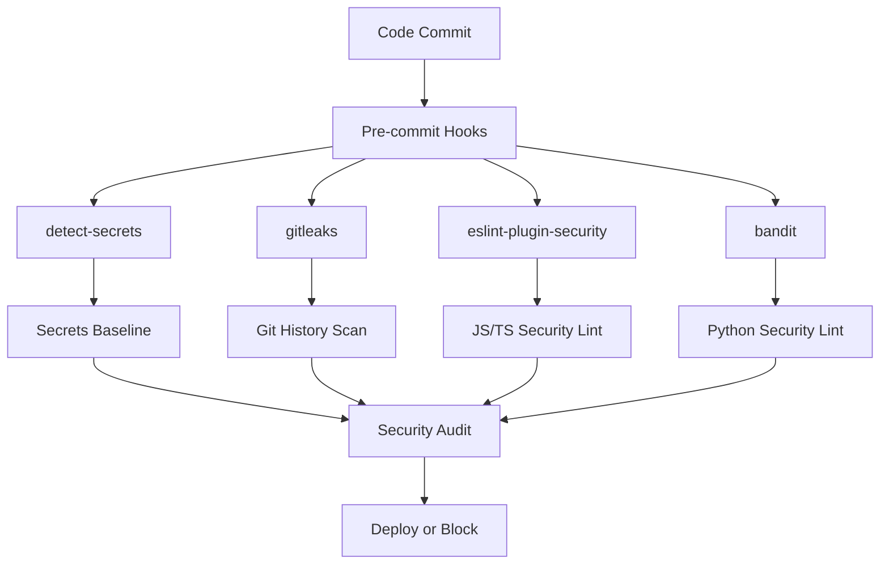
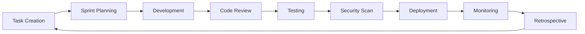

# 🔗 INTEGRATION GUIDE

**Version:** 1.0.0
**Last Updated:** 2025-10-23
**Purpose:** How all Cursor documentation and tools work together

---

## 🎯 OVERVIEW

This guide explains how all the Cursor documentation files and tools integrate to create a comprehensive development environment. Each component has a specific role and they work together to ensure code quality, security, and productivity.

---

## 📚 DOCUMENT RELATIONSHIPS

### Core Documentation Hierarchy

```
.cursorrules (Master Rules)
├── CURSOR_SECURITY_ADDENDUM.md (Security Focus)
├── CURSOR_AGILE_WORKFLOW.md (Process Focus)
├── CURSOR_DOCS_REFERENCE.md (Reference Focus)
└── INTEGRATION_GUIDE.md (Integration Focus)
```

### How They Work Together

1. **`.cursorrules`** provides the foundation - coding standards and rules
2. **`CURSOR_SECURITY_ADDENDUM.md`** adds security-specific requirements
3. **`CURSOR_AGILE_WORKFLOW.md`** defines the development process
4. **`CURSOR_DOCS_REFERENCE.md`** provides quick access to tools and prompts
5. **`INTEGRATION_GUIDE.md`** explains how everything connects

---

## 🔧 TOOL INTEGRATION

### Security Tools Integration



### Development Workflow Integration



---

## 🚀 IMPLEMENTATION STEPS

### Phase 1: Foundation Setup

1. **Install Core Tools**

   ```bash
   # Install security tools
   pip install detect-secrets bandit safety
   npm install -g eslint-plugin-security
   brew install gitleaks trivy
   ```

2. **Create Configuration Files**
   - `.pre-commit-config.yaml`
   - `.secrets.baseline`
   - `.dockerignore`
   - `.env.example`

3. **Setup Pre-commit Hooks**
   ```bash
   pre-commit install
   ```

### Phase 2: Documentation Integration

1. **Read All Documentation**
   - Start with `.cursorrules`
   - Review security addendum
   - Understand agile workflow
   - Bookmark reference guide

2. **Customize for Your Project**
   - Adapt rules to your tech stack
   - Modify workflow to your team size
   - Add project-specific security requirements

### Phase 3: Team Onboarding

1. **Team Training**
   - Security awareness training
   - Tool usage training
   - Process training
   - Documentation review

2. **Gradual Rollout**
   - Start with core team
   - Expand to all developers
   - Monitor adoption
   - Gather feedback

---

## 🔄 DAILY WORKFLOW

### Morning Routine

1. **Check Security Alerts**
   - Review overnight security scans
   - Check for new vulnerabilities
   - Review failed authentication attempts

2. **Update Dependencies**
   - Check for updates
   - Review changelogs
   - Test updates in staging

3. **Review Tasks**
   - Check sprint progress
   - Identify blockers
   - Plan day's work

### Development Workflow

1. **Start New Task**
   - Create feature branch
   - Write tests first (TDD)
   - Follow coding standards

2. **During Development**
   - Run pre-commit hooks
   - Use Cursor AI assistance
   - Follow security guidelines
   - Document complex logic

3. **Before Committing**
   - Run full test suite
   - Check security scan
   - Review code quality
   - Update documentation

### End of Day

1. **Code Review**
   - Review team's pull requests
   - Provide constructive feedback
   - Approve or request changes

2. **Documentation**
   - Update progress
   - Document learnings
   - Update knowledge base

---

## 🛡️ SECURITY INTEGRATION

### Automated Security Checks

```yaml
# .pre-commit-config.yaml
repos:
  - repo: local
    hooks:
      - id: detect-secrets
        name: detect-secrets
        entry: detect-secrets scan --all-files
        language: system
        pass_filenames: false
      - id: gitleaks
        name: gitleaks
        entry: gitleaks detect --source . --verbose
        language: system
        pass_filenames: false
      - id: bandit
        name: bandit
        entry: bandit -r .
        language: system
        pass_filenames: false
```

### Security Monitoring

```bash
# Daily security check
./scripts/security-audit.sh

# Weekly vulnerability scan
npm audit
pip-audit

# Monthly comprehensive scan
trivy image myapp:latest
```

---

## 📊 METRICS AND MONITORING

### Key Metrics to Track

- **Code Quality**: Test coverage, linting errors
- **Security**: Vulnerabilities found, secrets detected
- **Productivity**: Velocity, cycle time
- **Process**: Review time, deployment frequency

### Monitoring Tools

- **GitHub Actions**: CI/CD pipeline
- **Sentry**: Error tracking
- **DataDog**: Performance monitoring
- **Custom Dashboards**: Project-specific metrics

---

## 🔧 CUSTOMIZATION

### Project-Specific Adaptations

#### For Python Projects

```yaml
# .pre-commit-config.yaml
repos:
  - repo: https://github.com/psf/black
    rev: 22.3.0
    hooks:
      - id: black
  - repo: https://github.com/pycqa/bandit
    rev: 1.7.4
    hooks:
      - id: bandit
        args: ['-r', '.']
```

#### For Node.js Projects

```yaml
# .pre-commit-config.yaml
repos:
  - repo: https://github.com/pre-commit/mirrors-eslint
    rev: v8.15.0
    hooks:
      - id: eslint
        args: ['--fix']
  - repo: https://github.com/pre-commit/mirrors-prettier
    rev: v2.6.2
    hooks:
      - id: prettier
```

#### For React Projects

```yaml
# .pre-commit-config.yaml
repos:
  - repo: https://github.com/pre-commit/mirrors-eslint
    rev: v8.15.0
    hooks:
      - id: eslint
        args: ['--fix', '--ext', '.js,.jsx,.ts,.tsx']
```

---

## 🚨 TROUBLESHOOTING

### Common Integration Issues

#### Pre-commit Hooks Not Running

```bash
# Check installation
pre-commit --version

# Reinstall hooks
pre-commit uninstall
pre-commit install

# Run manually
pre-commit run --all-files
```

#### Security Tools Conflicts

```bash
# Check tool versions
detect-secrets --version
gitleaks version
bandit --version

# Update tools
pip install --upgrade detect-secrets bandit
brew upgrade gitleaks
```

#### Documentation Sync Issues

```bash
# Check file timestamps
ls -la docs/

# Update documentation
git add docs/
git commit -m "docs: update documentation"
```

---

## 📈 CONTINUOUS IMPROVEMENT

### Regular Reviews

- **Weekly**: Process effectiveness
- **Monthly**: Tool performance
- **Quarterly**: Documentation updates
- **Annually**: Complete system review

### Feedback Collection

- **Team Surveys**: Process satisfaction
- **Tool Metrics**: Performance data
- **Security Reports**: Vulnerability trends
- **Productivity Metrics**: Development velocity

### Improvement Actions

- **Process Updates**: Based on feedback
- **Tool Upgrades**: New features and fixes
- **Documentation Updates**: Keep current
- **Training Updates**: New requirements

---

## 🎯 SUCCESS METRICS

### Quality Metrics

- **Test Coverage**: >80%
- **Security Vulnerabilities**: <5 per month
- **Code Review Time**: <24 hours
- **Deployment Frequency**: Daily

### Process Metrics

- **Sprint Velocity**: Consistent
- **Bug Rate**: <5% of features
- **Documentation Coverage**: 100%
- **Team Satisfaction**: >4/5

### Security Metrics

- **Secrets Detected**: 0 in production
- **Vulnerability Response**: <24 hours
- **Security Training**: 100% completion
- **Incident Response**: <1 hour

---

## 📞 SUPPORT AND MAINTENANCE

### Regular Maintenance

- **Daily**: Monitor security alerts
- **Weekly**: Update dependencies
- **Monthly**: Review and update documentation
- **Quarterly**: Full system audit

### Support Channels

- **Internal**: Team Slack channels
- **External**: Tool documentation
- **Emergency**: On-call rotation
- **Training**: Regular workshops

---

**Remember: Integration is about making all the pieces work together seamlessly!**

This guide should be your go-to resource for understanding how all the Cursor documentation and tools work together to create a comprehensive development environment.
