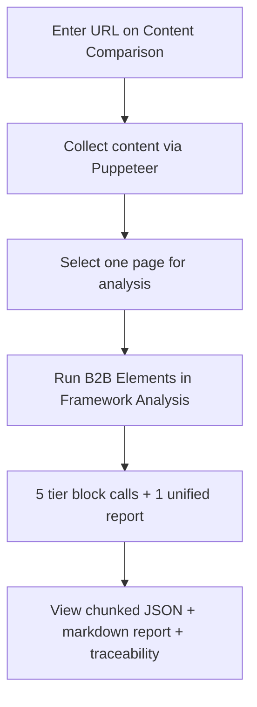
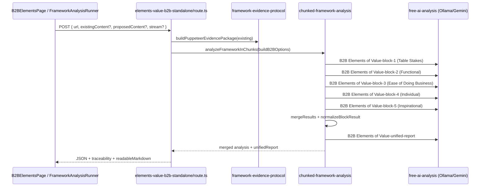

# B2B Elements of Value Assessment — Complete Guide

**Version:** 2.0 (Flat Fractional Scoring)  
**Last updated:** June 2026  
**Audience:** Product owners, analysts, and engineers working with the Zero Barriers Growth Accelerator B2B Elements of Value assessment.

---

## Scoring authority (read this first)

**Production scoring is flat fractional only (0.0–1.0).** Two framework docs split responsibilities:

| Document | Role |
|----------|------|
| [`B2B-BAIN-PYRAMID-TAXONOMY.md`](../frameworks/B2B-BAIN-PYRAMID-TAXONOMY.md) | **Structure authority** — Bain categories, subcategories, 40 slugs, rollup rules, code SSOT |
| [`B2B-Elements-Value-Flat-Scoring.md`](../frameworks/B2B-Elements-Value-Flat-Scoring.md) | **Scoring authority** — bands, formulas; injected into every AI block prompt (first 12,000 characters) |
| `B2B_ELEMENTS_OF_VALUE_COMPLETE.md` | **Definitions + Bain examples only** — its 1–10 tables are **not** used by the runtime assessment |

Nothing in this guide overrides those two files.

No scoring logic was changed to produce these guides. If any other doc disagrees with the flat-scoring doc, **trust the flat-scoring doc**.

**Design rationale:** Flat-scoring md is purpose-built for **website brand signals** (enterprise value claims on public copy). The archived Bain complete doc adds definitions, official examples, and synonyms — not an alternate 1–10 scoring method. Overall score = sum of 40 element scores ÷ 40. Keyword hints live in `B2B_ELEMENTS` (`element-definitions.ts`) as supplementary recognition aids. See [guides README](./README.md#why-flat-scoring-not-the-complete-reference-scales).

---

## Table of Contents

1. [What This Assessment Does](#1-what-this-assessment-does)
2. [Official B2B Elements of Value References](#2-official-b2b-elements-of-value-references)
3. [The 40 Elements and Five Tiers](#3-the-40-elements-and-five-tiers)
4. [Scoring Methodology](#4-scoring-methodology)
5. [How We Apply B2B Elements to Website Content](#5-how-we-apply-b2b-elements-to-website-content)
6. [User Workflows](#6-user-workflows)
7. [End-to-End Pipeline](#7-end-to-end-pipeline)
8. [Prompt Construction](#8-prompt-construction)
9. [API Contract](#9-api-contract)
10. [Response Structure](#10-response-structure)
11. [Integrity and Completeness Checks](#11-integrity-and-completeness-checks)
12. [Code and Documentation Reference Index](#12-code-and-documentation-reference-index)
13. [Dual Analysis Paths (Chunked vs Enhanced)](#13-dual-analysis-paths-chunked-vs-enhanced)
14. [Taxonomy Maintenance (resolved June 2026)](#14-taxonomy-maintenance-resolved-june-2026)
15. [Environment and Performance](#15-environment-and-performance)
16. [Troubleshooting](#16-troubleshooting)
17. [Testing](#17-testing)
18. [Annotated Bibliography](#18-annotated-bibliography)
19. [Per-Element Reference Catalog](#19-per-element-reference-catalog)
20. [Implementation & Prompt File Reference](#20-implementation--prompt-file-reference)
21. [Frontend & Backend Impact Note](#21-frontend--backend-impact-note)

---

## 1. What This Assessment Does

The B2B Elements of Value assessment evaluates **enterprise value propositions** expressed on a B2B website (or pasted content) against Bain & Company’s **40-element B2B value pyramid**.

The platform:

- Reads **public website content** collected by Puppeteer (pricing, compliance, ROI claims, integration language, case studies, etc.)
- Scores **all 40 elements** using **flat fractional scoring** (0.0–1.0 per element, no weights)
- Produces **per-element evidence**, **tier averages**, an **overall score**, and a **unified markdown report**
- Supports **existing vs proposed content** comparison when proposed copy is supplied

**Core concept (Bain & Company):** Enterprise buyers evaluate vendors across a pyramid of value — from table-stakes requirements through functional outcomes, ease of doing business, individual buyer benefits, and inspirational value at the peak.

---

## 2. Official B2B Elements of Value References

> **Start here for deep research:** Section [19](#19-per-element-reference-catalog) maps every runtime element to archived doc line numbers, Bain examples, and keywords. Section [18](#18-annotated-bibliography) is the full numbered bibliography.

### External (official) sources

| Ref | Resource | URL |
|-----|----------|-----|
| [B2B-1] | Bain — B2B Elements of Value (interactive pyramid) | https://media.bain.com/b2b-eov/ |
| [B2B-2] | Almquist, Cleghorn, Sherer — *The B2B Elements of Value* (HBR, March–April 2018) | https://hbr.org/2018/03/the-b2b-elements-of-value |
| [B2B-3] | Bain — B2B Elements of Value research hub | https://www.bain.com/insights/b2b-elements-of-value/ |
| [B2B-4] | Bain — *The B2B Elements of Value* (insight summary) | https://www.bain.com/insights/the-b2b-elements-of-value/ |
| [B2B-5] | Almquist, E. et al. — *The Elements of Value* (B2C pyramid, conceptual predecessor) | https://www.bain.com/insights/the-elements-of-value/ |

### Internal reference documents

| Ref | Document | Purpose |
|-----|----------|---------|
| [B2B-INT-1] | [`docs/archived/B2B_ELEMENTS_OF_VALUE_COMPLETE.md`](../archived/B2B_ELEMENTS_OF_VALUE_COMPLETE.md) | **Definitions only** — Bain definitions, examples, synonyms (~1,156 lines). **Do not use its 1–10 scoring tables for production.** |
| [B2B-INT-2] | [`docs/frameworks/B2B-BAIN-PYRAMID-TAXONOMY.md`](../frameworks/B2B-BAIN-PYRAMID-TAXONOMY.md) | **Structure authority** — Bain pyramid, subcategories, slugs, rollup JSON, code SSOT chain |
| [B2B-INT-2b] | [`docs/frameworks/B2B-Elements-Value-Flat-Scoring.md`](../frameworks/B2B-Elements-Value-Flat-Scoring.md) | **Scoring authority** — flat 0.0–1.0 bands, calculation tables; injected into every block prompt |
| [B2B-INT-3] | [`docs/archived/COMPLETE_FRAMEWORK_INDEX.md`](../archived/COMPLETE_FRAMEWORK_INDEX.md) | Master index of all framework docs in this repo |
| [B2B-INT-4] | [`docs/guides/README.md`](./README.md) | Assessment guides index |
| [B2B-INT-5] | [`.cursorrules`](../../.cursorrules) | Project-wide B2B element inventory |
| [B2B-INT-6] | [`docs/PAGE_WORKFLOWS.md`](../PAGE_WORKFLOWS.md) | Dashboard workflow for `/dashboard/elements-value-b2b` |
| [B2B-INT-7] | [`docs/LOCAL_RUNBOOK.md`](../LOCAL_RUNBOOK.md) | Local Ollama/dev setup |
| [B2B-INT-8] | [`docs/guides/CLIFTONSTRENGTHS_ASSESSMENT_GUIDE.md`](./CLIFTONSTRENGTHS_ASSESSMENT_GUIDE.md) | Sister guide (same format) |

---

## 3. The 40 Elements and Five Tiers

The **production chunked path** organizes **40 value elements** into **five Bain tiers**. Categories and subcategories are **defined by the elements they contain** — labels like Career or Purpose are shorthand for specific value lists, not separate scored entities. Slugs use **snake_case** in JSON. **Table Stakes** is the only tier without subcategories; all others roll up `subcategoryScore` → `categoryScore`.

> **Full pyramid with every subcategory:** [`B2B-BAIN-PYRAMID-TAXONOMY.md`](../frameworks/B2B-BAIN-PYRAMID-TAXONOMY.md) — canonical reference. Do not re-derive from memory or the archived complete doc.

| Tier | Category key | Subcategories | Elements | Buyer question |
|------|--------------|---------------|----------|----------------|
| 1 | `table_stakes` | *(none — flat)* | 4 | Does this vendor meet baseline requirements? |
| 2 | `functional` | Economic, Performance | 5 | Does it improve revenue, reduce cost, and perform? |
| 3 | `ease_of_business` | Productivity, Operational, Access, Relationship, Strategic | 21 | Is it easy to buy, deploy, and work with? |
| 4 | `individual` | Career, Personal | 7 | Does it help *me* as a buyer/user? |
| 5 | `inspirational` | Purpose | 3 | Does it inspire confidence in the future? |

**Count proof:** 4 + 5 + 21 + 7 + 3 = **40**.

### Tier 1: Table Stakes (4) — flat, no subcategories

`meeting_specifications` · `acceptable_price` · `regulatory_compliance` · `ethical_standards`

### Tier 2: Functional Value (5)

| Subcategory | Elements |
|-------------|----------|
| **Economic** | `improved_top_line`, `cost_reduction` |
| **Performance** | `product_quality`, `scalability`, `innovation` |

### Tier 3: Ease of Doing Business (21)

| Subcategory | Elements |
|-------------|----------|
| **Productivity** | `time_savings`, `reduced_effort`, `decreased_hassles`, `information`, `transparency` |
| **Operational** | `organization`, `simplification`, `connection`, `integration` |
| **Access** | `availability`, `variety`, `configurability` |
| **Relationship** | `responsiveness`, `expertise`, `commitment`, `stability`, `cultural_fit` |
| **Strategic** | `risk_reduction`, `reach`, `flexibility`, `component_quality` |

### Tier 4: Individual Value (7)

| Subcategory | Elements |
|-------------|----------|
| **Career** | `network_expansion`, `marketability`, `reputational_assurance` |
| **Personal** | `design_aesthetics_b2b`, `growth_development`, `reduced_anxiety_b2b`, `fun_perks` |

### Tier 5: Inspirational Value (3)

| Subcategory | Elements |
|-------------|----------|
| **Purpose** | `vision`, `hope_b2b`, `social_responsibility` |

---

## 4. Scoring Methodology

**Copied from the scoring authority** [`B2B-Elements-Value-Flat-Scoring.md`](../frameworks/B2B-Elements-Value-Flat-Scoring.md). Do not substitute any other scale.

### Scoring scale (from flat-scoring doc)

| Score range | Rating | Meaning |
|-------------|--------|---------|
| 0.8 – 1.0 | **Excellent** | Industry-leading, exceptional value |
| 0.6 – 0.79 | **Good** | Above market average, solid delivery |
| 0.4 – 0.59 | **Needs Work** | Below expectations, requires improvement |
| 0.0 – 0.39 | **Poor** | Weak or non-existent, critical gap |

### Calculation method (three-level hierarchy)

| Level | Field | Formula |
|-------|-------|---------|
| Element | `score` | 0.0–1.0 from evidence (AI scores these) |
| Subcategory | `subcategoryScore` | Average of element scores in Bain subcategory |
| Category | `categoryScore` | Table Stakes: avg of 4 elements; other tiers: avg of subcategory scores |
| Overall | `overallScore` | Average of all **40** element scores |

```
SUBCATEGORY SCORE = sum(element scores in subcategory) ÷ element count

TABLE STAKES TIER = sum(4 element scores) ÷ 4

OTHER TIER SCORE  = sum(subcategory scores) ÷ subcategory count

OVERALL SCORE     = sum(all 40 element scores) ÷ 40
```

Runtime applies rollups in `rollupB2BCategoryBreakdown()` after AI returns per-element scores. Full worked example: [`B2B-Elements-Value-Flat-Scoring.md`](../frameworks/B2B-Elements-Value-Flat-Scoring.md#calculation-method).

**No arbitrary weights.** Elements are equal within subcategories; subcategories are equal within tiers; all 40 elements are equal in the overall score.

### Diagnostic drill-down (all tiers)

Weak at any level → evaluate the **elements that define the level below** (see [`B2B-BAIN-PYRAMID-TAXONOMY.md`](../frameworks/B2B-BAIN-PYRAMID-TAXONOMY.md#diagnostic-drill-down-all-tiers)):

| Tier | Subcategories | Drill-down |
|------|---------------|------------|
| Table Stakes | *(none)* | 4 elements directly |
| Functional | Economic, Performance | Weakest subcategory → its 2 or 3 elements |
| Ease of Doing Business | Productivity, Operational, Access, Relationship, Strategic | Weakest of 5 → its elements |
| Individual | Career, Personal | Weakest of 2 → its 3 or 4 elements |
| Inspirational | Purpose only | Purpose = entire tier → `vision`, `hope_b2b`, `social_responsibility` |

Code helpers: `getB2BCategoryDiagnosticGuide()`, `resolveB2BDrillDownTarget()` in `b2b-taxonomy.ts`.

### Derived insights (from flat scoring spec)

When sufficient content evidence exists, the AI should also surface:

- Top 5–10 value elements with strongest evidence
- Bottom 5 elements (critical gaps)
- Tier balance analysis
- Enterprise sales and retention implications
- 5–7 prioritized recommendations

The chunked runtime focuses on **per-element scores + evidence + recommendations**, then synthesizes an executive report in the unified step.

---

## 5. How We Apply B2B Elements to Website Content

Website copy is treated as **proxy evidence** for enterprise value delivery:

| Evidence stream | Source | Elements commonly signaled |
|-----------------|--------|---------------------------|
| Pricing / ROI language | Page text, stats blocks | `acceptable_price`, `cost_reduction`, `improved_top_line` |
| Compliance / certifications | Badges, footer, security pages | `regulatory_compliance`, `risk_reduction`, `ethical_standards` |
| Integration / API copy | Feature sections | `integration`, `connection`, `simplification` |
| Support / SLA messaging | Service pages | `responsiveness`, `commitment`, `stability` |
| Case studies / logos | Testimonial selectors | `reputational_assurance`, `product_quality`, `hope_b2b` |
| Mission / vision statements | Purpose selectors | `vision`, `belief`-adjacent language |
| Onboarding / UX claims | Product pages | `reduced_effort`, `time_savings`, `decreased_hassles` |

Evidence normalization: [`src/lib/framework-evidence-protocol.ts`](../../src/lib/framework-evidence-protocol.ts).

Per-element keyword hints: [`src/lib/elements/element-definitions.ts`](../../src/lib/elements/element-definitions.ts) → `B2B_ELEMENTS`.

---

## 6. User Workflows

### Primary UI entry points

| Route | Component | API endpoint |
|-------|-----------|--------------|
| `/dashboard/elements-value-b2b` | `B2BElementsPage` | `/api/analyze/elements-value-b2b-standalone` |
| Content Comparison → Framework Analysis tab | `FrameworkAnalysisRunner` | Same endpoint via `framework-analysis-entrypoint` |
| Workspace shortcut | — | `/dashboard/elements-value-b2b` |

### Typical flow (recommended)



1. **Collect** — Puppeteer gathers page content. Collection does **not** call Ollama/Gemini.
2. **Select page** — By default, one primary page is analyzed (homepage or entered URL).
3. **Analyze** — Chunked AI runs 5 tier blocks sequentially, then one unified synthesis.
4. **Review** — Results include per-element scores, evidence, `verification.completeness_check`, and `readableMarkdown`.

### Standalone page flow

[`src/components/analysis/B2BElementsPage.tsx`](../../src/components/analysis/B2BElementsPage.tsx) uses `useFrameworkPageAnalysis`:

- Enter URL (required)
- Optionally paste **proposed content** for comparison
- Optionally paste **scraped JSON** to skip re-collection
- Stream progress per tier block

### Workflow documentation

See [`docs/PAGE_WORKFLOWS.md`](../PAGE_WORKFLOWS.md) — section `/dashboard/elements-value-b2b`.

---

## 7. End-to-End Pipeline

### Architecture diagram



### Key implementation files

| Step | File |
|------|------|
| API route | [`src/app/api/analyze/elements-value-b2b-standalone/route.ts`](../../src/app/api/analyze/elements-value-b2b-standalone/route.ts) |
| Chunk orchestration | [`src/lib/chunked-framework-analysis.ts`](../../src/lib/chunked-framework-analysis.ts) |
| Canonical chunk list | [`src/lib/framework/chunk-definitions.ts`](../../src/lib/framework/chunk-definitions.ts) → `B2B_CHUNK_CONFIG` |
| AI provider | [`src/lib/free-ai-analysis.ts`](../../src/lib/free-ai-analysis.ts) |
| Streaming wrapper | [`src/lib/streaming-analysis.ts`](../../src/lib/streaming-analysis.ts) |
| Client hook | [`src/hooks/useFrameworkPageAnalysis.ts`](../../src/hooks/useFrameworkPageAnalysis.ts) |
| Client streaming | [`src/hooks/useChunkedAnalysis.ts`](../../src/hooks/useChunkedAnalysis.ts) |
| Framework router | [`src/lib/framework-analysis-entrypoint.ts`](../../src/lib/framework-analysis-entrypoint.ts) |

### Ollama lifecycle

Ollama is touched **only when analysis starts**, inside `analyzeFrameworkInChunks()` via `touchOllamaBeforeAnalysis()` — not during content collection.

### Chunk configuration

The B2B route does **not** set `categoriesPerBlock`. Because the framework has **40 elements** (> 34 threshold), `chooseCategoriesPerBlock()` automatically selects **`1` category per block**:

```
Block 1: Table Stakes (4 elements)
Block 2: Functional Value (9 elements)
Block 3: Ease of Doing Business (21 elements)  ← largest block
Block 4: Individual Value (7 elements)
Block 5: Inspirational Value (2 elements)
```

**Total AI calls per assessment:** 6 (5 blocks + 1 unified report).

**Analysis type labels** (for logging / provider routing):

- `B2B Elements of Value-block-1` … `B2B Elements of Value-block-5`
- `B2B Elements of Value-unified-report`

---

## 8. Prompt Construction

Each block prompt is built by `buildBlockPrompt()` in [`src/lib/chunked-framework-analysis.ts`](../../src/lib/chunked-framework-analysis.ts).

### Prompt ingredients

| Section | Source | Notes |
|---------|--------|-------|
| Framework markdown | `docs/frameworks/B2B-Elements-Value-Flat-Scoring.md` | Truncated to **12,000 characters** |
| Website content summary | `buildContentSummary()` | URL, title, meta, keywords, **first 1,500 chars** of content |
| Evidence protocol | Prepended to `contentText` in `buildB2BOptions()` | CTAs, headlines, testimonials, compliance signals |
| Tier + element list | Per-block chunk definition | Exact slugs the model must score |
| **Recognition keyword hints** | `element-keyword-hints.ts` ← `B2B_ELEMENTS` | Per-element keywords + descriptions; supplementary only |
| Scoring rubric | Flat-scoring md (injected above) | Never overridden by keyword hints |
| JSON schema | Inline in prompt | `categories.{tier}.elements.{slug}` |

### Block prompt template (abbreviated)

```
You are analyzing website content using the B2B Elements of Value framework.
Evaluate EVERY element listed below. Do not skip any element.

FRAMEWORK MARKDOWN (SOURCE OF TRUTH):
{first 12k of B2B-Elements-Value-Flat-Scoring.md}

WEBSITE CONTENT:
URL: ...
Title: ...
Content (first 1500 chars): ...

CATEGORIES IN THIS BLOCK:
- Table Stakes (table_stakes): meeting_specifications, acceptable_price, ...

SCORING:
Score each element 0.0-1.0 (flat fractional scoring): ...

Return ONLY valid JSON in this exact format:
{ "categories": { "table_stakes": { "categoryScore": 0.0, "elements": { ... } } } }
```

### Unified report prompt

After all blocks merge, `buildUnifiedReportWithOllama()` sends merged JSON plus instructions to produce markdown sections: Executive Summary, What Is Working, What Needs Improvement, Prioritized Action Plan, Risk Notes.

### AI failure fallback

If all AI calls fail, [`src/lib/framework-fallback-generator.ts`](../../src/lib/framework-fallback-generator.ts) produces markdown via `generateFrameworkFallbackMarkdown({ framework: 'b2b-elements', ... })`.

---

## 9. API Contract

### Endpoint

```
POST /api/analyze/elements-value-b2b-standalone
```

**`maxDuration`:** 300 seconds (Vercel serverless).

### Request body

```json
{
  "url": "https://example.com",
  "proposedContent": "optional proposed copy string",
  "existingContent": { "title": "...", "cleanText": "...", "seo": { ... } },
  "analysisType": "full",
  "stream": true
}
```

| Field | Required | Description |
|-------|----------|-------------|
| `url` | Yes | Target B2B website URL |
| `existingContent` | No | Pre-collected payload from Content Comparison / LocalForage |
| `proposedContent` | No | Proposed copy for side-by-side comparison |
| `stream` | No | `true` enables SSE progress events (default in UI hooks) |
| `analysisType` | No | Reserved; currently `"full"` |

### Content sourcing priority

1. Client-provided `existingContent` (preferred — avoids re-scrape)
2. Vercel production: `ProductionContentExtractor`
3. Local dev: internal call to `/api/analyze/compare`

---

## 10. Response Structure

### Top-level success payload

```json
{
  "success": true,
  "existing": { "title": "...", "cleanText": "...", "url": "..." },
  "proposed": null,
  "analysis": { ... },
  "readableMarkdown": "# Executive Summary\n...",
  "traceability": { ... },
  "puppeteerEvidence": { ... },
  "message": "B2B Elements analysis completed"
}
```

### `analysis` object (chunked result)

| Field | Type | Description |
|-------|------|-------------|
| `framework` | string | `"B2B Elements of Value"` |
| `url` | string | Analyzed URL |
| `overallScore` | number | 0.0–1.0 mean of all 40 elements |
| `totalElements` | number | Should be 40 |
| `categories` | object | Keyed by `categoryKey` (e.g. `table_stakes`) |
| `topStrengths` | array | Up to 5 elements with score ≥ 0.7 |
| `criticalGaps` | array | Up to 5 elements with score < 0.4 |
| `verification` | object | Completeness metadata |
| `chunkedReport` | string | Markdown from merge step |
| `unifiedReport` | string | AI-synthesized executive report |
| `analysisMethod` | string | `"chunked-blocked"` |
| `chunksCompleted` / `chunksTotal` | number | Block progress |
| `errors` | string[]? | Per-block failure messages |

### Per-element element shape

```json
{
  "score": 0.68,
  "evidence": "Pricing page cites 30% cost reduction in case study...",
  "recommendation": "Add quantified ROI metrics to homepage hero."
}
```

### Tier shape (with subcategories)

```json
{
  "individual": {
    "categoryName": "Individual Value",
    "categoryScore": 0.48,
    "elementCount": 7,
    "subcategories": {
      "career": {
        "subcategoryName": "Career",
        "subcategoryScore": 0.52,
        "elementCount": 3,
        "elements": {
          "network_expansion": { "score": 0.6, "evidence": "...", "recommendation": "..." }
        }
      },
      "personal": {
        "subcategoryName": "Personal",
        "subcategoryScore": 0.44,
        "elementCount": 4,
        "elements": {
          "design_aesthetics_b2b": { "score": 0.4, "evidence": "...", "recommendation": "..." }
        }
      }
    }
  }
}
```

**Table Stakes** is the only tier without `subcategories` — elements sit directly on the tier object. See [`B2B-BAIN-PYRAMID-TAXONOMY.md`](../frameworks/B2B-BAIN-PYRAMID-TAXONOMY.md#scoring-rollup-rules).

---

## 11. Integrity and Completeness Checks

### Automated test coverage

[`src/test/framework/element-completeness.test.ts`](../../src/test/framework/element-completeness.test.ts) asserts:

- **40** expected elements
- **5** tier categories
- Chunk list matches `B2B_CHUNK_CONFIG`
- No duplicates; definitions align with `B2B_ELEMENTS`

Validator: [`src/lib/framework/element-completeness.ts`](../../src/lib/framework/element-completeness.ts).

### Runtime verification (per analysis)

`mergeResults()` sets:

```json
{
  "verification": {
    "total_elements_in_framework": 40,
    "total_elements_analyzed": 40,
    "completeness_check": "pass",
    "all_elements_accounted_for": true,
    "breakdown": {
      "present": 14,
      "partial": 18,
      "missing": 8,
      "total": 40
    }
  }
}
```

| `completeness_check` | Meaning |
|----------------------|---------|
| `pass` | All 40 element slots returned in merged result |
| `fail` | One or more elements missing (block failure or parse error) |

`normalizeBlockResult()` fills missing elements with score `0` and evidence `"Not found"` when the AI omits them.

---

## 12. Code and Documentation Reference Index

### Runtime (chunked path) — use these first

| Asset | Path |
|-------|------|
| API route | `src/app/api/analyze/elements-value-b2b-standalone/route.ts` |
| Chunk config (canonical) | `src/lib/framework/chunk-definitions.ts` → `B2B_CHUNK_CONFIG` |
| Chunk orchestration | `src/lib/chunked-framework-analysis.ts` |
| Element definitions + keywords | `src/lib/elements/element-definitions.ts` → `B2B_ELEMENTS` |
| Flat scoring spec (prompts) | `docs/frameworks/B2B-Elements-Value-Flat-Scoring.md` |
| Evidence protocol | `src/lib/framework-evidence-protocol.ts` |
| UI (standalone) | `src/components/analysis/B2BElementsPage.tsx` |
| Dashboard route | `src/app/dashboard/elements-value-b2b/page.tsx` |
| Framework runner wiring | `src/components/analysis/FrameworkAnalysisRunner.tsx` |
| Client entrypoint | `src/lib/framework-analysis-entrypoint.ts` |
| Completeness validator | `src/lib/framework/element-completeness.ts` |

### Reference / archival

| Asset | Path |
|-------|------|
| Full element encyclopedia (Bain order) | `docs/archived/B2B_ELEMENTS_OF_VALUE_COMPLETE.md` |
| Page workflows | `docs/PAGE_WORKFLOWS.md` |
| Local dev runbook | `docs/LOCAL_RUNBOOK.md` |
| CliftonStrengths guide (same format) | `docs/guides/CLIFTONSTRENGTHS_ASSESSMENT_GUIDE.md` |

### Enhanced / legacy path

| Asset | Path |
|-------|------|
| Assessment rules (0–100 schema) | `src/lib/ai-engines/assessment-rules/elements-value-b2b-rules.json` |
| Framework knowledge JSON | `src/lib/ai-engines/framework-knowledge/elements-value-b2b-framework.json` |
| Detailed service | `src/lib/services/elements-value-b2b.service.ts` |
| Standalone service | `src/lib/services/standalone-elements-value-b2b.service.ts` |
| Individual API route | `src/app/api/analyze/individual/b2b-elements/route.ts` |
| Saved analysis retrieval | `src/app/api/analysis/elements-value-b2b/[id]/route.ts` |
| Data flow test | `tests/b2b-data-flow-test.ts` |

---

## 13. Dual Analysis Paths (Chunked vs Enhanced)

| Aspect | Chunked (production) | Enhanced (legacy) |
|--------|----------------------|-------------------|
| Entry | `/api/analyze/elements-value-b2b-standalone` | `/api/analyze/individual/b2b-elements`, step-by-step routes |
| Scoring | 0.0–1.0 flat fractional | 0–100 integer (per rules JSON) |
| Prompt source | `B2B-Elements-Value-Flat-Scoring.md` | `elements-value-b2b-rules.json` |
| Theme knowledge | Injected markdown | `elements-value-b2b-framework.json` |
| Completeness test | Yes (`b2b-elements` key) | No automated parity check |
| Enterprise framing | General value scoring | Explicit enterprise sales / retention / deal-size fields |

When debugging scoring discrepancies, confirm which path produced the report.

---

## 14. Taxonomy maintenance (resolved June 2026)

**Scoring is not negotiable** — it comes only from [`B2B-Elements-Value-Flat-Scoring.md`](../frameworks/B2B-Elements-Value-Flat-Scoring.md). **Structure is not negotiable** — it comes only from [`B2B-BAIN-PYRAMID-TAXONOMY.md`](../frameworks/B2B-BAIN-PYRAMID-TAXONOMY.md).

The following drift bugs were fixed and are documented in the taxonomy doc’s [historical drift register](../frameworks/B2B-BAIN-PYRAMID-TAXONOMY.md#historical-drift-register-resolved):

- `purpose` treated as an element (41+ elements) — **Purpose is a subcategory**
- Inline `buildB2BOptions()` chunk list — now imports `B2B_CHUNK_CONFIG`
- `access` as element slug — **Access is a subcategory** (availability, variety, configurability)
- Flexibility / component quality under Functional — moved to **Ease → Strategic** per Bain
- Missing `social_responsibility` — added under **Inspirational → Purpose**

### When changing B2B elements

1. Edit `src/lib/framework/b2b-taxonomy.ts` first
2. Sync `chunk-definitions.ts`, `element-definitions.ts`, `backend/b2b_taxonomy.py`
3. Run `npm run test -- src/test/framework/b2b-taxonomy.test.ts src/test/framework/element-completeness.test.ts`
4. Rebuild catalog: `cd backend && pipenv run python scripts/build_framework_catalog.py`

### Archived doc role

[`B2B_ELEMENTS_OF_VALUE_COMPLETE.md`](../archived/B2B_ELEMENTS_OF_VALUE_COMPLETE.md) is for **definitions, synonyms, and Bain examples only**. Its tier element counts and 1–10 scoring tables are not used in production.

---

## 15. Environment and Performance

### Required / common variables

| Variable | Purpose |
|----------|---------|
| `AI_PROVIDER` | `ollama` (local) or cloud provider |
| `OLLAMA_BASE_URL` | e.g. `http://127.0.0.1:11434` |
| `OLLAMA_MODEL` | e.g. `llama3.1:8b` |
| `OLLAMA_NUM_PREDICT` | Max tokens per call (e.g. `1200`–`1400`) |
| `OLLAMA_KEEP_ALIVE` | Model keep-alive duration |
| `GEMINI_API_KEY` | Fallback when Ollama fails (if fallbacks enabled) |
| `AI_ALLOW_FALLBACKS` | Whether to fall back to Gemini |
| `NEXT_PUBLIC_APP_URL` / `NEXTAUTH_URL` | Base URL for local compare API calls |

See [`docs/LOCAL_RUNBOOK.md`](../LOCAL_RUNBOOK.md).

### Performance characteristics (typical local Ollama)

| Factor | Impact |
|--------|--------|
| 6 sequential AI calls | ~6× single-call latency |
| Ease of Doing Business block | 21 elements in one prompt — slowest block |
| 1,500-char content cap per block | May miss deep-page ROI/compliance proof |
| `categoriesPerBlock: auto → 1` | Triggered because 40 > 34 element threshold |

**Collection is fast; analysis is slow.** Run `ollama serve` before assessments. Content collection defaults to **single-page** mode.

### API timeout

Route `maxDuration = 300` seconds. The 21-element Ease of Doing Business block is the most likely timeout risk on slow local models.

---

## 16. Troubleshooting

| Symptom | Likely cause | What to check |
|---------|--------------|---------------|
| `completeness_check: fail` | Block AI error or JSON parse failure | `analysis.errors`, logs for `B2B Elements of Value-block-N` |
| 41–42 elements in response vs 40 expected | Taxonomy drift — `purpose` as element slug | See [`B2B-BAIN-PYRAMID-TAXONOMY.md`](../frameworks/B2B-BAIN-PYRAMID-TAXONOMY.md); Purpose is subcategory only |
| All scores `0` with "Analysis failed" | Ollama unreachable | `OLLAMA_BASE_URL`, `ollama serve` |
| Block 3 consistently slow/fails | 21-element Ease of Doing Business prompt | Reduce `OLLAMA_NUM_PREDICT` or split block (set `categoriesPerBlock: 1` explicitly) |
| Thin evidence for ROI elements | 1,500-char truncation | Analyze pricing/case-study page; provide richer `existingContent` |
| Scores differ from Bain workshop output | Expected — this analyzes **website copy**, not buyer interviews | Re-read [Section 5](#5-how-we-apply-b2b-elements-to-website-content) |
| Unified report is raw JSON | Ollama returned JSON instead of markdown | Use `chunkedReport` as fallback |
| Re-scrape on every run | `existingContent` not passed | Collect via Content Comparison first |

### Exporting prompts for external debugging

1. Copy `docs/frameworks/B2B-Elements-Value-Flat-Scoring.md` + sample `contentText` + block element list
2. Reproduce with analysis type labels `B2B Elements of Value-block-1` etc.
3. Pay special attention to **block 3** (Ease of Doing Business) when tuning prompts

---

## 17. Testing

| Test | Location | What it validates |
|------|----------|-------------------|
| Element completeness | `src/test/framework/element-completeness.test.ts` | 40 elements, 5 tiers, no duplicates |
| Bain taxonomy rollups | `src/test/framework/b2b-taxonomy.test.ts` | Subcategory placement, Table Stakes flat, Strategic elements |
| Primary page picker | `src/test/framework/pick-primary-page.test.ts` | Single-page analysis default |
| Content collection config | `src/test/framework/content-collection-config.test.ts` | Homepage-first collection defaults |
| B2B data flow | `tests/b2b-data-flow-test.ts` | Legacy/enhanced data flow |

Run:

```bash
npm run test -- src/test/framework/element-completeness.test.ts
npm run type-check
```

---

## 18. Annotated Bibliography

### External sources

| ID | Citation | Used for |
|----|----------|----------|
| [B2B-1] | Bain & Company. (n.d.). *B2B Elements of Value* (interactive pyramid). https://media.bain.com/b2b-eov/ | Canonical 40-element pyramid structure |
| [B2B-2] | Almquist, E., Cleghorn, J., & Sherer, L. (2018). *The B2B Elements of Value*. Harvard Business Review, March–April 2018. https://hbr.org/2018/03/the-b2b-elements-of-value | Original research article, enterprise buyer value model |
| [B2B-3] | Bain & Company. (n.d.). *B2B Elements of Value* (insights hub). https://www.bain.com/insights/b2b-elements-of-value/ | Research summaries and case context |
| [B2B-4] | Bain & Company. (n.d.). *The B2B Elements of Value* (insight page). https://www.bain.com/insights/the-b2b-elements-of-value/ | Framework overview and business application |
| [B2B-5] | Almquist, E., Senior, J., & Bloch, N. (2016). *The Elements of Value* (B2C pyramid). https://www.bain.com/insights/the-elements-of-value/ | Conceptual predecessor to B2B model |

### Internal implementation sources

| ID | File | Role in assessment |
|----|------|-------------------|
| [B2B-INT-1] | `docs/archived/B2B_ELEMENTS_OF_VALUE_COMPLETE.md` | Per-element Bain definitions, official examples, 1–10 rubric |
| [B2B-INT-2] | `docs/frameworks/B2B-Elements-Value-Flat-Scoring.md` | Injected into AI block prompts (≤12k chars) |
| [B2B-INT-3] | `src/lib/framework/chunk-definitions.ts` → `B2B_CHUNK_CONFIG` | Canonical 40-element chunk manifest |
| [B2B-INT-4] | `src/lib/elements/element-definitions.ts` → `B2B_ELEMENTS` | Keyword hints for content matching |
| [B2B-INT-5] | `src/app/api/analyze/elements-value-b2b-standalone/route.ts` | Production API; `buildB2BOptions()` |
| [B2B-INT-6] | `src/lib/chunked-framework-analysis.ts` | `buildBlockPrompt()`, `mergeResults()`, unified report |
| [B2B-INT-7] | `src/lib/framework-evidence-protocol.ts` | Puppeteer evidence → prompt preamble |
| [B2B-INT-8] | `src/test/framework/element-completeness.test.ts` | Automated 40-element integrity test |

---

## 19. Per-Element Reference Catalog

Runtime elements from `B2B_CHUNK_CONFIG` (40 total). **Archived doc** line numbers point to `B2B_ELEMENTS_OF_VALUE_COMPLETE.md` (Bain pyramid order, top → bottom). Elements marked *Bain only* appear in the archived doc but not in the runtime canonical config.

### Tier 1: Table Stakes

| Slug | Element | Block | Archived doc (line) | Keywords (sample) |
|------|---------|-------|---------------------|-------------------|
| `meeting_specifications` | Meeting Specifications | 1 | [L1007](../archived/B2B_ELEMENTS_OF_VALUE_COMPLETE.md#L1007) | meets requirements, specifications, standards |
| `acceptable_price` | Acceptable Price | 1 | [L1033](../archived/B2B_ELEMENTS_OF_VALUE_COMPLETE.md#L1033) | competitive, affordable, value, pricing |
| `regulatory_compliance` | Regulatory Compliance | 1 | [L1060](../archived/B2B_ELEMENTS_OF_VALUE_COMPLETE.md#L1060) | compliant, certified, approved, regulated |
| `ethical_standards` | Ethical Standards | 1 | [L1086](../archived/B2B_ELEMENTS_OF_VALUE_COMPLETE.md#L1086) | ethical, responsible, integrity, transparent |

### Tier 2: Functional Value

| Slug | Element | Block | Archived doc (line) | Keywords (sample) |
|------|---------|-------|---------------------|-------------------|
| `improved_top_line` | Improved Top Line | 2 | [L872](../archived/B2B_ELEMENTS_OF_VALUE_COMPLETE.md#L872) | revenue, growth, sales, profit |
| `cost_reduction` | Cost Reduction | 2 | [L898](../archived/B2B_ELEMENTS_OF_VALUE_COMPLETE.md#L898) | savings, reduce costs, efficiency |
| `product_quality` | Product Quality | 2 | [L926](../archived/B2B_ELEMENTS_OF_VALUE_COMPLETE.md#L926) | quality, reliable, durable, premium |
| `scalability` | Scalability | 2 | [L952](../archived/B2B_ELEMENTS_OF_VALUE_COMPLETE.md#L952) | scalable, expandable, grows with you |
| `innovation` | Innovation | 2 | [L978](../archived/B2B_ELEMENTS_OF_VALUE_COMPLETE.md#L978) | innovative, cutting-edge, advanced |
| `risk_reduction` | Risk Reduction | 2 | [L764](../archived/B2B_ELEMENTS_OF_VALUE_COMPLETE.md#L764) | risk-free, safe, secure, protected |
| `reach` | Reach | 2 | [L790](../archived/B2B_ELEMENTS_OF_VALUE_COMPLETE.md#L790) | reach, scale, global, worldwide |
| `flexibility` | Flexibility | 2 | [L816](../archived/B2B_ELEMENTS_OF_VALUE_COMPLETE.md#L816) | flexible, adaptable, customizable |
| `component_quality` | Component Quality | 2 | [L842](../archived/B2B_ELEMENTS_OF_VALUE_COMPLETE.md#L842) | quality, reliable, durable, premium |

### Tier 3: Ease of Doing Business

| Slug | Element | Block | Archived doc (line) | Keywords (sample) |
|------|---------|-------|---------------------|-------------------|
| `time_savings` | Time Savings | 3 | [L310](../archived/B2B_ELEMENTS_OF_VALUE_COMPLETE.md#L310) | time-saving, efficient, quick, fast |
| `reduced_effort` | Reduced Effort | 3 | [L336](../archived/B2B_ELEMENTS_OF_VALUE_COMPLETE.md#L336) | effortless, easy, simple, straightforward |
| `decreased_hassles` | Decreased Hassles | 3 | [L362](../archived/B2B_ELEMENTS_OF_VALUE_COMPLETE.md#L362) | hassle-free, smooth, seamless |
| `information` | Information | 3 | [L388](../archived/B2B_ELEMENTS_OF_VALUE_COMPLETE.md#L388) | insights, data, analytics, reporting |
| `transparency` | Transparency | 3 | [L415](../archived/B2B_ELEMENTS_OF_VALUE_COMPLETE.md#L415) | transparent, clear, open, honest |
| `organization` | Organization | 3 | [L443](../archived/B2B_ELEMENTS_OF_VALUE_COMPLETE.md#L443) | organized, structured, systematic |
| `simplification` | Simplification | 3 | [L469](../archived/B2B_ELEMENTS_OF_VALUE_COMPLETE.md#L469) | simple, streamlined, unified |
| `connection` | Connection | 3 | [L495](../archived/B2B_ELEMENTS_OF_VALUE_COMPLETE.md#L495) | connect, integrate, unify, link |
| `integration` | Integration | 3 | [L521](../archived/B2B_ELEMENTS_OF_VALUE_COMPLETE.md#L521) | seamless, compatible, works with |
| `access` | Access | 3 | — (see Availability L549) | available, accessible, 24/7, always on |
| `availability` | Availability | 3 | [L549](../archived/B2B_ELEMENTS_OF_VALUE_COMPLETE.md#L549) | available, accessible, 24/7 |
| `variety` | Variety | 3 | [L575](../archived/B2B_ELEMENTS_OF_VALUE_COMPLETE.md#L575) | options, choices, flexible, diverse |
| `configurability` | Configurability | 3 | [L601](../archived/B2B_ELEMENTS_OF_VALUE_COMPLETE.md#L601) | configurable, customizable, tailored |
| `responsiveness` | Responsiveness | 3 | [L629](../archived/B2B_ELEMENTS_OF_VALUE_COMPLETE.md#L629) | responsive, quick, immediate, prompt |
| `expertise` | Expertise | 3 | [L655](../archived/B2B_ELEMENTS_OF_VALUE_COMPLETE.md#L655) | expert, specialized, knowledgeable |
| `commitment` | Commitment | 3 | [L682](../archived/B2B_ELEMENTS_OF_VALUE_COMPLETE.md#L682) | committed, dedicated, loyal |
| `stability` | Stability | 3 | [L708](../archived/B2B_ELEMENTS_OF_VALUE_COMPLETE.md#L708) | stable, reliable, consistent |
| `cultural_fit` | Cultural Fit | 3 | [L735](../archived/B2B_ELEMENTS_OF_VALUE_COMPLETE.md#L735) | culture, values, alignment |

### Tier 4: Individual Value

| Slug | Element | Block | Archived doc (line) | Keywords (sample) |
|------|---------|-------|---------------------|-------------------|
| `network_expansion` | Network Expansion | 4 | [L117](../archived/B2B_ELEMENTS_OF_VALUE_COMPLETE.md#L117) | network, connections, relationships |
| `marketability` | Marketability | 4 | [L143](../archived/B2B_ELEMENTS_OF_VALUE_COMPLETE.md#L143) | marketable, credible, reputable |
| `reputational_assurance` | Reputational Assurance | 4 | [L170](../archived/B2B_ELEMENTS_OF_VALUE_COMPLETE.md#L170) | reputation, trusted, reliable |
| `design_aesthetics_b2b` | Design & Aesthetics | 4 | [L199](../archived/B2B_ELEMENTS_OF_VALUE_COMPLETE.md#L199) | beautiful, stunning, elegant |
| `growth_development` | Growth & Development | 4 | [L225](../archived/B2B_ELEMENTS_OF_VALUE_COMPLETE.md#L225) | growth, development, learning |
| `reduced_anxiety_b2b` | Reduced Anxiety | 4 | [L252](../archived/B2B_ELEMENTS_OF_VALUE_COMPLETE.md#L252) | peace of mind, confidence, reassurance |
| `fun_perks` | Fun & Perks | 4 | [L279](../archived/B2B_ELEMENTS_OF_VALUE_COMPLETE.md#L279) | enjoyable, fun, engaging, rewarding |

### Tier 5: Inspirational Value

| Slug | Element | Block | Archived doc (line) | Keywords (sample) |
|------|---------|-------|---------------------|-------------------|
| `vision` | Vision | 5 | [L34](../archived/B2B_ELEMENTS_OF_VALUE_COMPLETE.md#L34) | vision, future, potential, aspiration |
| `hope_b2b` | Hope | 5 | [L60](../archived/B2B_ELEMENTS_OF_VALUE_COMPLETE.md#L60) | hope, optimism, confidence, belief |

### Bain-only elements (archived doc, not in runtime canonical config)

| Element | Archived doc (line) | Notes |
|---------|---------------------|-------|
| Purpose | — | **Subcategory** under Inspirational (not a scored element slug) |
| Social Responsibility | [L86](../archived/B2B_ELEMENTS_OF_VALUE_COMPLETE.md#L86) | Element slug `social_responsibility` under Purpose |

### Additional archived reference sections

| Topic | Archived doc (line) | Content |
|-------|---------------------|---------|
| AI scoring guidance (1–10) | [L1113](../archived/B2B_ELEMENTS_OF_VALUE_COMPLETE.md#L1113) | Legacy detailed scoring bands |
| Evidence quality hierarchy | [L1128](../archived/B2B_ELEMENTS_OF_VALUE_COMPLETE.md#L1128) | Strongest → weakest evidence types |
| Quick tier list | [L1138](../archived/B2B_ELEMENTS_OF_VALUE_COMPLETE.md#L1138) | All 40 elements by tier |

---

## 20. Implementation & Prompt File Reference

### API & chunk wiring

| Concern | File | Symbol / function |
|---------|------|-------------------|
| HTTP entry | `src/app/api/analyze/elements-value-b2b-standalone/route.ts` | `POST`, `buildB2BOptions()` |
| Chunk manifest (canonical) | `src/lib/framework/chunk-definitions.ts` | `B2B_CHUNK_CONFIG` |
| Chunk manifest | `src/lib/framework/chunk-definitions.ts` | `B2B_CHUNK_CONFIG` — imported by route via `buildB2BOptions()` |
| Taxonomy SSOT | `src/lib/framework/b2b-taxonomy.ts` | Bain pyramid, subcategories, display names, rollup |
| Analysis engine | `src/lib/chunked-framework-analysis.ts` | `analyzeFrameworkInChunks()` |
| Keyword hint builder | `src/lib/framework/element-keyword-hints.ts` | `formatKeywordHintsSection()` |
| Block prompt builder | `src/lib/chunked-framework-analysis.ts` | `buildBlockPrompt()` |
| Markdown loader | `src/lib/chunked-framework-analysis.ts` | `loadFrameworkMarkdown()` → `B2B-Elements-Value-Flat-Scoring.md` |
| Content truncation | `src/lib/chunked-framework-analysis.ts` | `buildContentSummary()` — 1,500 chars |
| Merge + verification | `src/lib/chunked-framework-analysis.ts` | `mergeResults()`, `normalizeBlockResult()` |
| Unified report | `src/lib/chunked-framework-analysis.ts` | `buildUnifiedReportWithOllama()` |
| Evidence package | `src/lib/framework-evidence-protocol.ts` | `buildPuppeteerEvidencePackage()`, `formatEvidenceForPrompt()` |
| AI calls | `src/lib/free-ai-analysis.ts` | `analyzeWithAI()` |
| Ollama preflight | `src/lib/server/ollama-lifecycle.ts` | `touchOllamaBeforeAnalysis()` |
| Streaming SSE | `src/lib/streaming-analysis.ts` | `streamChunkedAnalysis()` |

### AI analysis type labels (for logs & debugging)

| Call order | `analysisType` string |
|------------|----------------------|
| 1 | `B2B Elements of Value-block-1` (Table Stakes) |
| 2 | `B2B Elements of Value-block-2` (Functional Value) |
| 3 | `B2B Elements of Value-block-3` (Ease of Doing Business — 21 elements) |
| 4 | `B2B Elements of Value-block-4` (Individual Value) |
| 5 | `B2B Elements of Value-block-5` (Inspirational Value) |
| 6 | `B2B Elements of Value-unified-report` |

### Enhanced / legacy path (not chunked production)

| File | Role |
|------|------|
| `src/lib/ai-engines/assessment-rules/elements-value-b2b-rules.json` | 0–100 JSON schema, enterprise sales persona |
| `src/lib/ai-engines/framework-knowledge/elements-value-b2b-framework.json` | Per-element indicators + revenue impact |
| `src/lib/services/elements-value-b2b.service.ts` | Enhanced analysis service |
| `src/lib/services/standalone-elements-value-b2b.service.ts` | Standalone service layer |
| `src/app/api/analyze/individual/b2b-elements/route.ts` | Individual analysis route |
| `tests/b2b-data-flow-test.ts` | Legacy data flow test |

---

## 21. Frontend & Backend Impact Note

The Bain taxonomy changes **API shape, prompts, definitions, Flask output, and some UI**. Runtime merge + Flask enrich are done. **Standalone** B2B page display is done; comparison/report views and persistence are not.

**Full impact register:** [`docs/frameworks/B2B-FE-BE-IMPACT-NOTE.md`](../frameworks/B2B-FE-BE-IMPACT-NOTE.md)

| Area | Status |
|------|--------|
| API `categories` with nested `subcategories` | ✅ Chunked + Flask |
| AI prompts (`B2B_SCORING_PROMPT_INSTRUCTIONS`) | ✅ Production route |
| `B2B_ELEMENTS` definitions + catalog | ✅ Aligned to Bain |
| `B2BElementsPage` strength-first hierarchical display | ✅ `ElementsValueResultsPanel` |
| `AssessmentResultsView` B2B tab | ❌ Legacy flat fields / "coming soon" |
| `structured-storage.service.ts` subcategories | ❌ Does not flatten nested elements for Prisma |
| Legacy `gemini-prompts.ts` / enhanced services | ⚠️ Drift from 40-element taxonomy |

When building remaining UI: reuse `ElementsValueResultsPanel` + `elements-value-display.ts`; do not duplicate parsing.

---

## Quick Reference Card

```
Framework:     B2B Elements of Value (Bain & Company)
Elements:        40 across 5 tiers (4+5+21+7+3)
Scoring:         0.0–1.0 flat; element → subcategory → category rollups
AI calls:        6 (5 tier blocks + 1 unified report)
Endpoint:        POST /api/analyze/elements-value-b2b-standalone
UI:              /dashboard/elements-value-b2b → ElementsValueResultsPanel (comparison views pending)
Structure SSOT:  docs/frameworks/B2B-BAIN-PYRAMID-TAXONOMY.md
Scoring SSOT:    docs/frameworks/B2B-Elements-Value-Flat-Scoring.md
FE/BE impact:    docs/frameworks/B2B-FE-BE-IMPACT-NOTE.md
Code taxonomy:   src/lib/framework/b2b-taxonomy.ts
Canonical chunks: src/lib/framework/chunk-definitions.ts → B2B_CHUNK_CONFIG
Completeness:    src/test/framework/b2b-taxonomy.test.ts + element-completeness.test.ts
Largest block:   Ease of Doing Business (21 elements)
```

---

*For element definitions and Bain examples, start with [`B2B_ELEMENTS_OF_VALUE_COMPLETE.md`](../archived/B2B_ELEMENTS_OF_VALUE_COMPLETE.md). For implementation debugging, start with [`elements-value-b2b-standalone/route.ts`](../../src/app/api/analyze/elements-value-b2b-standalone/route.ts) and [`chunk-definitions.ts`](../../src/lib/framework/chunk-definitions.ts).*
