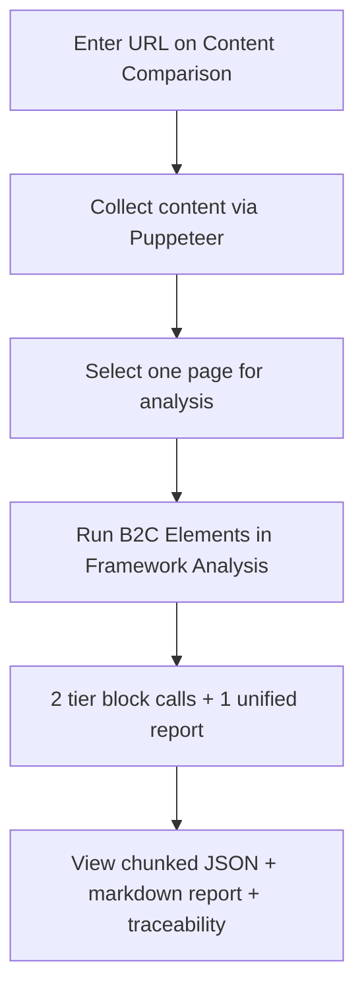
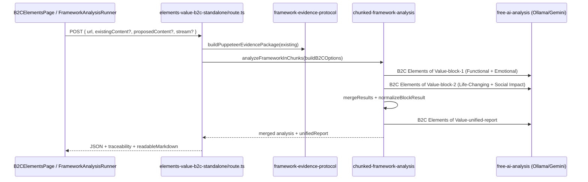

# B2C Elements of Value Assessment — Complete Guide

**Version:** 2.0 (Flat Fractional Scoring)  
**Last updated:** June 2026  
**Audience:** Product owners, analysts, and engineers working with the Zero Barriers Growth Accelerator B2C Elements of Value assessment.

---

## Scoring authority (read this first)

**Production scoring is flat fractional only (0.0–1.0).** The sole authority for how to score, the rating bands, the calculation tables, and the tier/element structure is:

**[`docs/frameworks/B2C-Elements-Value-Flat-Scoring.md`](../frameworks/B2C-Elements-Value-Flat-Scoring.md)**

That file is injected into every AI block prompt (first 12,000 characters). Nothing in this guide overrides it.

| Document | Role |
|----------|------|
| `B2C-Elements-Value-Flat-Scoring.md` | **Scoring + structure** — use this for all score interpretation |
| `B2C_ELEMENTS_OF_VALUE_COMPLETE.md` | **Definitions + Bain examples only** — its 1–10 tables are **not** used by the runtime assessment |

No scoring logic was changed to produce these guides. If any other doc disagrees with the flat-scoring doc, **trust the flat-scoring doc**.

**Design rationale:** Flat-scoring md is purpose-built for **website brand signals** (what the company says and implies). The archived Bain complete doc adds definitions, examples, and synonyms — not an alternate 1–10 scoring method. Overall score = sum of 30 element scores ÷ 30. Keyword hints live in `B2C_ELEMENTS` (`element-definitions.ts`) as supplementary recognition aids. See [guides README](./README.md#why-flat-scoring-not-the-complete-reference-scales).

---

## Table of Contents

1. [What This Assessment Does](#1-what-this-assessment-does)
2. [Official B2C Elements of Value References](#2-official-b2c-elements-of-value-references)
3. [The 30 Elements and Four Tiers](#3-the-30-elements-and-four-tiers)
4. [Scoring Methodology](#4-scoring-methodology)
5. [How We Apply B2C Elements to Website Content](#5-how-we-apply-b2c-elements-to-website-content)
6. [User Workflows](#6-user-workflows)
7. [End-to-End Pipeline](#7-end-to-end-pipeline)
8. [Prompt Construction](#8-prompt-construction)
9. [API Contract](#9-api-contract)
10. [Response Structure](#10-response-structure)
11. [Integrity and Completeness Checks](#11-integrity-and-completeness-checks)
12. [Code and Documentation Reference Index](#12-code-and-documentation-reference-index)
13. [Dual Analysis Paths (Chunked vs Enhanced)](#13-dual-analysis-paths-chunked-vs-enhanced)
14. [Known Drift and Documentation Gaps](#14-known-drift-and-documentation-gaps)
15. [Environment and Performance](#15-environment-and-performance)
16. [Troubleshooting](#16-troubleshooting)
17. [Testing](#17-testing)
18. [Annotated Bibliography](#18-annotated-bibliography)
19. [Per-Element Reference Catalog](#19-per-element-reference-catalog)
20. [Implementation & Prompt File Reference](#20-implementation--prompt-file-reference)

---

## 1. What This Assessment Does

The B2C Elements of Value assessment evaluates **consumer value propositions** on a website (or pasted content) against Bain & Company’s **30-element B2C value pyramid**, grounded in Maslow’s hierarchy of needs.

The platform:

- Reads **public website content** collected by Puppeteer (product claims, pricing, social proof, lifestyle imagery, cause marketing, etc.)
- Scores **all 30 elements** using **flat fractional scoring** (0.0–1.0 per element, no weights)
- Produces **per-element evidence**, **tier averages**, an **overall score**, and a **unified markdown report**
- Supports **existing vs proposed content** comparison when proposed copy is supplied

**Core concept (Bain & Company):** Consumers perceive value across a pyramid — from functional utility through emotional fulfillment, life-changing impact, and social transcendence at the peak. Companies delivering more elements can command premium pricing and loyalty.

**Research foundation:** Bain’s original study surveyed **8,000+ consumers** across **50 US companies** to validate the pyramid ([B2C-2], [B2C-INT-1]).

---

## 2. Official B2C Elements of Value References

> **Start here for deep research:** Section [19](#19-per-element-reference-catalog) maps every runtime element to archived doc line numbers, Bain examples, and keywords. Section [18](#18-annotated-bibliography) is the full numbered bibliography.

### External (official) sources

| Ref | Resource | URL |
|-----|----------|-----|
| [B2C-1] | Bain — Elements of Value (interactive B2C pyramid) | https://media.bain.com/elements-of-value/ |
| [B2C-2] | Almquist, Senior, Bloch — *The Elements of Value* (HBR, September 2016) | https://hbr.org/2016/09/the-elements-of-value |
| [B2C-3] | Bain — *The Elements of Value* (insight hub) | https://www.bain.com/insights/the-elements-of-value/ |
| [B2C-4] | Bain — B2B Elements of Value (enterprise extension of same research lineage) | https://media.bain.com/b2b-eov/ |
| [B2C-5] | Maslow, A. H. — *A Theory of Human Motivation* (1943) | Conceptual basis for pyramid tiers |

### Internal reference documents

| Ref | Document | Purpose |
|-----|----------|---------|
| [B2C-INT-1] | [`docs/archived/B2C_ELEMENTS_OF_VALUE_COMPLETE.md`](../archived/B2C_ELEMENTS_OF_VALUE_COMPLETE.md) | **Definitions only** — Bain definitions, examples, industry rankings (~1,048 lines). **Do not use its 1–10 scoring tables for production.** |
| [B2C-INT-2] | [`docs/frameworks/B2C-Elements-Value-Flat-Scoring.md`](../frameworks/B2C-Elements-Value-Flat-Scoring.md) | **Scoring authority** — flat 0.0–1.0 bands, calculation tables, tier structure; injected into every block prompt |
| [B2C-INT-3] | [`docs/archived/COMPLETE_FRAMEWORK_INDEX.md`](../archived/COMPLETE_FRAMEWORK_INDEX.md) | Master index of all framework docs in this repo |
| [B2C-INT-4] | [`docs/guides/README.md`](./README.md) | Assessment guides index |
| [B2C-INT-5] | [`.cursorrules`](../../.cursorrules) | Project-wide B2C element inventory |
| [B2C-INT-6] | [`docs/PAGE_WORKFLOWS.md`](../PAGE_WORKFLOWS.md) | Dashboard workflow for `/dashboard/elements-value-b2c` |
| [B2C-INT-7] | [`docs/LOCAL_RUNBOOK.md`](../LOCAL_RUNBOOK.md) | Local Ollama/dev setup |
| [B2C-INT-8] | [`docs/guides/B2B_ELEMENTS_ASSESSMENT_GUIDE.md`](./B2B_ELEMENTS_ASSESSMENT_GUIDE.md) | Sister guide — enterprise B2B pyramid |
| [B2C-INT-9] | [`docs/guides/CLIFTONSTRENGTHS_ASSESSMENT_GUIDE.md`](./CLIFTONSTRENGTHS_ASSESSMENT_GUIDE.md) | Sister guide — organizational strengths |

---

## 3. The 30 Elements and Four Tiers

The **production chunked path** organizes 30 elements into **four tiers** (categories). Slugs use **snake_case** in JSON responses and chunk definitions.

| Tier | Category key | Elements | Count | Consumer question |
|------|--------------|----------|-------|-------------------|
| 1 | `functional` | Practical utility & convenience | 14 | Does this solve my everyday problem efficiently? |
| 2 | `emotional` | Feelings, aesthetics, well-being | 10 | How does this make me feel? |
| 3 | `life_changing` | Transformation, belonging, legacy | 5 | Does this change my life or identity? |
| 4 | `social_impact` | Greater good | 1 | Does this help society beyond me? |

### Tier 1: Functional (14)

| # | Element | Slug |
|---|---------|------|
| 1 | Saves Time | `saves_time` |
| 2 | Simplifies | `simplifies` |
| 3 | Makes Money | `makes_money` |
| 4 | Reduces Effort | `reduces_effort` |
| 5 | Reduces Cost | `reduces_cost` |
| 6 | Reduces Risk | `reduces_risk` |
| 7 | Organizes | `organizes` |
| 8 | Integrates | `integrates` |
| 9 | Connects | `connects` |
| 10 | Quality | `quality` |
| 11 | Variety | `variety` |
| 12 | Informs | `informs` |
| 13 | Avoids Hassles | `avoids_hassles` |
| 14 | Sensory Appeal | `sensory_appeal` |

### Tier 2: Emotional (10)

| # | Element | Slug |
|---|---------|------|
| 1 | Reduces Anxiety | `reduces_anxiety` |
| 2 | Rewards Me | `rewards_me` |
| 3 | Nostalgia | `nostalgia` |
| 4 | Design / Aesthetics | `design_aesthetics` |
| 5 | Badge Value | `badge_value` |
| 6 | Wellness | `wellness` |
| 7 | Therapeutic Value | `therapeutic` |
| 8 | Fun / Entertainment | `fun_entertainment` |
| 9 | Attractiveness | `attractiveness` |
| 10 | Provides Access | `provides_access` |

### Tier 3: Life-Changing (5)

| # | Element | Slug (canonical) | Slug (route drift) |
|---|---------|------------------|------------------|
| 1 | Provides Hope | `provides_hope` | `provides_hope` |
| 2 | Self-Actualization | `self_actualization` | `self_actualization` |
| 3 | Motivation | `motivation` | `motivation` |
| 4 | Heirloom | `heirloom` | `heirloom` |
| 5 | Affiliation & Belonging | `affiliation` | `affiliation_belonging` ⚠️ |

### Tier 4: Social Impact (1)

| # | Element | Slug |
|---|---------|------|
| 1 | Self-Transcendence | `self_transcendence` |

---

## 4. Scoring Methodology

**Copied from the scoring authority** [`B2C-Elements-Value-Flat-Scoring.md`](../frameworks/B2C-Elements-Value-Flat-Scoring.md). Do not substitute any other scale.

### Scoring scale (from flat-scoring doc)

| Score range | Rating | Meaning |
|-------------|--------|---------|
| 0.8 – 1.0 | **Excellent** | Best-in-class, exceptional delivery |
| 0.6 – 0.79 | **Good** | Above average, solid performance |
| 0.4 – 0.59 | **Needs Work** | Below average, requires attention |
| 0.0 – 0.39 | **Poor** | Weak or non-existent |

### Calculation method (from flat-scoring doc)

```
OVERALL SCORE = Sum of all 30 element scores ÷ 30

TIER SCORE    = Sum of elements in tier ÷ Number of elements in tier
```

**No weights.** Every element counts equally.

---

## 5. How We Apply B2C Elements to Website Content

Website copy is **proxy evidence** for consumer value delivery:

| Evidence stream | Source | Elements commonly signaled |
|-----------------|--------|---------------------------|
| Speed / convenience claims | Hero, feature bullets | `saves_time`, `simplifies`, `reduces_effort`, `avoids_hassles` |
| Pricing & deals | Pricing blocks, promos | `reduces_cost`, `rewards_me` |
| Quality & guarantees | Product pages, warranties | `quality`, `reduces_risk`, `reduces_anxiety` |
| Visual design | Imagery, layout selectors | `design_aesthetics`, `sensory_appeal`, `attractiveness` |
| Loyalty / VIP programs | Membership copy | `provides_access`, `badge_value` |
| Community / UGC | Social proof, forums | `connects`, `affiliation` |
| Cause marketing | Mission, sustainability | `self_transcendence` |
| Aspirational messaging | Brand story | `provides_hope`, `self_actualization`, `motivation` |
| Heritage / legacy | About pages | `heirloom`, `nostalgia` |

Evidence normalization: [`src/lib/framework-evidence-protocol.ts`](../../src/lib/framework-evidence-protocol.ts).

Per-element keyword hints: [`src/lib/elements/element-definitions.ts`](../../src/lib/elements/element-definitions.ts) → `B2C_ELEMENTS`.

### Industry context (archived research)

[`B2C_ELEMENTS_OF_VALUE_COMPLETE.md`](../archived/B2C_ELEMENTS_OF_VALUE_COMPLETE.md) includes **top-5 element rankings for 10 industries** (apparel, discount retail, grocery, food & beverage, smartphones, TV, banking, brokerage, auto insurance, credit cards) — see [L893](../archived/B2C_ELEMENTS_OF_VALUE_COMPLETE.md#L893) onward.

---

## 6. User Workflows

### Primary UI entry points

| Route | Component | API endpoint |
|-------|-----------|--------------|
| `/dashboard/elements-value-b2c` | `B2CElementsPage` | `/api/analyze/elements-value-b2c-standalone` |
| Content Comparison → Framework Analysis tab | `FrameworkAnalysisRunner` | Same endpoint via `framework-analysis-entrypoint` |
| Workspace shortcut | — | `/dashboard/elements-value-b2c` |

### Typical flow (recommended)



1. **Collect** — Puppeteer gathers page content. Collection does **not** call Ollama/Gemini.
2. **Select page** — By default, one primary page is analyzed (homepage or entered URL).
3. **Analyze** — Chunked AI runs tier blocks, then unified synthesis.
4. **Review** — Results include per-element scores, evidence, `verification.completeness_check`, and `readableMarkdown`.

### Standalone page flow

[`src/components/analysis/B2CElementsPage.tsx`](../../src/components/analysis/B2CElementsPage.tsx) uses `useFrameworkPageAnalysis`:

- Enter URL (required)
- Optionally paste **proposed content** for comparison
- Optionally paste **scraped JSON** to skip re-collection
- Stream progress per tier block

### Workflow documentation

See [`docs/PAGE_WORKFLOWS.md`](../PAGE_WORKFLOWS.md) — section `/dashboard/elements-value-b2c`.

---

## 7. End-to-End Pipeline

### Architecture diagram



### Key implementation files

| Step | File |
|------|------|
| API route | [`src/app/api/analyze/elements-value-b2c-standalone/route.ts`](../../src/app/api/analyze/elements-value-b2c-standalone/route.ts) |
| Chunk orchestration | [`src/lib/chunked-framework-analysis.ts`](../../src/lib/chunked-framework-analysis.ts) |
| Canonical chunk list | [`src/lib/framework/chunk-definitions.ts`](../../src/lib/framework/chunk-definitions.ts) → `B2C_CHUNK_CONFIG` |
| AI provider | [`src/lib/free-ai-analysis.ts`](../../src/lib/free-ai-analysis.ts) |
| Streaming wrapper | [`src/lib/streaming-analysis.ts`](../../src/lib/streaming-analysis.ts) |
| Client hook | [`src/hooks/useFrameworkPageAnalysis.ts`](../../src/hooks/useFrameworkPageAnalysis.ts) |
| Client streaming | [`src/hooks/useChunkedAnalysis.ts`](../../src/hooks/useChunkedAnalysis.ts) |
| Framework router | [`src/lib/framework-analysis-entrypoint.ts`](../../src/lib/framework-analysis-entrypoint.ts) |

### Chunk configuration & AI call count

The B2C route does **not** set `categoriesPerBlock`. With **30 elements** (≤ 34 threshold) and typical content length, `chooseCategoriesPerBlock()` defaults to **`2` categories per block**:

```
Block 1: Functional (14) + Emotional (10)  ← 24 elements in one prompt
Block 2: Life-Changing (5) + Social Impact (1)
```

**Total AI calls (typical):** 3 (2 blocks + 1 unified report).

If `contentText` exceeds **7,000 characters**, `categoriesPerBlock` auto-switches to **`1`**, producing **5 blocks + unified = 6 calls**:

```
Block 1: Functional (14)
Block 2: Emotional (10)
Block 3: Life-Changing (5)
Block 4: Social Impact (1)
Block 5: (n/a — only 4 chunks)
```

With 4 chunks and block size 1 → 4 blocks + 1 unified = **5 calls**.

**Analysis type labels:**

- `B2C Elements of Value-block-1` … `B2C Elements of Value-block-N`
- `B2C Elements of Value-unified-report`

---

## 8. Prompt Construction

Each block prompt is built by `buildBlockPrompt()` in [`src/lib/chunked-framework-analysis.ts`](../../src/lib/chunked-framework-analysis.ts).

### Prompt ingredients

| Section | Source | Notes |
|---------|--------|-------|
| Framework markdown | `docs/frameworks/B2C-Elements-Value-Flat-Scoring.md` | Truncated to **12,000 characters** |
| Website content summary | `buildContentSummary()` | URL, title, meta, keywords, **first 1,500 chars** of content |
| Evidence protocol | Prepended to `contentText` in `buildB2COptions()` | CTAs, headlines, testimonials, etc. |
| Tier + element list | Per-block chunk definition | Exact slugs the model must score |
| **Recognition keyword hints** | `element-keyword-hints.ts` ← `B2C_ELEMENTS` | Per-element keywords + descriptions; supplementary only |
| Scoring rubric | Flat-scoring md (injected above) | Never overridden by keyword hints |
| JSON schema | Inline in prompt | `categories.{tier}.elements.{slug}` |

### Block prompt template (abbreviated)

```
You are analyzing website content using the B2C Elements of Value framework.
Evaluate EVERY element listed below. Do not skip any element.

FRAMEWORK MARKDOWN (SOURCE OF TRUTH):
{first 12k of B2C-Elements-Value-Flat-Scoring.md}

WEBSITE CONTENT:
URL: ...
Content (first 1500 chars): ...

CATEGORIES IN THIS BLOCK:
- Functional (functional): saves_time, simplifies, ...

SCORING:
Score each element 0.0-1.0 (flat fractional scoring): ...

Return ONLY valid JSON in this exact format:
{ "categories": { "functional": { "categoryScore": 0.0, "elements": { ... } } } }
```

### Unified report prompt

`buildUnifiedReportWithOllama()` synthesizes markdown: Executive Summary, What Is Working, What Needs Improvement, Prioritized Action Plan, Risk Notes.

### AI failure fallback

[`src/lib/framework-fallback-generator.ts`](../../src/lib/framework-fallback-generator.ts) → `generateFrameworkFallbackMarkdown({ framework: 'b2c-elements', ... })`.

---

## 9. API Contract

### Endpoint

```
POST /api/analyze/elements-value-b2c-standalone
```

**`maxDuration`:** 300 seconds (Vercel serverless).

### Request body

```json
{
  "url": "https://example.com",
  "proposedContent": "optional proposed copy string",
  "existingContent": { "title": "...", "cleanText": "...", "seo": { ... } },
  "analysisType": "full",
  "stream": true
}
```

| Field | Required | Description |
|-------|----------|-------------|
| `url` | Yes | Target consumer brand / product URL |
| `existingContent` | No | Pre-collected payload from Content Comparison / LocalForage |
| `proposedContent` | No | Proposed copy for side-by-side comparison |
| `stream` | No | `true` enables SSE progress events |
| `analysisType` | No | Reserved; currently `"full"` |

### Content sourcing priority

1. Client-provided `existingContent` (preferred)
2. Vercel production: `ProductionContentExtractor`
3. Local dev: Puppeteer via compare/collection path

---

## 10. Response Structure

### Top-level success payload

```json
{
  "success": true,
  "existing": { "title": "...", "cleanText": "...", "url": "..." },
  "proposed": null,
  "analysis": { ... },
  "readableMarkdown": "# Executive Summary\n...",
  "traceability": { ... },
  "puppeteerEvidence": { ... },
  "message": "B2C Elements analysis completed"
}
```

### `analysis` object (chunked result)

| Field | Type | Description |
|-------|------|-------------|
| `framework` | string | `"B2C Elements of Value"` |
| `url` | string | Analyzed URL |
| `overallScore` | number | 0.0–1.0 mean of all 30 elements |
| `totalElements` | number | Should be 30 |
| `categories` | object | Keyed by `categoryKey` |
| `topStrengths` | array | Up to 5 elements with score ≥ 0.7 |
| `criticalGaps` | array | Up to 5 elements with score < 0.4 |
| `verification` | object | Completeness metadata |
| `chunkedReport` | string | Markdown from merge step |
| `unifiedReport` | string | AI-synthesized executive report |
| `analysisMethod` | string | `"chunked-blocked"` |
| `blockCount` | number | Number of AI block calls |

### Per-element shape

```json
{
  "score": 0.72,
  "evidence": "Homepage promises delivery in under 24 hours...",
  "recommendation": "Add quantified time-savings data to hero section."
}
```

---

## 11. Integrity and Completeness Checks

### Automated test coverage

[`src/test/framework/element-completeness.test.ts`](../../src/test/framework/element-completeness.test.ts) asserts:

- **30** expected elements
- **4** tier categories
- Chunk list matches `B2C_CHUNK_CONFIG`
- No duplicates; definitions align with `B2C_ELEMENTS`

Validator: [`src/lib/framework/element-completeness.ts`](../../src/lib/framework/element-completeness.ts).

### Runtime verification (per analysis)

```json
{
  "verification": {
    "total_elements_in_framework": 30,
    "total_elements_analyzed": 30,
    "completeness_check": "pass",
    "all_elements_accounted_for": true,
    "breakdown": { "present": 11, "partial": 14, "missing": 5, "total": 30 }
  }
}
```

`normalizeBlockResult()` fills missing elements with score `0` and evidence `"Not found"`.

---

## 12. Code and Documentation Reference Index

### Runtime (chunked path)

| Asset | Path |
|-------|------|
| API route | `src/app/api/analyze/elements-value-b2c-standalone/route.ts` |
| Chunk config (canonical) | `src/lib/framework/chunk-definitions.ts` → `B2C_CHUNK_CONFIG` |
| Chunk orchestration | `src/lib/chunked-framework-analysis.ts` |
| Element definitions + keywords | `src/lib/elements/element-definitions.ts` → `B2C_ELEMENTS` |
| Flat scoring spec (prompts) | `docs/frameworks/B2C-Elements-Value-Flat-Scoring.md` |
| Evidence protocol | `src/lib/framework-evidence-protocol.ts` |
| UI (standalone) | `src/components/analysis/B2CElementsPage.tsx` |
| Dashboard route | `src/app/dashboard/elements-value-b2c/page.tsx` |
| Framework runner | `src/components/analysis/FrameworkAnalysisRunner.tsx` |
| Client entrypoint | `src/lib/framework-analysis-entrypoint.ts` |
| Completeness validator | `src/lib/framework/element-completeness.ts` |

### Reference / archival

| Asset | Path |
|-------|------|
| Full element encyclopedia | `docs/archived/B2C_ELEMENTS_OF_VALUE_COMPLETE.md` |
| Page workflows | `docs/PAGE_WORKFLOWS.md` |
| Local dev runbook | `docs/LOCAL_RUNBOOK.md` |

### Enhanced / legacy path

| Asset | Path |
|-------|------|
| Assessment rules (0–100 schema) | `src/lib/ai-engines/assessment-rules/elements-value-b2c-rules.json` |
| Framework knowledge JSON | `src/lib/ai-engines/framework-knowledge/elements-value-b2c-framework.json` |
| Enhanced route | `src/app/api/analyze/enhanced/b2c-elements/route.ts` |
| Individual route | `src/app/api/analyze/individual/b2c-elements/route.ts` |
| Service layer | `src/lib/services/elements-value-b2c.service.ts` |
| Saved analysis retrieval | `src/app/api/analysis/elements-value-b2c/[id]/route.ts` |

---

## 13. Dual Analysis Paths (Chunked vs Enhanced)

| Aspect | Chunked (production) | Enhanced (legacy) |
|--------|----------------------|-------------------|
| Entry | `/api/analyze/elements-value-b2c-standalone` | `/api/analyze/enhanced/b2c-elements`, individual routes |
| Scoring | 0.0–1.0 flat fractional | 0–100 integer (per rules JSON) |
| Prompt source | `B2C-Elements-Value-Flat-Scoring.md` | `elements-value-b2c-rules.json` |
| Theme knowledge | Injected markdown | `elements-value-b2c-framework.json` |
| Completeness test | Yes (`b2c-elements` key) | No automated parity check |
| Revenue framing | General value scoring | Premium pricing / CLV / revenue opportunity fields |

---

## 14. Code Inventory Bugs (not scoring changes)

**Scoring is not negotiable** — it comes only from [`B2C-Elements-Value-Flat-Scoring.md`](../frameworks/B2C-Elements-Value-Flat-Scoring.md). This section documents **slug-list bugs** in code, not alternate scoring.

### Known slug bug

`buildB2COptions()` uses `affiliation_belonging` but the flat-scoring doc and `B2C_CHUNK_CONFIG` use `affiliation`. Fix the route to match the flat-scoring tier tables.

### What to align to

When fixing inventory bugs, align code to the **tier and element tables in the flat-scoring doc** — not to archived 1–10 scoring sections or informal rule text.

### Archived doc role

[`B2C_ELEMENTS_OF_VALUE_COMPLETE.md`](../archived/B2C_ELEMENTS_OF_VALUE_COMPLETE.md) is for **definitions, synonyms, and Bain examples only**. Its 1–10 scoring tables are not used in production.

---

## 15. Environment and Performance

| Variable | Purpose |
|----------|---------|
| `AI_PROVIDER` | `ollama` (local) or cloud provider |
| `OLLAMA_BASE_URL` | e.g. `http://127.0.0.1:11434` |
| `OLLAMA_MODEL` | e.g. `llama3.1:8b` |
| `OLLAMA_NUM_PREDICT` | Max tokens per call |
| `GEMINI_API_KEY` | Fallback when Ollama fails |
| `AI_ALLOW_FALLBACKS` | Enable Gemini fallback |

See [`docs/LOCAL_RUNBOOK.md`](../LOCAL_RUNBOOK.md).

### Performance characteristics

| Factor | Impact |
|--------|--------|
| Default 2-block mode | Block 1 scores **24 elements** (Functional + Emotional) — heaviest prompt |
| 3 AI calls (typical) | Faster than B2B (6 calls) or Clifton (5 calls) |
| 1,500-char content cap | May miss deep-page value proof |
| Long content (>7k chars) | Switches to 1 category/block → up to 5 calls |

---

## 16. Troubleshooting

| Symptom | Likely cause | What to check |
|---------|--------------|---------------|
| `completeness_check: fail` | Block error or `affiliation_belonging` slug drift | `analysis.errors`; compare route slugs to `B2C_CHUNK_CONFIG` |
| Block 1 timeout | 24 elements in one prompt | Shorten content; use `categoriesPerBlock: 1` in `buildB2COptions` |
| All scores `0` | Ollama unreachable | `OLLAMA_BASE_URL`, `ollama serve` |
| Thin emotional scores | Functional-heavy homepage only | Analyze lifestyle/brand page; pass richer `existingContent` |
| Unified report is raw JSON | Ollama JSON vs markdown conflict | Use `chunkedReport` fallback |

---

## 17. Testing

| Test | Location | What it validates |
|------|----------|-------------------|
| Element completeness | `src/test/framework/element-completeness.test.ts` | 30 elements, 4 tiers |
| Primary page picker | `src/test/framework/pick-primary-page.test.ts` | Single-page default |
| Content collection config | `src/test/framework/content-collection-config.test.ts` | Collection defaults |

```bash
npm run test -- src/test/framework/element-completeness.test.ts
npm run type-check
```

---

## 18. Annotated Bibliography

### External sources

| ID | Citation | Used for |
|----|----------|----------|
| [B2C-1] | Bain & Company. (n.d.). *Elements of Value* (interactive pyramid). https://media.bain.com/elements-of-value/ | Canonical 30-element B2C pyramid |
| [B2C-2] | Almquist, E., Senior, J., & Bloch, N. (2016). *The Elements of Value*. Harvard Business Review, September 2016. https://hbr.org/2016/09/the-elements-of-value | Original research; 8,000+ consumer survey |
| [B2C-3] | Bain & Company. (n.d.). *The Elements of Value* (insights). https://www.bain.com/insights/the-elements-of-value/ | Framework application guidance |
| [B2C-4] | Bain & Company. (n.d.). *B2B Elements of Value*. https://media.bain.com/b2b-eov/ | Enterprise extension of value pyramid research |
| [B2C-5] | Maslow, A. H. (1943). *A Theory of Human Motivation*. Psychological Review, 50(4), 370–396. | Conceptual tier hierarchy |

### Internal implementation sources

| ID | File | Role in assessment |
|----|------|-------------------|
| [B2C-INT-1] | `docs/archived/B2C_ELEMENTS_OF_VALUE_COMPLETE.md` | Per-element Bain definitions, examples, industry rankings |
| [B2C-INT-2] | `docs/frameworks/B2C-Elements-Value-Flat-Scoring.md` | Injected into AI block prompts (≤12k chars) |
| [B2C-INT-3] | `src/lib/framework/chunk-definitions.ts` → `B2C_CHUNK_CONFIG` | Canonical 30-element chunk manifest |
| [B2C-INT-4] | `src/lib/elements/element-definitions.ts` → `B2C_ELEMENTS` | Keyword hints |
| [B2C-INT-5] | `src/app/api/analyze/elements-value-b2c-standalone/route.ts` | Production API; `buildB2COptions()` |
| [B2C-INT-6] | `src/lib/chunked-framework-analysis.ts` | Prompt builder, merge, unified report |
| [B2C-INT-7] | `src/lib/framework-evidence-protocol.ts` | Puppeteer evidence → prompt preamble |
| [B2C-INT-8] | `src/test/framework/element-completeness.test.ts` | Automated 30-element integrity test |

---

## 19. Per-Element Reference Catalog

Runtime elements from `B2C_CHUNK_CONFIG` (30 total). **Archived doc** line numbers point to `B2C_ELEMENTS_OF_VALUE_COMPLETE.md` (Bain pyramid order, top → bottom).

### Tier 1: Functional (14)

| Slug | Element | Block (default) | Archived doc (line) | Keywords (sample) |
|------|---------|-----------------|---------------------|-------------------|
| `saves_time` | Saves Time | 1 | [L485](../archived/B2C_ELEMENTS_OF_VALUE_COMPLETE.md#L485) | fast, quick, instant, efficient, time-saving |
| `simplifies` | Simplifies | 1 | [L514](../archived/B2C_ELEMENTS_OF_VALUE_COMPLETE.md#L514) | simple, easy, straightforward, user-friendly |
| `makes_money` | Makes Money | 1 | [L543](../archived/B2C_ELEMENTS_OF_VALUE_COMPLETE.md#L543) | earn, income, profit, revenue, money |
| `reduces_effort` | Reduces Effort | 1 | [L688](../archived/B2C_ELEMENTS_OF_VALUE_COMPLETE.md#L688) | effortless, easy, minimal effort |
| `reduces_cost` | Reduces Cost | 1 | [L746](../archived/B2C_ELEMENTS_OF_VALUE_COMPLETE.md#L746) | affordable, cheap, budget, cost-effective |
| `reduces_risk` | Reduces Risk | 1 | [L572](../archived/B2C_ELEMENTS_OF_VALUE_COMPLETE.md#L572) | safe, secure, guaranteed, risk-free |
| `organizes` | Organizes | 1 | [L601](../archived/B2C_ELEMENTS_OF_VALUE_COMPLETE.md#L601) | organized, structured, systematic, orderly |
| `integrates` | Integrates | 1 | [L630](../archived/B2C_ELEMENTS_OF_VALUE_COMPLETE.md#L630) | integrates, unified, seamless, compatible |
| `connects` | Connects | 1 | [L659](../archived/B2C_ELEMENTS_OF_VALUE_COMPLETE.md#L659) | connect, link, network, community, social |
| `quality` | Quality | 1 | [L775](../archived/B2C_ELEMENTS_OF_VALUE_COMPLETE.md#L775) | quality, premium, excellent, superior |
| `variety` | Variety | 1 | [L804](../archived/B2C_ELEMENTS_OF_VALUE_COMPLETE.md#L804) | variety, options, choices, selection |
| `informs` | Informs | 1 | [L862](../archived/B2C_ELEMENTS_OF_VALUE_COMPLETE.md#L862) | informative, educational, insights, knowledge |
| `avoids_hassles` | Avoids Hassles | 1 | [L717](../archived/B2C_ELEMENTS_OF_VALUE_COMPLETE.md#L717) | hassle-free, convenient, smooth, painless |
| `sensory_appeal` | Sensory Appeal | 1 | [L833](../archived/B2C_ELEMENTS_OF_VALUE_COMPLETE.md#L833) | beautiful, stunning, elegant, stylish |

### Tier 2: Emotional (10)

| Slug | Element | Block (default) | Archived doc (line) | Keywords (sample) |
|------|---------|-----------------|---------------------|-------------------|
| `reduces_anxiety` | Reduces Anxiety | 1 | [L193](../archived/B2C_ELEMENTS_OF_VALUE_COMPLETE.md#L193) | calming, soothing, reassuring, comforting |
| `rewards_me` | Rewards Me | 1 | [L222](../archived/B2C_ELEMENTS_OF_VALUE_COMPLETE.md#L222) | rewards, incentives, bonuses, perks |
| `nostalgia` | Nostalgia | 1 | [L251](../archived/B2C_ELEMENTS_OF_VALUE_COMPLETE.md#L251) | nostalgic, memories, retro, classic, vintage |
| `design_aesthetics` | Design / Aesthetics | 1 | [L280](../archived/B2C_ELEMENTS_OF_VALUE_COMPLETE.md#L280) | beautiful, stunning, elegant, design |
| `badge_value` | Badge Value | 1 | [L309](../archived/B2C_ELEMENTS_OF_VALUE_COMPLETE.md#L309) | status, prestige, exclusive, elite, luxury |
| `wellness` | Wellness | 1 | [L338](../archived/B2C_ELEMENTS_OF_VALUE_COMPLETE.md#L338) | healthy, wellness, fitness, well-being |
| `therapeutic` | Therapeutic Value | 1 | [L367](../archived/B2C_ELEMENTS_OF_VALUE_COMPLETE.md#L367) | healing, therapeutic, relaxing, stress-relief |
| `fun_entertainment` | Fun / Entertainment | 1 | [L396](../archived/B2C_ELEMENTS_OF_VALUE_COMPLETE.md#L396) | fun, entertaining, enjoyable, exciting |
| `attractiveness` | Attractiveness | 1 | [L425](../archived/B2C_ELEMENTS_OF_VALUE_COMPLETE.md#L425) | beautiful, attractive, stunning, gorgeous |
| `provides_access` | Provides Access | 1 | [L454](../archived/B2C_ELEMENTS_OF_VALUE_COMPLETE.md#L454) | exclusive, membership, VIP, special, insider |

### Tier 3: Life-Changing (5)

| Slug (canonical) | Element | Block (default) | Archived doc (line) | Keywords (sample) |
|------------------|---------|-----------------|---------------------|-------------------|
| `provides_hope` | Provides Hope | 2 | [L45](../archived/B2C_ELEMENTS_OF_VALUE_COMPLETE.md#L45) | hope, future, potential, possibility, dream |
| `self_actualization` | Self-Actualization | 2 | [L74](../archived/B2C_ELEMENTS_OF_VALUE_COMPLETE.md#L74) | potential, growth, development, achievement |
| `motivation` | Motivation | 2 | [L103](../archived/B2C_ELEMENTS_OF_VALUE_COMPLETE.md#L103) | motivating, inspiring, encouraging, empowering |
| `heirloom` | Heirloom | 2 | [L132](../archived/B2C_ELEMENTS_OF_VALUE_COMPLETE.md#L132) | legacy, lasting, timeless, enduring, heritage |
| `affiliation` | Affiliation & Belonging | 2 | [L161](../archived/B2C_ELEMENTS_OF_VALUE_COMPLETE.md#L161) | belonging, community, family, group, team |

> **Route drift:** `buildB2COptions()` uses `affiliation_belonging` instead of `affiliation`. See [§14](#14-known-drift-and-documentation-gaps).

### Tier 4: Social Impact (1)

| Slug | Element | Block (default) | Archived doc (line) | Keywords (sample) |
|------|---------|-----------------|---------------------|-------------------|
| `self_transcendence` | Self-Transcendence | 2 | [L13](../archived/B2C_ELEMENTS_OF_VALUE_COMPLETE.md#L13) | greater good, impact, change, difference, purpose |

### Additional archived reference sections

| Topic | Archived doc (line) | Content |
|-------|---------------------|---------|
| Industry top-5 rankings | [L893](../archived/B2C_ELEMENTS_OF_VALUE_COMPLETE.md#L893) | 10 industries × top 5 elements |
| Strategic insights | [L985](../archived/B2C_ELEMENTS_OF_VALUE_COMPLETE.md#L985) | Multi-element power, measurement |
| AI scoring guidance (1–10) | [L1001](../archived/B2C_ELEMENTS_OF_VALUE_COMPLETE.md#L1001) | Legacy detailed scoring bands |
| Evidence quality hierarchy | [L1014](../archived/B2C_ELEMENTS_OF_VALUE_COMPLETE.md#L1014) | Strongest → weakest evidence |
| Quick tier list | [L1032](../archived/B2C_ELEMENTS_OF_VALUE_COMPLETE.md#L1032) | All 30 elements by tier |

---

## 20. Implementation & Prompt File Reference

### API & chunk wiring

| Concern | File | Symbol / function |
|---------|------|-------------------|
| HTTP entry | `src/app/api/analyze/elements-value-b2c-standalone/route.ts` | `POST`, `buildB2COptions()` |
| Chunk manifest (canonical) | `src/lib/framework/chunk-definitions.ts` | `B2C_CHUNK_CONFIG` |
| Chunk manifest (route copy) | `src/app/api/analyze/elements-value-b2c-standalone/route.ts` | `buildB2COptions().chunks` — **drifts** on `affiliation` slug |
| Analysis engine | `src/lib/chunked-framework-analysis.ts` | `analyzeFrameworkInChunks()` |
| Keyword hint builder | `src/lib/framework/element-keyword-hints.ts` | `formatKeywordHintsSection()` |
| Block prompt builder | `src/lib/chunked-framework-analysis.ts` | `buildBlockPrompt()` |
| Markdown loader | `src/lib/chunked-framework-analysis.ts` | `loadFrameworkMarkdown()` → `B2C-Elements-Value-Flat-Scoring.md` |
| Content truncation | `src/lib/chunked-framework-analysis.ts` | `buildContentSummary()` — 1,500 chars |
| Block sizing | `src/lib/chunked-framework-analysis.ts` | `chooseCategoriesPerBlock()` — default 2 for B2C |
| Merge + verification | `src/lib/chunked-framework-analysis.ts` | `mergeResults()`, `normalizeBlockResult()` |
| Unified report | `src/lib/chunked-framework-analysis.ts` | `buildUnifiedReportWithOllama()` |
| Evidence package | `src/lib/framework-evidence-protocol.ts` | `buildPuppeteerEvidencePackage()`, `formatEvidenceForPrompt()` |
| AI calls | `src/lib/free-ai-analysis.ts` | `analyzeWithAI()` |
| Streaming SSE | `src/lib/streaming-analysis.ts` | `streamChunkedAnalysis()` |

### AI analysis type labels (default 2-block mode)

| Call order | `analysisType` string | Elements scored |
|------------|----------------------|-----------------|
| 1 | `B2C Elements of Value-block-1` | Functional (14) + Emotional (10) |
| 2 | `B2C Elements of Value-block-2` | Life-Changing (5) + Social Impact (1) |
| 3 | `B2C Elements of Value-unified-report` | Synthesis only |

### Enhanced / legacy path

| File | Role |
|------|------|
| `src/lib/ai-engines/assessment-rules/elements-value-b2c-rules.json` | 0–100 JSON schema, premium pricing persona |
| `src/lib/ai-engines/framework-knowledge/elements-value-b2c-framework.json` | Per-element indicators + revenue impact |
| `src/lib/services/elements-value-b2c.service.ts` | Enhanced analysis service |
| `src/app/api/analyze/enhanced/b2c-elements/route.ts` | Enhanced API route |
| `src/app/api/analyze/individual/b2c-elements/route.ts` | Individual analysis route |

---

## Quick Reference Card

```
Framework:     B2C Elements of Value (Bain & Company)
Elements:        30 across 4 tiers
Scoring:         0.0–1.0 flat (no weights)
AI calls:        3 typical (2 blocks + unified); up to 5 if content >7k chars
Endpoint:        POST /api/analyze/elements-value-b2c-standalone
UI:              /dashboard/elements-value-b2c
Source of truth: docs/frameworks/B2C-Elements-Value-Flat-Scoring.md
Canonical chunks: src/lib/framework/chunk-definitions.ts → B2C_CHUNK_CONFIG
Completeness:    src/test/framework/element-completeness.test.ts (expect 30)
Largest block:   Functional + Emotional (24 elements, default mode)
Research base:   8,000+ consumers, 50 US companies (Bain 2016)
```

---

*For element definitions and Bain examples, start with [`B2C_ELEMENTS_OF_VALUE_COMPLETE.md`](../archived/B2C_ELEMENTS_OF_VALUE_COMPLETE.md). For implementation debugging, start with [`elements-value-b2c-standalone/route.ts`](../../src/app/api/analyze/elements-value-b2c-standalone/route.ts) and [`chunk-definitions.ts`](../../src/lib/framework/chunk-definitions.ts).*
