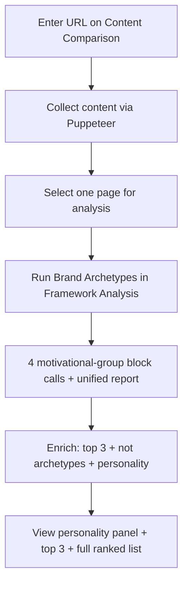
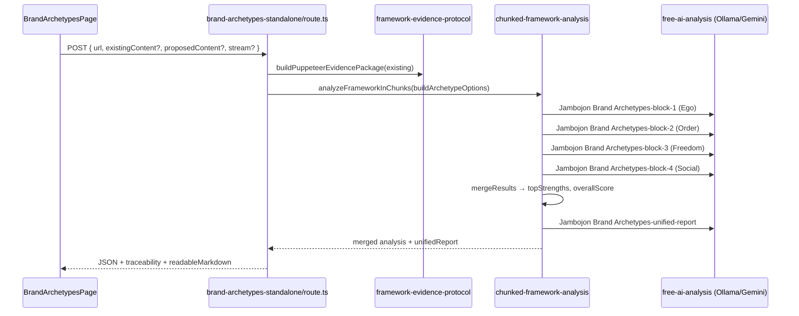

# Brand Archetypes Assessment — Complete Guide

**Version:** 2.0 (Flat Fractional Scoring)  
**Last updated:** June 2026  
**Audience:** Product owners, analysts, and engineers working with the Zero Barriers Growth Accelerator Jambojon Brand Archetypes assessment.

---

## Scoring authority (read this first)

**Production scoring is flat fractional only (0.0–1.0).** The sole authority for **rating bands and per-archetype scoring rules** is:

**[`docs/frameworks/Brand-Archetypes-Flat-Scoring.md`](../frameworks/Brand-Archetypes-Flat-Scoring.md)**

That file is injected into every AI block prompt (first 12,000 characters). Nothing in this guide overrides its scoring math.

| Document | Role |
|----------|------|
| `Brand-Archetypes-Flat-Scoring.md` | **Scoring authority** — bands, evidence policy, flat average |
| This guide §5–§11 | **Strategic read** — top 3, not archetypes, personality, API enrich fields |
| `JAMBOJON_ARCHETYPES_ENHANCED.md` | **Definitions + synonyms + evidence cues only** — its example JSON uses labels, not alternate scoring math |
| `jambojon-archetypes-framework.json` | **Keyword signals + “as the guide” patterns** — supplementary recognition aids for prompts |

No scoring logic was changed to produce this guide except aligning route `scoringInstructions` with flat scoring (removed legacy 40/30/30 factor weights). If any doc disagrees with the flat-scoring doc, **trust the flat-scoring doc**.

**Design rationale:** Flat-scoring md is purpose-built for **website narrative signals**. Keyword hints from `jambojon-archetypes-framework.json` help recognition; they do not reweight scores. Overall score = sum of 12 archetype scores ÷ 12. **Primary and secondary archetypes are derived by rank from those flat scores**, not from category weights. See [guides README](./README.md#why-flat-scoring-not-the-complete-reference-scales).

---

## Why flat scoring for website analysis (design rationale)

Carl Jung’s 12 archetypes describe universal character patterns. Jambojon adapts them for **brand narrative identity**. This platform scores **what the website says and implies** — headlines, CTAs, testimonials, mission copy — not psychographic customer surveys.

### Two documents, two jobs

| | `Brand-Archetypes-Flat-Scoring.md` | `JAMBOJON_ARCHETYPES_ENHANCED.md` |
|---|-----------------------------------|-------------------------------------|
| **Written for** | Website brand narrative analysis | Deep per-archetype synonym catalogs |
| **Evidence** | Communication streams on public pages | Language, visual, tone cues for humans/AI |
| **Scoring** | 0.0–1.0 flat per archetype | Same bands documented; rich “what to look for” |
| **Role in pipeline** | Injected into AI prompts — **scoring source of truth** | Recognition reference; not alternate math |

### Why 0.0–1.0 fractional (not percentage tiers)

Most brands express **1–3 dominant archetypes** strongly and others weakly. Fractional scoring captures that spread honestly:

- **0.88** — Sage dominant: research language, expert CTAs, educational content throughout  
- **0.42** — Moderate Hero: occasional “overcome challenges” copy without sustained narrative  
- **0.15** — Weak Outlaw: essentially absent from public messaging  

### Why equal weight across all 12 archetypes

```
OVERALL = (sage + explorer + … + ruler) ÷ 12   ← every archetype equal weight
```

Motivational **groups** (Ego, Order, Freedom, Social) are for **reporting and chunking only**. Group averages must **not** reweight the overall score ([BA-INT-2] flat doc, calculation rules).

### Identifying top archetype(s) from flat scores

After all 12 archetypes are scored:

| Step | Rule |
|------|------|
| 1 | Sort all 12 scores **descending** |
| 2 | **Primary archetype** = highest score |
| 3 | **Secondary archetype(s)** = next strongest with score **≥ 0.6** and meaningfully below primary (typically ranks #2–#3) |
| 4 | **Co-primary** = two or more archetypes within **0.05** of the top score — list all tied leaders |
| 5 | **Dominant cluster** = all archetypes scoring **≥ 0.8** (may be 1–3 on strong brands) |

**Strength labels** (from flat-scoring doc):

| Score | Label | Role |
|-------|-------|------|
| 0.8–1.0 | Dominant | Core brand identity signal |
| 0.6–0.79 | Strong / Supporting | Influential secondary theme |
| 0.4–0.59 | Moderate | Occasional or inconsistent |
| 0.0–0.39 | Weak / Absent | Rarely or never signaled |

Runtime `mergeResults()` also surfaces **`topStrengths`**: up to 5 archetypes with score **≥ 0.7**, sorted descending — a quick proxy for primary + secondary candidates.

---

## Table of Contents

1. [What This Assessment Does](#1-what-this-assessment-does)
2. [Official Brand Archetype References](#2-official-brand-archetype-references)
3. [The 12 Archetypes and Four Motivational Groups](#3-the-12-archetypes-and-four-motivational-groups)
4. [Scoring Methodology](#4-scoring-methodology)
5. [Strategic Read — Top 3, What You're Not, and Site Personality](#5-strategic-read--top-3-what-youre-not-and-site-personality)
6. [How We Apply Archetypes to Website Content](#6-how-we-apply-archetypes-to-website-content)
7. [User Workflows](#7-user-workflows)
8. [End-to-End Pipeline](#8-end-to-end-pipeline)
9. [Prompt Construction](#9-prompt-construction)
10. [API Contract](#10-api-contract)
11. [Response Structure](#11-response-structure)
12. [Integrity and Completeness Checks](#12-integrity-and-completeness-checks)
13. [Code and Documentation Reference Index](#13-code-and-documentation-reference-index)
14. [Dual Analysis Paths (Chunked vs Enhanced)](#14-dual-analysis-paths-chunked-vs-enhanced)
15. [Known Drift and Documentation Gaps](#15-known-drift-and-documentation-gaps)
16. [Environment and Performance](#16-environment-and-performance)
17. [Troubleshooting](#17-troubleshooting)
18. [Testing](#18-testing)
19. [Annotated Bibliography](#19-annotated-bibliography)
20. [Per-Archetype Reference Catalog](#20-per-archetype-reference-catalog)
21. [Implementation & Prompt File Reference](#21-implementation--prompt-file-reference)

---

## 1. What This Assessment Does

The Brand Archetypes assessment evaluates **brand narrative identity** on a website (or pasted content) using the **12 Jambojon Brand Archetypes** — standard Jungian archetypes adapted for marketing and storytelling.

The platform:

- Reads **public website content** collected by Puppeteer (headlines, CTAs, testimonials, mission copy, navigation labels, alt text cues)
- Scores **all 12 archetypes** using **flat fractional scoring** (0.0–1.0 per archetype, no weights)
- **Identifies primary and secondary archetype(s)** by ranking flat scores
- Produces **per-archetype evidence**, **motivational-group averages**, an **overall score**, and a **unified markdown report**
- Supports **existing vs proposed content** comparison when proposed copy is supplied

**Core concept (Jung / Pearson lineage):** Every brand embodies archetypal patterns that resonate with specific customer values. Scoring all 12 flat reveals which patterns dominate public messaging versus which are absent or weak.

**Framework lineage:** Jungian archetypes → popularized in branding by Carol S. Pearson and Margaret Mark (*The Hero and the Outlaw*, 2001) → Jambojon framework adaptation in this codebase.

---

## 2. Official Brand Archetype References

> **Start here for deep research:** Section [20](#20-per-archetype-reference-catalog) maps every runtime archetype to enhanced doc line numbers, keyword signals, and definitions. Section [19](#19-annotated-bibliography) is the full numbered bibliography.

### External (official / canonical) sources

| Ref | Resource | URL |
|-----|----------|-----|
| [BA-1] | Jung, C. G. — *Archetypes and the Collective Unconscious* (1959) | Foundational archetype theory |
| [BA-2] | Mark, M., & Pearson, C. S. — *The Hero and the Outlaw* (2001) | 12 archetypes in brand strategy |
| [BA-3] | Pearson, C. S. — *Awakening the Heroes Within* (1991) | Motivational groups / archetype dynamics |
| [BA-4] | Margaret Mark — brand archetype consulting lineage | Industry application of [BA-2] |
| [BA-5] | Archetypes.com (Pearson/Mark resource hub) | https://www.archetypes.com/ |

### Internal reference documents

| Ref | Document | Purpose |
|-----|----------|---------|
| [BA-INT-1] | [`docs/JAMBOJON_ARCHETYPES_ENHANCED.md`](../JAMBOJON_ARCHETYPES_ENHANCED.md) | **Definitions only** — synonyms, visual/tone cues, “what to look for” (~748 lines) |
| [BA-INT-2] | [`docs/frameworks/Brand-Archetypes-Flat-Scoring.md`](../frameworks/Brand-Archetypes-Flat-Scoring.md) | **Scoring authority** — flat 0.0–1.0 bands, primary/secondary rules; injected into prompts |
| [BA-INT-3] | [`docs/ARCHETYPES_ASSESSMENT_INTEGRATION.md`](../ARCHETYPES_ASSESSMENT_INTEGRATION.md) | Integration into Framework Analysis runner |
| [BA-INT-4] | [`docs/guides/README.md`](./README.md) | Assessment guides index |
| [BA-INT-5] | [`docs/PAGE_WORKFLOWS.md`](../PAGE_WORKFLOWS.md) | Dashboard workflow for `/dashboard/brand-archetypes-standalone` |
| [BA-INT-6] | [`docs/LOCAL_RUNBOOK.md`](../LOCAL_RUNBOOK.md) | Local Ollama/dev setup |
| [BA-INT-7] | [`src/lib/ai-engines/framework-knowledge/jambojon-archetypes-framework.json`](../../src/lib/ai-engines/framework-knowledge/jambojon-archetypes-framework.json) | Runtime keyword signals + “as the guide” patterns |
| [BA-INT-8] | [`docs/guides/GOLDEN_CIRCLE_ASSESSMENT_GUIDE.md`](./GOLDEN_CIRCLE_ASSESSMENT_GUIDE.md) | Sister guide — purpose/messaging (WHY/HOW/WHAT/WHO) |

---

## 3. The 12 Archetypes and Four Motivational Groups

The **production chunked path** organizes 12 archetypes into **four motivational groups** (categories). Slugs use **snake_case** in JSON responses.

| Group | Category key | Motivation | Archetypes | Count |
|-------|--------------|------------|------------|-------|
| 1 | `ego` | Leave a mark on the world | Hero, Magician, Outlaw | 3 |
| 2 | `order` | Provide structure | Caregiver, Ruler, Creator | 3 |
| 3 | `freedom` | Yearn for paradise | Innocent, Explorer, Sage | 3 |
| 4 | `social` | Connect with others | Regular Guy/Girl, Jester, Lover | 3 |

**Total:** 12 archetypes.

### Full slug manifest

| # | Archetype | Slug | Group |
|---|-----------|------|-------|
| 1 | The Sage | `sage` | freedom |
| 2 | The Explorer | `explorer` | freedom |
| 3 | The Hero | `hero` | ego |
| 4 | The Outlaw | `outlaw` | ego |
| 5 | The Magician | `magician` | ego |
| 6 | The Regular Guy/Girl | `regular_guy_girl` | social |
| 7 | The Jester | `jester` | social |
| 8 | The Caregiver | `caregiver` | order |
| 9 | The Creator | `creator` | order |
| 10 | The Innocent | `innocent` | freedom |
| 11 | The Lover | `lover` | social |
| 12 | The Ruler | `ruler` | order |

> **Note:** Archetype numbering in [`JAMBOJON_ARCHETYPES_ENHANCED.md`](../JAMBOJON_ARCHETYPES_ENHANCED.md) follows a different sort order than runtime chunks. Always use **slugs** and **category keys** from `buildArchetypeOptions()` as the production source of truth.

---

## 4. Scoring Methodology

**Authority:** [`Brand-Archetypes-Flat-Scoring.md`](../frameworks/Brand-Archetypes-Flat-Scoring.md)

### Rating bands (per archetype)

| Score range | Status label | Meaning |
|-------------|--------------|---------|
| 0.8–1.0 | `strong` / Dominant | Strong, explicit expression across multiple evidence streams |
| 0.6–0.79 | `moderate` / Strong | Clear but partial expression |
| 0.4–0.59 | `weak` / Moderate | Weak or inconsistent expression |
| 0.0–0.39 | `absent` / Weak | Minimal or absent expression |

### Calculation

```
Group score (reporting only) = mean of 3 archetype scores in that group
Overall score              = sum of 12 archetype scores ÷ 12
```

Runtime `mergeResults()` in [`chunked-framework-analysis.ts`](../../src/lib/chunked-framework-analysis.ts) implements **sum of all archetype scores ÷ count**.

### Evidence policy

Score from **communication evidence**, not product specs alone. Primary evidence streams ([BA-INT-2]):

1. Headlines and subheads  
2. CTA language  
3. Testimonials and social proof  
4. Promise and claim language  
5. Mission, purpose, and belief language  
6. Navigation labels and IA wording  
7. Image alt text and visual-caption language  

### Required per-archetype output (AI target)

From flat-scoring doc — each archetype should include:

- `score` (0.0–1.0)  
- `status` (`strong`, `moderate`, `weak`, `absent`)  
- `evidence` (quotes tied to streams)  
- `reasoning`  
- `improvement_actions`  

Chunked JSON uses `score`, `evidence`, `recommendation` per element (slug).

---

## 5. Strategic Read — Top 3, What You're Not, and Site Personality

This is the core strategic output for analysts and the standalone UI. **All identification derives from flat 0.0–1.0 scores** — no weighted formulas.

### Algorithm (production — primary UI read)

```text
1. Collect scores for all 12 slugs across categories.ego, .order, .freedom, .social
2. Flatten to a single ranked list (slug, score, evidence)
3. top_three_archetypes  ← ranks #1, #2, #3 by score (always 3 when 12 analyzed)
4. not_archetypes        ← all archetypes with score < 0.4 (what the brand is NOT)
5. personality_profile   ← headline, signalType, tensions, coherenceScore
```

### Co-primary / legacy fields (still in API)

```text
primary_archetype      ← rank #1 (or ties within 0.05 of #1)
secondary_archetypes   ← score ≥ 0.6, excluding primary
dominant_cluster       ← all archetypes with score ≥ 0.8
```

Implemented in [`src/lib/framework/archetype-ranking.ts`](../../src/lib/framework/archetype-ranking.ts) (`enrichAnalysisWithArchetypeRanking`). Personality in [`src/lib/framework/brand-personality.ts`](../../src/lib/framework/brand-personality.ts). UI: [`BrandArchetypesPage.tsx`](../../src/components/analysis/BrandArchetypesPage.tsx) + [`BrandPersonalityPanel.tsx`](../../src/components/analysis/BrandPersonalityPanel.tsx).

### Co-primary and blend detection

| Scenario | Interpretation |
|----------|----------------|
| Hero 0.84, Magician 0.81 | Co-primary **Hero–Magician** blend |
| Sage 0.79, Explorer 0.52 | Primary **Sage** only; Explorer moderate |
| Three archetypes ≥ 0.8 | Multi-dominant brand (e.g., Hero + Ruler + Creator) |
| All scores < 0.5 | Undefined archetype identity — generic messaging |

### Mapping flat scores to strategic labels

| Label | Score rule | Strategic meaning |
|-------|------------|-------------------|
| **Primary** | Rank #1 | Lead with this archetype in brand narrative |
| **Secondary** | Rank #2–#3, score ≥ 0.6 | Support primary; avoid conflicting tone |
| **Supporting** | Score 0.6–0.79, not in top 3 | Acceptable background theme |
| **Gap** | Score < 0.4 | Missing narrative opportunity or intentional omission |

### Runtime helpers

| Field | Source | Use |
|-------|--------|-----|
| `top_three_archetypes` | `enrichAnalysisWithArchetypeRanking()` | **Primary UI read** — ranks 1–3 |
| `not_archetypes` | `enrichAnalysisWithArchetypeRanking()` | Weak/absent voices (score < 0.4) |
| `personality_profile` | `deriveArchetypePersonality()` | Site personality + conflict detection |
| `topStrengths` | `mergeResults()` — score ≥ 0.7, max 5 | Merge-step strength candidates |
| `criticalGaps` | `mergeResults()` — score < 0.4, max 5 | Merge-step gap candidates |
| `unifiedReport` | Ollama synthesis | Narrative summary |
| `chunkedReport` | Deterministic markdown | Ranked category scores + top strengths |

### Example interpretation

```json
"categories": {
  "freedom": {
    "elements": {
      "sage": { "score": 0.87, "evidence": "Research-backed guides, 'learn' CTAs..." },
      "explorer": { "score": 0.41, "evidence": "Occasional 'discover' in nav..." },
      "innocent": { "score": 0.22, "evidence": "..." }
    }
  },
  "ego": {
    "elements": {
      "hero": { "score": 0.74, "evidence": "Customer success stories..." }
    }
  }
}
```

**Reading:** Top 3 = **Sage** (0.87), **Hero** (0.74), **Creator** (0.60). Not archetypes include **Jester** (0.12), **Innocent** (0.22). `personality_profile.headline` ≈ **The Sage brand voice** with Hero/Creator support. Check `tensions` if multiple high scores conflict (e.g. Ruler + Regular Guy).

---

## 6. How We Apply Archetypes to Website Content

### Evidence mapping by archetype family

| Group | Narrative signals | Typical page locations |
|-------|-------------------|------------------------|
| **Ego** | Triumph, transformation, rebellion | Hero sections, case studies, disruption claims |
| **Order** | Care, leadership, craftsmanship | About, quality, enterprise, process pages |
| **Freedom** | Wisdom, adventure, optimism | Blog, resources, brand story, mission |
| **Social** | Belonging, humor, passion | Community, testimonials, lifestyle, culture |

### Analysis discipline (from [BA-INT-1] [L706–724](../JAMBOJON_ARCHETYPES_ENHANCED.md#L706))

- Analyze **language, visuals (alt/captions), themes, CTAs, and overall personality**  
- Use keyword hints as **recognition aids**, not automatic high scores  
- Tie every score to **quoted or paraphrased evidence**  
- Score conservatively when evidence is thin  

### Common website failure modes

| Failure mode | Signal | Typical scores |
|--------------|--------|----------------|
| Generic corporate speak | No archetype dominates | All 0.3–0.5 |
| Product-spec-only copy | WHAT without narrative | Low across all; slight Creator/Ruler |
| Conflicting tones | Hero + Innocent + Outlaw all high | High variance; flag inconsistency |
| Single-campaign spike | One page strong, rest weak | Block variance; prefer richer `existingContent` |

Evidence normalization: [`src/lib/framework-evidence-protocol.ts`](../../src/lib/framework-evidence-protocol.ts).

Keyword hints: [`jambojon-archetypes-framework.json`](../../src/lib/ai-engines/framework-knowledge/jambojon-archetypes-framework.json) → `keyword_signals` per archetype, injected via [`element-keyword-hints.ts`](../../src/lib/framework/element-keyword-hints.ts).

---

## 7. User Workflows

### Primary UI entry points

| Route | Component | API endpoint |
|-------|-----------|--------------|
| `/dashboard/brand-archetypes-standalone` | `BrandArchetypesPage` | `/api/analyze/brand-archetypes-standalone` |
| Content Comparison → Framework Analysis | `FrameworkAnalysisRunner` | Same via `framework-analysis-entrypoint` |
| Workspace shortcut | — | `/dashboard/brand-archetypes-standalone` |

### Typical flow



1. **Collect** — Puppeteer gathers page content  
2. **Analyze** — One AI call per motivational group (4 blocks) + unified synthesis  
3. **Rank** — Sort 12 flat scores → `top_three_archetypes`, `not_archetypes`, `personality_profile`  
4. **Review** — Site personality, top 3, what you're not, collapsible all-12 list, `readableMarkdown`  

### Workflow documentation

See [`docs/PAGE_WORKFLOWS.md`](../PAGE_WORKFLOWS.md) — `/dashboard/brand-archetypes-standalone`.

---

## 8. End-to-End Pipeline

### Architecture diagram



### Chunk configuration & AI call count

The route sets **`categoriesPerBlock: 1`** — one motivational group per block:

```
Block 1: Ego     (hero, magician, outlaw)
Block 2: Order   (caregiver, ruler, creator)
Block 3: Freedom (innocent, explorer, sage)
Block 4: Social  (regular_guy_girl, jester, lover)
```

**Total AI calls (typical):** **5** (4 blocks + 1 unified report).

Each block scores **3 archetypes** — keeps prompts within Ollama-friendly budgets while ensuring all 12 are evaluated.

**Analysis type labels:**

- `Jambojon Brand Archetypes-block-1` … `block-4`
- `Jambojon Brand Archetypes-unified-report`

---

## 9. Prompt Construction

Each block prompt is built by `buildBlockPrompt()` in [`chunked-framework-analysis.ts`](../../src/lib/chunked-framework-analysis.ts).

### Prompt ingredients

| Section | Source | Notes |
|---------|--------|-------|
| Framework markdown | `Brand-Archetypes-Flat-Scoring.md` | Truncated to **12,000 characters** |
| Website content summary | `buildContentSummary()` | URL, title, meta, keywords, **first 1,500 chars** |
| Evidence protocol | Prepended to `contentText` | Headlines, CTAs, testimonials, etc. |
| Group + archetype list | Per-block chunk definition | Exact slugs the model must score |
| **Recognition keyword hints** | `element-keyword-hints.ts` ← `jambojon-archetypes-framework.json` | `keyword_signals` + definition per slug |
| Scoring rubric | Flat-scoring md + `scoringInstructions` in route | Flat 0.0–1.0 only — **no weighted factor math** |
| JSON schema | Inline in prompt | `categories.{group}.elements.{slug}` |

### Block prompt template (abbreviated)

```
You are analyzing website content using the Jambojon Brand Archetypes framework.
Evaluate EVERY archetype listed below. Do not skip any archetype.

FRAMEWORK MARKDOWN (SOURCE OF TRUTH):
{first 12k of Brand-Archetypes-Flat-Scoring.md}

RECOGNITION HINTS (supplementary — do NOT change scoring rules above):
- **hero**: look for [courage, strength, determination, ...] — Represents courage...

CATEGORIES IN THIS BLOCK:
- Ego Archetypes (ego): hero, magician, outlaw

SCORING:
Score each archetype 0.0-1.0 (flat fractional scoring): ...
Primary archetype = highest score; secondary = next strongest (≥ 0.6).

Return ONLY valid JSON...
```

### Unified report prompt

`buildUnifiedReportWithOllama()` receives merged JSON including `topStrengths` and asks for Executive Summary, What Is Working, What Needs Improvement, Prioritized Action Plan, Risk Notes. Analysts should **explicitly name primary and secondary archetypes** when reading the unified report.

---

## 10. API Contract

### Endpoint

```
POST /api/analyze/brand-archetypes-standalone
```

**`maxDuration`:** 300 seconds.

### Request body

| Field | Type | Required | Description |
|-------|------|----------|-------------|
| `url` | string | **Yes** | Target website URL |
| `existingContent` | object | No | Pre-scraped content from LocalForage |
| `proposedContent` | string | No | Proposed copy for comparison context |
| `stream` | boolean | No | SSE progress streaming |

### Success response (abbreviated)

```json
{
  "success": true,
  "framework": "brand-archetypes",
  "existing": { "title": "...", "cleanText": "...", "url": "..." },
  "analysis": {
    "framework": "Jambojon Brand Archetypes",
    "overallScore": 0.583,
    "totalElements": 12,
    "categories": {
      "ego": {
        "categoryName": "Ego Archetypes (Leave a Mark on the World)",
        "categoryScore": 0.62,
        "elements": {
          "hero": { "score": 0.74, "evidence": "...", "recommendation": "..." }
        }
      }
    },
    "topStrengths": [
      { "element": "sage", "category": "freedom", "score": 0.87, "evidence": "..." }
    ],
    "criticalGaps": [
      { "element": "jester", "category": "social", "score": 0.18, "recommendation": "..." }
    ],
    "verification": { "completeness_check": "pass", "expected": 12, "analyzed": 12 },
    "unifiedReport": "# Brand Archetypes Analysis\n...",
    "chunkedReport": "..."
  },
  "readableMarkdown": "...",
  "traceability": { },
  "message": "Brand Archetypes analysis completed successfully"
}
```

---

## 11. Response Structure

### Enriched fields (added by `enrichAnalysisWithArchetypeRanking`)

| Field | Type | Description |
|-------|------|-------------|
| `top_three_archetypes` | array | Ranks #1–#3: `{ name, slug, score, strength, group, evidence }` |
| `not_archetypes` | array | Score < 0.4: same shape — narratives the site does **not** project |
| `personality_profile` | object | See below |
| `primary_archetype` | object \| array | Co-primary within 0.05 of #1 (legacy/strategic) |
| `secondary_archetypes` | array | Score ≥ 0.6, excluding primary |
| `dominant_cluster` | array | All archetypes ≥ 0.8 |
| `archetype_ranking.allRanked` | array | Full ranked list |

### `personality_profile` object

| Field | Type | Description |
|-------|------|-------------|
| `framework` | string | `"brand-archetypes"` |
| `headline` | string | e.g. `"The Sage–The Hero brand voice"` |
| `summary` | string | Narrative for analysts |
| `signalType` | string | `coherent_single` \| `coherent_blend` \| `multi_dominant` \| `conflicting_signals` \| `undefined_identity` \| `generic_messaging` |
| `dominantLabels` | string[] | Top 3 display names |
| `supportingLabels` | string[] | Weak/absent names (up to 3) |
| `tensions` | array | `{ labelA, labelB, scoreA, scoreB, reason }` when opposing pairs both ≥ 0.6 |
| `coherenceScore` | number | 0.0–1.0 |

### Top-level analysis fields (from merge + enrich)

| Field | Type | Description |
|-------|------|-------------|
| `overallScore` | number | Mean of 12 archetype scores (0.0–1.0) |
| `totalElements` | number | **12** when complete |
| `categories` | object | Keys: `ego`, `order`, `freedom`, `social` |
| `topStrengths` | array | From merge — archetypes ≥ 0.7 (up to 5) |
| `criticalGaps` | array | From merge — archetypes < 0.4 (up to 5) |
| `verification.completeness_check` | string | `pass` / `fail` |

---

## 12. Integrity and Completeness Checks

### Expected coverage

| Check | Expected |
|-------|----------|
| Total archetypes | 12 |
| Motivational groups | 4 |
| Elements per group | 3 |
| Duplicate slugs | None (each slug unique) |

Validated by `validateFrameworkCompleteness('brand-archetypes')` and `src/test/framework/element-completeness.test.ts`.

### Runtime verification

`mergeResults()` sets `verification.completeness_check` to **`pass`** when all 12 slugs return numeric scores.

### Keyword hint coverage test

[`element-keyword-hints.test.ts`](../../src/test/framework/element-keyword-hints.test.ts) validates Jambojon framework hint injection for archetype blocks.

---

## 13. Code and Documentation Reference Index

| Concern | Path |
|---------|------|
| Scoring authority | `docs/frameworks/Brand-Archetypes-Flat-Scoring.md` |
| Enhanced definitions | `docs/JAMBOJON_ARCHETYPES_ENHANCED.md` |
| Keyword signals | `src/lib/ai-engines/framework-knowledge/jambojon-archetypes-framework.json` |
| Hint injection | `src/lib/framework/element-keyword-hints.ts` |
| Production API | `src/app/api/analyze/brand-archetypes-standalone/route.ts` |
| Chunk engine | `src/lib/chunked-framework-analysis.ts` |
| UI page | `src/components/analysis/BrandArchetypesPage.tsx` |
| Integration guide | `docs/ARCHETYPES_ASSESSMENT_INTEGRATION.md` |

---

## 14. Dual Analysis Paths (Chunked vs Enhanced)

| Path | Entry | Scoring | Primary/secondary |
|------|-------|---------|-------------------|
| **Chunked (production UI)** | `/api/analyze/brand-archetypes-standalone` | Flat 0.0–1.0 × 12 | Rank from merged JSON / `topStrengths` |
| **Enhanced rules** | `jambojon-archetypes-rules.json` | Flat 0.0–1.0 | Explicit `primary_archetype` / `secondary_archetypes` in JSON schema |
| **Framework runner** | `FrameworkAnalysisRunner` | Uses standalone endpoint | Same as chunked |

Enhanced path JSON schema ([BA-INT-7 rules file]) defines explicit `primary_archetype` and `secondary_archetypes` objects — the chunked path achieves the same outcome by **ranking flat scores** after merge.

---

## 15. Known Drift and Documentation Gaps

| Topic | Canonical source | Drift / gap |
|-------|------------------|-------------|
| Chunk manifest | `BRAND_ARCHETYPES_CHUNK_CONFIG` | Route uses `buildChunkAnalysisOptions('brand-archetypes')` — aligned |
| Route scoring text | Flat-scoring doc | Aligned — flat 0.0–1.0 only; no weighted factors |
| JSON `analysis_methodology.scoring_criteria` in framework JSON | Percentage tiers (40/30/20/10) | **Not production** — legacy enhanced-path artifact |
| Enhanced doc archetype order | Numbered 1–12 in doc | Differs from runtime group chunk order |
| `mergeResults` field names | `element` in topStrengths | Contains archetype **slug**, not display name — UI maps via `archetype-ranking.ts` |

---

## 16. Environment and Performance

| Variable | Purpose |
|----------|---------|
| `AI_PROVIDER` | `ollama` or cloud |
| `OLLAMA_BASE_URL` | Local Ollama URL |
| `OLLAMA_MODEL` | Model slug |
| `GEMINI_API_KEY` | Fallback provider |

### Performance characteristics

| Factor | Impact |
|--------|--------|
| 4 blocks × 3 archetypes | 5 AI calls total (4 + unified) |
| 3 archetypes per prompt | Smaller than B2C block 1 (24 elements) |
| `categoriesPerBlock: 1` | Fixed — does not switch to 2-block mode |
| 1,500-char content cap | May miss deep-page narrative cues |

---

## 17. Troubleshooting

| Symptom | Likely cause | What to check |
|---------|--------------|---------------|
| No clear primary | Generic messaging | All scores 0.4–0.55 — review homepage + About |
| `completeness_check: fail` | Block error | `analysis.errors`; verify all 4 groups returned |
| Conflicting primaries | Mixed brand voice | Compare scores across groups; check page selection |
| All scores low | Wrong page analyzed | Pass richer `existingContent` from key brand pages |
| topStrengths empty | All scores < 0.7 | Primary may still exist at 0.65 — rank manually |
| Unified report omits archetype names | Synthesis gap | Use `chunkedReport` + ranked JSON |

---

## 18. Testing

| Test | Location | What it validates |
|------|----------|-------------------|
| Keyword hints | `src/test/framework/element-keyword-hints.test.ts` | Jambojon hint injection |
| API security | `src/test/security/security-config.test.ts` | Protected route |

```bash
npm run test -- src/test/framework/element-keyword-hints.test.ts
npm run type-check
```

---

## 19. Annotated Bibliography

### External sources

| ID | Citation | Used for |
|----|----------|----------|
| [BA-1] | Jung, C. G. (1959). *The Archetypes and the Collective Unconscious*. Princeton University Press. | Original archetype theory |
| [BA-2] | Mark, M., & Pearson, C. S. (2001). *The Hero and the Outlaw: Building Extraordinary Brands Through the Power of Archetypes*. McGraw-Hill. | 12 brand archetypes, motivational groups |
| [BA-3] | Pearson, C. S. (1991). *Awakening the Heroes Within*. HarperOne. | Archetype dynamics and group psychology |
| [BA-4] | Margaret Mark — brand strategy consulting | Industry application of archetype branding |
| [BA-5] | Archetypes.com — Pearson/Mark resources. https://www.archetypes.com/ | Public archetype reference material |

### Internal implementation sources

| ID | File | Role in assessment |
|----|------|-------------------|
| [BA-INT-1] | `docs/JAMBOJON_ARCHETYPES_ENHANCED.md` | Per-archetype synonyms, visual/tone cues |
| [BA-INT-2] | `docs/frameworks/Brand-Archetypes-Flat-Scoring.md` | Injected into AI block prompts (≤12k chars) |
| [BA-INT-3] | `src/lib/ai-engines/framework-knowledge/jambojon-archetypes-framework.json` | Keyword signals, “as the guide”, revenue notes |
| [BA-INT-4] | `src/app/api/analyze/brand-archetypes-standalone/route.ts` | Production API; `buildArchetypeOptions()` |
| [BA-INT-5] | `src/lib/chunked-framework-analysis.ts` | Prompt builder, merge, `topStrengths`, unified report |
| [BA-INT-6] | `src/lib/framework/element-keyword-hints.ts` | `buildArchetypeHintLookup()` |
| [BA-INT-7] | `src/lib/ai-engines/assessment-rules/jambojon-archetypes-rules.json` | Enhanced path flat schema with explicit primary/secondary |
| [BA-INT-8] | `docs/ARCHETYPES_ASSESSMENT_INTEGRATION.md` | Framework Analysis runner integration |

---

## 20. Per-Archetype Reference Catalog

All 12 production archetypes from `buildArchetypeOptions()`. **Enhanced doc** line numbers point to [`JAMBOJON_ARCHETYPES_ENHANCED.md`](../JAMBOJON_ARCHETYPES_ENHANCED.md). **Keywords** from [`jambojon-archetypes-framework.json`](../../src/lib/ai-engines/framework-knowledge/jambojon-archetypes-framework.json).

### Group: Ego (`ego`) — Leave a Mark on the World

| Slug | Archetype | Block | Enhanced doc | Keywords (sample) |
|------|-----------|-------|--------------|-------------------|
| `hero` | The Hero | 1 | [L146](../JAMBOJON_ARCHETYPES_ENHANCED.md#L146) | courage, strength, determination, overcome adversity, triumph |
| `magician` | The Magician | 1 | [L482](../JAMBOJON_ARCHETYPES_ENHANCED.md#L482) | transformation, vision, innovation, miracles, infinite possibilities |
| `outlaw` | The Outlaw | 1 | [L426](../JAMBOJON_ARCHETYPES_ENHANCED.md#L426) | rebel, disruption, nonconformity, edgy, revolution |

### Group: Order (`order`) — Provide Structure

| Slug | Archetype | Block | Enhanced doc | Keywords (sample) |
|------|-----------|-------|--------------|-------------------|
| `caregiver` | The Caregiver | 2 | [L258](../JAMBOJON_ARCHETYPES_ENHANCED.md#L258) | compassion, empathy, help, care, nurturing, support |
| `ruler` | The Ruler | 2 | [L594](../JAMBOJON_ARCHETYPES_ENHANCED.md#L594) | authority, control, leadership, excellence, prestige |
| `creator` | The Creator | 2 | [L538](../JAMBOJON_ARCHETYPES_ENHANCED.md#L538) | create, innovation, artistry, expression, originality |

### Group: Freedom (`freedom`) — Yearn for Paradise

| Slug | Archetype | Block | Enhanced doc | Keywords (sample) |
|------|-----------|-------|--------------|-------------------|
| `innocent` | The Innocent | 3 | [L370](../JAMBOJON_ARCHETYPES_ENHANCED.md#L370) | optimism, simplicity, purity, honesty, hope, clarity |
| `explorer` | The Explorer | 3 | [L90](../JAMBOJON_ARCHETYPES_ENHANCED.md#L90) | freedom, adventure, discovery, curiosity, independence |
| `sage` | The Sage | 3 | [L34](../JAMBOJON_ARCHETYPES_ENHANCED.md#L34) | wisdom, knowledge, truth, learning, mentor, expertise |

### Group: Social (`social`) — Connect with Others

| Slug | Archetype | Block | Enhanced doc | Keywords (sample) |
|------|-----------|-------|--------------|-------------------|
| `regular_guy_girl` | The Regular Guy/Girl | 4 | [L202](../JAMBOJON_ARCHETYPES_ENHANCED.md#L202) | everyday, relatable, down-to-earth, belonging, approachable |
| `jester` | The Jester | 4 | [L314](../JAMBOJON_ARCHETYPES_ENHANCED.md#L314) | joy, humor, entertainment, fun, playful, laughter |
| `lover` | The Lover | 4 | [L650](../JAMBOJON_ARCHETYPES_ENHANCED.md#L650) | passion, intimacy, connection, desire, romance |

### Additional reference sections

| Topic | Enhanced doc (line) | Content |
|-------|---------------------|---------|
| Scoring method | [L706](../JAMBOJON_ARCHETYPES_ENHANCED.md#L706) | Flat 0.0–1.0, dominant/supporting/weak identification |
| What to analyze | [L718](../JAMBOJON_ARCHETYPES_ENHANCED.md#L718) | Language, visuals, themes, CTAs, personality |
| Example output JSON | [L728](../JAMBOJON_ARCHETYPES_ENHANCED.md#L728) | `dominant_archetypes` array pattern |

### “As the guide” patterns

Each archetype in [`jambojon-archetypes-framework.json`](../../src/lib/ai-engines/framework-knowledge/jambojon-archetypes-framework.json) includes an `as_the_guide` array — value delivery patterns to recognize in copy (e.g., Sage: “Provides expertise and knowledge”, “Promotes critical thinking”). Use for **evidence interpretation**, not separate weighted scoring.

---

## 21. Implementation & Prompt File Reference

### API & chunk wiring

| Concern | File | Symbol / function |
|---------|------|-------------------|
| HTTP entry | `src/app/api/analyze/brand-archetypes-standalone/route.ts` | `POST`, `buildArchetypeOptions()` → `buildChunkAnalysisOptions` |
| Chunk manifest | `src/lib/framework/chunk-definitions.ts` | `BRAND_ARCHETYPES_CHUNK_CONFIG` |
| Top 3 + not + personality | `src/lib/framework/archetype-ranking.ts` | `enrichAnalysisWithArchetypeRanking()` |
| Personality synthesis | `src/lib/framework/brand-personality.ts` | `deriveArchetypePersonality()` |
| Personality UI | `src/components/analysis/BrandPersonalityPanel.tsx` | Shared with CliftonStrengths |
| Analysis engine | `src/lib/chunked-framework-analysis.ts` | `analyzeFrameworkInChunks()` |
| Keyword hint builder | `src/lib/framework/element-keyword-hints.ts` | `buildArchetypeHintLookup()`, `formatKeywordHintsSection()` |
| Markdown loader | `src/lib/chunked-framework-analysis.ts` | `loadFrameworkMarkdown()` → `Brand-Archetypes-Flat-Scoring.md` |
| Merge + top archetypes | `src/lib/chunked-framework-analysis.ts` | `mergeResults()` → `topStrengths`, `overallScore` |
| Unified report | `src/lib/chunked-framework-analysis.ts` | `buildUnifiedReportWithOllama()` |
| Evidence package | `src/lib/framework-evidence-protocol.ts` | `buildPuppeteerEvidencePackage()` |
| UI | `src/components/analysis/BrandArchetypesPage.tsx` | Standalone assessment page |

### AI analysis type labels

| Call order | `analysisType` string | Archetypes scored |
|------------|----------------------|-------------------|
| 1 | `Jambojon Brand Archetypes-block-1` | hero, magician, outlaw |
| 2 | `Jambojon Brand Archetypes-block-2` | caregiver, ruler, creator |
| 3 | `Jambojon Brand Archetypes-block-3` | innocent, explorer, sage |
| 4 | `Jambojon Brand Archetypes-block-4` | regular_guy_girl, jester, lover |
| 5 | `Jambojon Brand Archetypes-unified-report` | Synthesis (name primary/secondary) |

### Enhanced / legacy path

| File | Role |
|------|------|
| `src/lib/ai-engines/assessment-rules/jambojon-archetypes-rules.json` | Explicit `primary_archetype` JSON schema |
| `src/lib/ai-engines/framework-integration.service.ts` | Enhanced analysis integration |
| `docs/ARCHETYPES_ASSESSMENT_INTEGRATION.md` | Runner integration notes |

---

## Quick Reference Card

```
Framework:       Jambojon Brand Archetypes (12 Jungian archetypes)
Archetypes:      12 across 4 motivational groups (3 each)
Scoring:         0.0–1.0 flat (no weights)
Primary:         Highest of 12 flat scores
Secondary:       Next strongest with score ≥ 0.6
Dominant cluster: All archetypes ≥ 0.8
AI calls:        5 (4 group blocks + unified report)
Endpoint:        POST /api/analyze/brand-archetypes-standalone
UI:              /dashboard/brand-archetypes-standalone
Source of truth: docs/frameworks/Brand-Archetypes-Flat-Scoring.md
Keyword hints:   jambojon-archetypes-framework.json (keyword_signals)
Canonical chunks: src/lib/framework/chunk-definitions.ts → BRAND_ARCHETYPES_CHUNK_CONFIG
Runtime ranking: archetype-ranking.ts → top_three_archetypes, not_archetypes, personality_profile
Research base:   Jung (1959); Mark & Pearson (2001)
```

---

*For archetype definitions and synonyms, start with [`JAMBOJON_ARCHETYPES_ENHANCED.md`](../JAMBOJON_ARCHETYPES_ENHANCED.md). For implementation debugging, start with [`brand-archetypes-standalone/route.ts`](../../src/app/api/analyze/brand-archetypes-standalone/route.ts) and rank flat scores to identify primary and secondary archetypes.*
