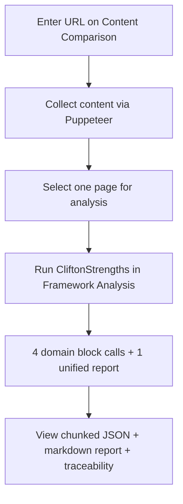
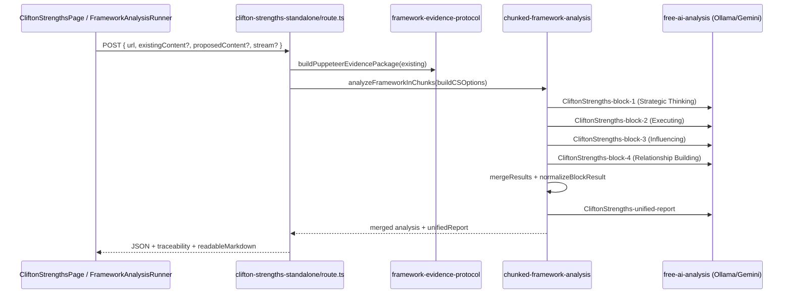

# CliftonStrengths Assessment — Complete Guide

**Version:** 2.0 (Flat Fractional Scoring)  
**Last updated:** June 2026  
**Audience:** Product owners, analysts, and engineers working with the Zero Barriers Growth Accelerator CliftonStrengths assessment.

---

## Scoring authority (read this first)

**Production scoring is flat fractional only (0.0–1.0).** The sole authority for how to score, the rating bands, the calculation tables, and the element structure is:

**[`docs/frameworks/CliftonStrengths-Flat-Scoring.md`](../frameworks/CliftonStrengths-Flat-Scoring.md)**

That file is injected into every AI block prompt (first 12,000 characters). Nothing in this guide overrides it.

| Document | Role |
|----------|------|
| `CliftonStrengths-Flat-Scoring.md` | **Scoring + structure** — use this for all score interpretation |
| `CLIFTONSTRENGTHS_COMPLETE.md` | **Definitions + synonyms + evidence cues only** — its 1–10 tables are **not** used by the runtime assessment |

No scoring logic was changed to produce these guides. If archived doc tables disagree with the flat-scoring doc, **trust the flat-scoring doc**.

---

## Why flat scoring for website analysis (design rationale)

This adoption was intentional. Flat scoring and the complete reference doc serve **different jobs** and **different evidence types**. They must not be mixed.

### Two documents, two evidence types

| | `CliftonStrengths-Flat-Scoring.md` | `CLIFTONSTRENGTHS_COMPLETE.md` |
|---|-----------------------------------|--------------------------------|
| **Written for** | Website / brand content analysis | Individual assessment via behavioral observation |
| **Evidence** | What a company **says, promises, and implies** in public copy | Observable behaviors, patterns, energizers/drainers |
| **Scoring** | 0.0–1.0 flat fractional | 1–10 integer bands (9–10, 7–8, …) |
| **Role in pipeline** | Injected into AI prompts — **scoring source of truth** | Human/AI reference for **synonyms and “what to look for”** only |

Gallup’s psychometric assessment measures individual talents. This platform measures **organizational brand signals** on a website. Same 34 theme names; not the same evidence standard.

### Why 0.0–1.0 fractional (not 1–10)

Website content rarely yields strong signals across all 34 themes. Fractional scoring is more honest for **sparse evidence**:

- **0.85** — dominant theme, clear in copy  
- **0.25** — weak but present (implicit signal)  
- **0.15** — effectively absent  

A 1–10 integer scale collapses that nuance. Bands like 9–10 / 7–8 push the model toward round numbers and overstate confidence when evidence is thin.

### Why sum of 34 ÷ 34 (not average of 4 domain scores)

Flat calculation is mathematically fairer for a brand audit:

```
OVERALL = (theme₁ + theme₂ + … + theme₃₄) ÷ 34   ← every theme equal weight
```

The complete doc’s alternative — **average of 4 domain scores** — secretly double-weights domain size:

| Method | Strategic Thinking (8 themes) | Executing (9 themes) |
|--------|------------------------------|----------------------|
| Sum ÷ 34 | Each theme = 1/34 of overall | Each theme = 1/34 of overall |
| Average of 4 domains | Domain = 25% of overall regardless of theme count | Domain = 25% of overall |

For “where are the real gaps?” the flat mean is correct. Runtime `mergeResults()` in `chunked-framework-analysis.ts` implements **sum of all theme scores ÷ count** — matching the flat-scoring doc.

Domain scores are still reported as **simple means within each domain** for readability; they do not replace the overall formula.

### What the complete doc still gives you

The one thing flat scoring does **not** carry is rich per-theme material from the complete reference:

- Synonym lists (“Restorative” → problem-solver, fixer, troubleshooter, issue-resolver)  
- “What to look for” cues per theme  
- Official Gallup theme descriptions  

Those help the model **recognize** signals it might miss. They do **not** change how scores are calculated.

### Practical layering (best of both)

| Layer | Source | In prompt today? |
|-------|--------|------------------|
| Scoring bands, structure, calculations | `CliftonStrengths-Flat-Scoring.md` | ✅ Yes (first 12k chars) |
| Brand evidence streams (CTAs, headlines, mission, etc.) | `framework-evidence-protocol.ts` | ✅ Yes (prepended to `contentText`) |
| Keyword hints per theme | `CLIFTON_STRENGTHS_ELEMENTS` via `element-keyword-hints.ts` | ✅ Injected into every block prompt |
| Synonyms + deep “what to look for” | `CLIFTONSTRENGTHS_COMPLETE.md` | 📖 Reference / guide catalog (§18); not scoring |

**Implemented pattern:** flat-scoring md is the only scoring authority; per-block keyword hints from `CLIFTON_STRENGTHS_ELEMENTS` are injected via `src/lib/framework/element-keyword-hints.ts` → `formatKeywordHintsSection()` in `buildBlockPrompt()` — **without** importing the complete doc’s 1–10 methodology.

Section [18](#18-per-theme-reference-catalog) links each slug to archived synonyms and `element-definitions.ts` keywords for human review and future prompt enrichment.

---

## Table of Contents

1. [What This Assessment Does](#1-what-this-assessment-does)
2. [Official CliftonStrengths References](#2-official-cliftonstrengths-references)
3. [The 34 Themes and Four Domains](#3-the-34-themes-and-four-domains)
4. [Scoring Methodology](#4-scoring-methodology)
5. [How We Apply CliftonStrengths to Website Content](#5-how-we-apply-cliftonstrengths-to-website-content)
6. [User Workflows](#6-user-workflows)
7. [End-to-End Pipeline](#7-end-to-end-pipeline)
8. [Prompt Construction](#8-prompt-construction)
9. [API Contract](#9-api-contract)
10. [Response Structure](#10-response-structure)
11. [Integrity and Completeness Checks](#11-integrity-and-completeness-checks)
12. [Code and Documentation Reference Index](#12-code-and-documentation-reference-index)
13. [Dual Analysis Paths (Chunked vs Enhanced)](#13-dual-analysis-paths-chunked-vs-enhanced)
14. [Environment and Performance](#14-environment-and-performance)
15. [Troubleshooting](#15-troubleshooting)
16. [Testing](#16-testing)
17. [Annotated Bibliography](#17-annotated-bibliography)
18. [Per-Theme Reference Catalog](#18-per-theme-reference-catalog)
19. [Implementation & Prompt File Reference](#19-implementation--prompt-file-reference)

---

## 1. What This Assessment Does

The CliftonStrengths assessment in this platform evaluates **organizational culture and brand messaging signals** on a website (or pasted content) against Gallup’s **34 talent themes** grouped into **four domains**.

Unlike the official Gallup assessment (which measures individual talents via a psychometric survey), this implementation:

- Reads **public website content** collected by Puppeteer (headlines, CTAs, mission language, testimonials, etc.)
- Scores **all 34 themes** using **flat fractional scoring** (0.0–1.0 per theme, no weights)
- Produces **per-theme evidence**, **domain averages**, an **overall score**, and a **unified markdown report**
- Supports **existing vs proposed content** comparison when proposed copy is supplied

**Core philosophy (from Don Clifton / Gallup):** Focus on what is *right* with people and organizations — identify dominant strengths and leverage them rather than fix weaknesses in isolation.

---

## 2. Official CliftonStrengths References

> **Start here for deep research:** Section [18](#18-per-theme-reference-catalog) maps every theme to archived doc line numbers, code slugs, and keywords. Section [17](#17-annotated-bibliography) is the full numbered bibliography.

### External (official) sources

| Ref | Resource | URL |
|-----|----------|-----|
| [CS-1] | Gallup — 34 CliftonStrengths Themes (canonical list) | https://www.gallup.com/cliftonstrengths/en/253715/34-cliftonstrengths-themes.aspx |
| [CS-2] | CliftonStrengths product hub | https://www.gallup.com/cliftonstrengths |
| [CS-3] | Don Clifton biography (research lead) | https://www.gallup.com/cliftonstrengths/en/253676/don-clifton.aspx |
| [CS-4] | Gallup — CliftonStrengths domains overview | https://www.gallup.com/cliftonstrengths/en/253739/cliftonstrengths-domains.aspx |
| [CS-5] | Gallup — Why strengths-based development works | https://www.gallup.com/cliftonstrengths/en/253746/strengths-based-development.aspx |
| [CS-6] | *StrengthsFinder 2.0* (Tom Rath, Gallup Press, 2007) — popularized the 34 themes | https://www.gallup.com/cliftonstrengths/en/253867/strengthsfinder-book.aspx |
| [CS-7] | *Soar with Your Strengths* (Donald O. Clifton & Paula Nelson, 1992) — foundational strengths research | — |

### Internal reference documents

| Ref | Document | Purpose |
|-----|----------|---------|
| [CS-INT-1] | [`docs/archived/CLIFTONSTRENGTHS_COMPLETE.md`](../archived/CLIFTONSTRENGTHS_COMPLETE.md) | **Definitions only** — theme descriptions, synonyms, evidence cues (~1,077 lines). **Do not use its 1–10 scoring tables for production.** |
| [CS-INT-2] | [`docs/frameworks/CliftonStrengths-Flat-Scoring.md`](../frameworks/CliftonStrengths-Flat-Scoring.md) | **Scoring authority** — flat 0.0–1.0 bands, calculation tables, framework structure; injected into every block prompt |
| [CS-INT-3] | [`docs/archived/COMPLETE_FRAMEWORK_INDEX.md`](../archived/COMPLETE_FRAMEWORK_INDEX.md) | Master index of all framework docs in this repo |
| [CS-INT-4] | [`docs/guides/README.md`](./README.md) | Assessment guides index |
| [CS-INT-5] | [`.cursorrules`](../../.cursorrules) | Project-wide Clifton domain/theme inventory |
| [CS-INT-6] | [`docs/PAGE_WORKFLOWS.md`](../PAGE_WORKFLOWS.md) | Dashboard workflow for `/dashboard/clifton-strengths-simple` |
| [CS-INT-7] | [`docs/LOCAL_RUNBOOK.md`](../LOCAL_RUNBOOK.md) | Local Ollama/dev setup |

---

## 3. The 34 Themes and Four Domains

Gallup organizes 34 themes into four domains. Each domain answers a different organizational question when applied to website content.

| Domain | Themes | Count | Organizational signal |
|--------|--------|-------|----------------------|
| **Strategic Thinking** | Absorb and analyze information for better decisions | 8 | Vision, data, planning, learning language |
| **Executing** | Make things happen | 9 | Process, discipline, accountability, delivery |
| **Influencing** | Reach a broader audience | 8 | Leadership, persuasion, competition, visibility |
| **Relationship Building** | Hold teams together | 9 | Empathy, inclusion, trust, harmony |

### Theme slugs (runtime identifiers)

All theme keys use **snake_case** in JSON responses and chunk definitions.

#### Strategic Thinking (8)

| # | Theme | Slug |
|---|-------|------|
| 1 | Analytical | `analytical` |
| 2 | Context | `context` |
| 3 | Futuristic | `futuristic` |
| 4 | Ideation | `ideation` |
| 5 | Input | `input` |
| 6 | Intellection | `intellection` |
| 7 | Learner | `learner` |
| 8 | Strategic | `strategic` |

#### Executing (9)

| # | Theme | Slug |
|---|-------|------|
| 1 | Achiever | `achiever` |
| 2 | Arranger | `arranger` |
| 3 | Belief | `belief` |
| 4 | Consistency | `consistency` |
| 5 | Deliberative | `deliberative` |
| 6 | Discipline | `discipline` |
| 7 | Focus | `focus` |
| 8 | Responsibility | `responsibility` |
| 9 | Restorative | `restorative` |

#### Influencing (8)

| # | Theme | Slug |
|---|-------|------|
| 1 | Activator | `activator` |
| 2 | Command | `command` |
| 3 | Communication | `communication` |
| 4 | Competition | `competition` |
| 5 | Maximizer | `maximizer` |
| 6 | Self-Assurance | `self_assurance` |
| 7 | Significance | `significance` |
| 8 | Woo | `woo` |

#### Relationship Building (9)

| # | Theme | Slug |
|---|-------|------|
| 1 | Adaptability | `adaptability` |
| 2 | Connectedness | `connectedness` |
| 3 | Developer | `developer` |
| 4 | Empathy | `empathy` |
| 5 | Harmony | `harmony` |
| 6 | Includer | `includer` |
| 7 | Individualization | `individualization` |
| 8 | Positivity | `positivity` |
| 9 | Relator | `relator` |

> **Note on domain order:** Gallup’s public materials often list domains as Strategic Thinking → Relationship Building → Influencing → Executing. The **chunked analysis runtime** processes blocks in this order: Strategic Thinking → Executing → Influencing → Relationship Building (see `CLIFTON_CHUNK_CONFIG` and `buildCSOptions()`). Theme membership is identical; only processing order differs.

---

## 4. Scoring Methodology

**Copied from the scoring authority** [`CliftonStrengths-Flat-Scoring.md`](../frameworks/CliftonStrengths-Flat-Scoring.md). Do not substitute any other scale.

### Scoring scale (from flat-scoring doc)

| Score range | Rating | Meaning |
|-------------|--------|---------|
| 0.8 – 1.0 | **Dominant Strength** | Natural, effortless, energizing |
| 0.6 – 0.79 | **Supporting Strength** | Present and useful |
| 0.4 – 0.59 | **Moderate** | Occasional use |
| 0.0 – 0.39 | **Lesser Theme** | Rarely used or less natural |

### Calculation method (from flat-scoring doc)

```
OVERALL SCORE = Sum of all 34 theme scores ÷ 34

DOMAIN SCORE  = Sum of themes in domain ÷ Number of themes in domain
```

**No weights.** Every theme counts equally. Domain size (8, 9, 8, 9) does not weight the overall score.

### Derived insights (from flat scoring spec)

The flat-scoring document also specifies analytical outputs the AI should produce when sufficient behavioral evidence exists:

- Top 10 themes (5 Dominant + 5 Supporting)
- Bottom 5 themes (lesser themes)
- Domain balance analysis
- Strength combinations and blind spots
- 5–7 development recommendations

The chunked runtime focuses on **per-element scores + evidence + recommendations**, then synthesizes a readable report in the unified step.

---

## 5. How We Apply CliftonStrengths to Website Content

Website content is **not** a CliftonStrengths psychometric survey. The assessment treats observable copy as **proxy evidence** for organizational strengths:

| Evidence stream | Source | Themes commonly signaled |
|-----------------|--------|--------------------------|
| Headlines (`h1`–`h4`) | Puppeteer selectors | Communication, Significance, Futuristic |
| CTAs / buttons | `[class*="cta"]`, signup links | Activator, Woo, Achiever |
| Mission / values blocks | `[class*="mission"]`, purpose selectors | Belief, Connectedness, Context |
| Testimonials / social proof | `[class*="testimonial"]`, blockquote | Relator, Empathy, Maximizer |
| Stats / metrics | `[class*="stat"]` | Analytical, Competition, Achiever |
| Feature lists | `[class*="feature"]` | Input, Discipline, Strategic |

Evidence normalization lives in [`src/lib/framework-evidence-protocol.ts`](../../src/lib/framework-evidence-protocol.ts) (`buildPuppeteerEvidencePackage`, `formatEvidenceForPrompt`).

Keywords per theme for matching hints are in [`src/lib/elements/element-definitions.ts`](../../src/lib/elements/element-definitions.ts) (`CLIFTON_STRENGTHS_ELEMENTS`).

---

## 6. User Workflows

### Primary UI entry points

| Route | Component | API endpoint |
|-------|-----------|--------------|
| `/dashboard/clifton-strengths-simple` | `CliftonStrengthsPage` | `/api/analyze/clifton-strengths-standalone` |
| `/dashboard/clifton-strengths` | Legacy report viewer (saved analyses) | `/api/analysis/clifton-strengths/[id]` |
| Content Comparison → Framework Analysis tab | `FrameworkAnalysisRunner` | Same standalone endpoint via `framework-analysis-entrypoint` |

### Typical flow (recommended)



1. **Collect** — Puppeteer gathers page content. Collection does **not** call Ollama/Gemini.
2. **Select page** — By default, one primary page is analyzed (homepage or entered URL).
3. **Analyze** — Chunked AI runs 4 domain blocks sequentially, then one unified synthesis.
4. **Review** — Results include per-theme scores, evidence, `verification.completeness_check`, and `readableMarkdown`.

### Standalone page flow

[`src/components/analysis/CliftonStrengthsPage.tsx`](../../src/components/analysis/CliftonStrengthsPage.tsx) uses `useFrameworkPageAnalysis`:

- Enter URL (required)
- Optionally paste **proposed content** for comparison
- Optionally paste **scraped JSON** to skip re-collection
- Stream progress per domain block

### Workflow documentation

See [`docs/PAGE_WORKFLOWS.md`](../PAGE_WORKFLOWS.md) — section `/dashboard/clifton-strengths-simple`.

---

## 7. End-to-End Pipeline

### Architecture diagram



### Key implementation files

| Step | File |
|------|------|
| API route | [`src/app/api/analyze/clifton-strengths-standalone/route.ts`](../../src/app/api/analyze/clifton-strengths-standalone/route.ts) |
| Chunk orchestration | [`src/lib/chunked-framework-analysis.ts`](../../src/lib/chunked-framework-analysis.ts) |
| Canonical chunk list | [`src/lib/framework/chunk-definitions.ts`](../../src/lib/framework/chunk-definitions.ts) → `CLIFTON_CHUNK_CONFIG` |
| AI provider | [`src/lib/free-ai-analysis.ts`](../../src/lib/free-ai-analysis.ts) |
| Streaming wrapper | [`src/lib/streaming-analysis.ts`](../../src/lib/streaming-analysis.ts) |
| Client hook | [`src/hooks/useFrameworkPageAnalysis.ts`](../../src/hooks/useFrameworkPageAnalysis.ts) |
| Client streaming | [`src/hooks/useChunkedAnalysis.ts`](../../src/hooks/useChunkedAnalysis.ts) |
| Framework router | [`src/lib/framework-analysis-entrypoint.ts`](../../src/lib/framework-analysis-entrypoint.ts) |

### Ollama lifecycle

Ollama is touched **only when analysis starts**, inside `analyzeFrameworkInChunks()` via `touchOllamaBeforeAnalysis()` — not during content collection. See [`src/lib/server/ollama-lifecycle.ts`](../../src/lib/server/ollama-lifecycle.ts).

### Chunk configuration

```typescript
// buildCSOptions() in clifton-strengths-standalone/route.ts
categoriesPerBlock: 1  // one domain per AI call → 4 block calls
chunks: [ Strategic Thinking, Executing, Influencing, Relationship Building ]
```

With `categoriesPerBlock: 1`, each block evaluates **one domain’s themes** in a single prompt, keeping prompts within Ollama token budgets.

**Total AI calls per assessment:** 5 (4 blocks + 1 unified report).

---

## 8. Prompt Construction

Each block prompt is built by `buildBlockPrompt()` in [`src/lib/chunked-framework-analysis.ts`](../../src/lib/chunked-framework-analysis.ts).

### Prompt ingredients

| Section | Source | Notes |
|---------|--------|-------|
| Framework markdown | `docs/frameworks/CliftonStrengths-Flat-Scoring.md` | Truncated to **12,000 characters** |
| Website content summary | `buildContentSummary()` | URL, title, meta, keywords, **first 1,500 chars** of content |
| Evidence protocol | Prepended to `contentText` in `buildCSOptions()` | CTAs, headlines, testimonials, etc. |
| Category + element list | Per-block chunk definition | Exact slugs the model must score |
| **Recognition keyword hints** | `element-keyword-hints.ts` ← `CLIFTON_STRENGTHS_ELEMENTS` | Per-theme keywords + descriptions; supplementary only |
| Scoring rubric | Flat-scoring md (injected above) | Never overridden by keyword hints |
| JSON schema | Inline in prompt | `categories.{domain}.elements.{slug}` |

### Block prompt template (abbreviated)

```
You are analyzing website content using the CliftonStrengths framework.
Evaluate EVERY element listed below. Do not skip any element.

FRAMEWORK MARKDOWN (SOURCE OF TRUTH):
{first 12k of CliftonStrengths-Flat-Scoring.md}

WEBSITE CONTENT:
URL: ...
Title: ...
Content (first 1500 chars): ...

CATEGORIES IN THIS BLOCK:
- Strategic Thinking (strategic_thinking): analytical, context, ...

SCORING:
Score each element 0.0-1.0 (flat fractional scoring): ...

Return ONLY valid JSON in this exact format:
{ "categories": { "strategic_thinking": { "categoryScore": 0.0, "elements": { ... } } } }
```

### Unified report prompt

After all blocks merge, `buildUnifiedReportWithOllama()` sends:

- Framework name, URL, overall score
- Category snapshot, top strengths, critical gaps
- Full merged JSON
- Instructions to return **markdown** (Executive Summary, What Is Working, etc.)

**Analysis type labels** (for logging / provider routing):

- `CliftonStrengths-block-1` … `CliftonStrengths-block-4`
- `CliftonStrengths-unified-report`

### AI failure fallback

If all AI calls fail, [`src/lib/framework-fallback-generator.ts`](../../src/lib/framework-fallback-generator.ts) produces a markdown fallback via `generateFrameworkFallbackMarkdown({ framework: 'clifton-strengths', ... })`.

---

## 9. API Contract

### Endpoint

```
POST /api/analyze/clifton-strengths-standalone
```

**`maxDuration`:** 300 seconds (Vercel serverless).

### Request body

```json
{
  "url": "https://example.com",
  "proposedContent": "optional proposed copy string",
  "existingContent": { "title": "...", "cleanText": "...", "seo": { ... } },
  "analysisType": "full",
  "stream": true
}
```

| Field | Required | Description |
|-------|----------|-------------|
| `url` | Yes | Target website URL |
| `existingContent` | No | Pre-collected payload from Content Comparison / LocalForage |
| `proposedContent` | No | Proposed copy for side-by-side comparison |
| `stream` | No | `true` enables SSE progress events (default in UI hooks) |
| `analysisType` | No | Reserved; currently `"full"` |

### Content sourcing priority

1. Client-provided `existingContent` (preferred — avoids re-scrape)
2. Vercel production: `ProductionContentExtractor`
3. Local dev: internal call to `/api/analyze/compare`

---

## 10. Response Structure

### Top-level success payload

```json
{
  "success": true,
  "existing": { "title": "...", "cleanText": "...", "url": "..." },
  "proposed": null,
  "analysis": { ... },
  "readableMarkdown": "# Executive Summary\n...",
  "traceability": { ... },
  "puppeteerEvidence": { ... },
  "message": "CliftonStrengths analysis completed"
}
```

### `analysis` object (chunked result)

| Field | Type | Description |
|-------|------|-------------|
| `framework` | string | `"CliftonStrengths"` |
| `url` | string | Analyzed URL |
| `overallScore` | number | 0.0–1.0 mean of all 34 themes |
| `totalElements` | number | Should be 34 |
| `categories` | object | Keyed by `categoryKey` (e.g. `strategic_thinking`) |
| `topStrengths` | array | Up to 5 themes with score ≥ 0.7 |
| `criticalGaps` | array | Up to 5 themes with score < 0.4 |
| `verification` | object | Completeness metadata |
| `chunkedReport` | string | Markdown from merge step |
| `unifiedReport` | string | AI-synthesized executive report |
| `analysisMethod` | string | `"chunked-blocked"` |
| `chunksCompleted` / `chunksTotal` | number | Block progress |
| `errors` | string[]? | Per-block failure messages |

### Per-theme element shape

```json
{
  "score": 0.72,
  "evidence": "Homepage H1 emphasizes data-driven outcomes...",
  "recommendation": "Add case study metrics to strengthen Analytical signaling."
}
```

### Category shape

```json
{
  "strategic_thinking": {
    "categoryName": "Strategic Thinking",
    "categoryScore": 0.651,
    "elementCount": 8,
    "elements": {
      "analytical": { "score": 0.8, "evidence": "...", "recommendation": "..." },
      "context": { "score": 0.55, "evidence": "...", "recommendation": "..." }
    }
  }
}
```

---

## 11. Integrity and Completeness Checks

### Automated test coverage

[`src/test/framework/element-completeness.test.ts`](../../src/test/framework/element-completeness.test.ts) asserts:

- **34** expected themes
- **4** domain categories
- Chunk list matches `CLIFTON_CHUNK_CONFIG`
- No duplicates; definitions align with `CLIFTON_STRENGTHS_ELEMENTS`

Validator implementation: [`src/lib/framework/element-completeness.ts`](../../src/lib/framework/element-completeness.ts).

### Runtime verification (per analysis)

`mergeResults()` sets:

```json
{
  "verification": {
    "total_elements_in_framework": 34,
    "total_elements_analyzed": 34,
    "completeness_check": "pass",
    "all_elements_accounted_for": true,
    "breakdown": {
      "present": 12,
      "partial": 15,
      "missing": 7,
      "total": 34
    }
  }
}
```

| `completeness_check` | Meaning |
|----------------------|---------|
| `pass` | All 34 theme slots returned in merged result |
| `fail` | One or more themes missing (block failure or parse error) |

`normalizeBlockResult()` fills missing elements with score `0` and evidence `"Not found"` when the AI omits them.

### Known drift risk

The standalone API route **duplicates** chunk definitions inline in `buildCSOptions()` rather than importing `CLIFTON_CHUNK_CONFIG`. If you add or rename themes, update **both**:

- [`src/lib/framework/chunk-definitions.ts`](../../src/lib/framework/chunk-definitions.ts)
- [`src/app/api/analyze/clifton-strengths-standalone/route.ts`](../../src/app/api/analyze/clifton-strengths-standalone/route.ts) (`buildCSOptions`)

---

## 12. Code and Documentation Reference Index

### Runtime (chunked path) — use these first

| Asset | Path |
|-------|------|
| API route | `src/app/api/analyze/clifton-strengths-standalone/route.ts` |
| Chunk config (canonical) | `src/lib/framework/chunk-definitions.ts` → `CLIFTON_CHUNK_CONFIG` |
| Chunk orchestration | `src/lib/chunked-framework-analysis.ts` |
| Element definitions + keywords | `src/lib/elements/element-definitions.ts` → `CLIFTON_STRENGTHS_ELEMENTS` |
| Flat scoring spec (prompts) | `docs/frameworks/CliftonStrengths-Flat-Scoring.md` |
| Evidence protocol | `src/lib/framework-evidence-protocol.ts` |
| UI (standalone) | `src/components/analysis/CliftonStrengthsPage.tsx` |
| Dashboard route | `src/app/dashboard/clifton-strengths-simple/page.tsx` |
| Framework runner wiring | `src/components/analysis/FrameworkAnalysisRunner.tsx` |
| Client entrypoint | `src/lib/framework-analysis-entrypoint.ts` |
| Completeness validator | `src/lib/framework/element-completeness.ts` |

### Reference / archival

| Asset | Path |
|-------|------|
| Full theme encyclopedia | `docs/archived/CLIFTONSTRENGTHS_COMPLETE.md` |
| Page workflows | `docs/PAGE_WORKFLOWS.md` |
| Local dev runbook | `docs/LOCAL_RUNBOOK.md` |

### Enhanced / legacy path

| Asset | Path |
|-------|------|
| Assessment rules (0–100 schema) | `src/lib/ai-engines/assessment-rules/clifton-strengths-rules.json` |
| Framework knowledge JSON | `src/lib/ai-engines/framework-knowledge/clifton-strengths-framework.json` |
| Detailed service | `src/lib/services/clifton-strengths-detailed.service.ts` |
| Individual API route | `src/app/api/analyze/individual/clifton-strengths/route.ts` |
| Saved analysis retrieval | `src/app/api/analysis/clifton-strengths/[id]/route.ts` |

---

## 13. Dual Analysis Paths (Chunked vs Enhanced)

This codebase has **two** CliftonStrengths analysis paths. Only the **chunked path** is used by the standalone dashboard and Framework Analysis runner.

| Aspect | Chunked (production) | Enhanced (legacy) |
|--------|----------------------|-------------------|
| Entry | `/api/analyze/clifton-strengths-standalone` | `/api/analyze/individual/clifton-strengths`, step-by-step routes |
| Scoring | 0.0–1.0 flat fractional | 0–100 integer (per rules JSON) |
| Prompt source | `CliftonStrengths-Flat-Scoring.md` | `clifton-strengths-rules.json` |
| Theme knowledge | Injected markdown | `clifton-strengths-framework.json` |
| Completeness test | Yes (`clifton` key) | No automated parity check |

**Enhanced-only files:**

- [`src/lib/ai-engines/assessment-rules/clifton-strengths-rules.json`](../../src/lib/ai-engines/assessment-rules/clifton-strengths-rules.json)
- [`src/lib/ai-engines/framework-knowledge/clifton-strengths-framework.json`](../../src/lib/ai-engines/framework-knowledge/clifton-strengths-framework.json)
- [`src/lib/services/clifton-strengths-detailed.service.ts`](../../src/lib/services/clifton-strengths-detailed.service.ts)

When debugging scoring discrepancies, confirm which path produced the report.

---

## 14. Environment and Performance

### Required / common variables

| Variable | Purpose |
|----------|---------|
| `AI_PROVIDER` | `ollama` (local) or cloud provider |
| `OLLAMA_BASE_URL` | e.g. `http://127.0.0.1:11434` |
| `OLLAMA_MODEL` | e.g. `llama3.1:8b` |
| `OLLAMA_NUM_PREDICT` | Max tokens per call (e.g. `1200`–`1400`) |
| `OLLAMA_KEEP_ALIVE` | Model keep-alive duration |
| `GEMINI_API_KEY` | Fallback when Ollama fails (if fallbacks enabled) |
| `AI_ALLOW_FALLBACKS` | Whether to fall back to Gemini |
| `NEXT_PUBLIC_APP_URL` / `NEXTAUTH_URL` | Base URL for local compare API calls |

See [`docs/LOCAL_RUNBOOK.md`](../LOCAL_RUNBOOK.md) for local setup.

### Performance characteristics (typical local Ollama)

| Factor | Impact |
|--------|--------|
| 5 sequential AI calls | ~5× single-call latency |
| `llama3.1:8b` | Slower than cloud Gemini Flash |
| 1,500-char content cap per block | May miss signals buried deep in long pages |
| `categoriesPerBlock: 1` | Safer for token limits; more calls than `2` |

**Collection is fast; analysis is slow.** Run `ollama serve` before starting assessments. Content collection defaults to **single-page** mode (`maxPages=0`, `maxDepth=0`).

### API timeout

Route `maxDuration = 300` seconds. Very slow local models may still timeout on complex runs.

---

## 15. Troubleshooting

| Symptom | Likely cause | What to check |
|---------|--------------|---------------|
| `completeness_check: fail` | Block AI error or JSON parse failure | `analysis.errors`, server logs for `CliftonStrengths-block-N` |
| All scores `0` with "Analysis failed" | Ollama unreachable | `OLLAMA_BASE_URL`, `ollama serve`, [`LOCAL_RUNBOOK.md`](../LOCAL_RUNBOOK.md) |
| `fetch failed` mid-run | Ollama timeout or model unload | Increase `OLLAMA_KEEP_ALIVE`, reduce `OLLAMA_NUM_PREDICT` |
| Gemini fallback fails | Expired `GEMINI_API_KEY` or `AI_ALLOW_FALLBACKS=false` | `.env.local` |
| Thin evidence for many themes | 1,500-char truncation | Provide richer `existingContent` or analyze a content-heavy page |
| Scores differ from Gallup assessment | Expected — this analyzes **website copy**, not individual psychometrics | Re-read [Section 5](#5-how-we-apply-cliftonstrengths-to-website-content) |
| Unified report is raw JSON | Ollama returned JSON instead of markdown | Known tension with JSON suffix in Ollama path; use `chunkedReport` as fallback |
| Re-scrape on every run | `existingContent` not passed from Content Comparison | Ensure Framework Analysis tab has collected data first |

### Exporting prompts for external debugging

To inspect exact prompts sent to the model:

1. Add temporary logging in `buildBlockPrompt()` or enable server debug output
2. Copy `docs/frameworks/CliftonStrengths-Flat-Scoring.md` + sample `contentText` + block element list
3. Reproduce with `analysisType` labels `CliftonStrengths-block-1` etc. in Ollama CLI

---

## 16. Testing

| Test | Location | What it validates |
|------|----------|-------------------|
| Element completeness | [`src/test/framework/element-completeness.test.ts`](../../src/test/framework/element-completeness.test.ts) | 34 themes, 4 domains, no duplicates |
| Primary page picker | [`src/test/framework/pick-primary-page.test.ts`](../../src/test/framework/pick-primary-page.test.ts) | Single-page analysis default |
| Content collection config | [`src/test/framework/content-collection-config.test.ts`](../../src/test/framework/content-collection-config.test.ts) | Homepage-first collection defaults |
| Ollama E2E smoke (manual) | [`scripts/test-ollama-frameworks.mjs`](../../scripts/test-ollama-frameworks.mjs) | End-to-end framework calls |

Run:

```bash
npm run test -- src/test/framework/element-completeness.test.ts
npm run type-check
```

---

## 17. Annotated Bibliography

### External sources

| ID | Citation | Used for |
|----|----------|----------|
| [CS-1] | Gallup. (n.d.). *34 CliftonStrengths Themes*. https://www.gallup.com/cliftonstrengths/en/253715/34-cliftonstrengths-themes.aspx | Canonical theme list and official definitions |
| [CS-2] | Gallup. (n.d.). *CliftonStrengths*. https://www.gallup.com/cliftonstrengths | Product context, assessment methodology |
| [CS-3] | Gallup. (n.d.). *Don Clifton*. https://www.gallup.com/cliftonstrengths/en/253676/don-clifton.aspx | Research foundation, strengths-based psychology |
| [CS-4] | Gallup. (n.d.). *CliftonStrengths Domains*. https://www.gallup.com/cliftonstrengths/en/253739/cliftonstrengths-domains.aspx | Four-domain structure |
| [CS-5] | Gallup. (n.d.). *Strengths-Based Development*. https://www.gallup.com/cliftonstrengths/en/253746/strengths-based-development.aspx | Organizational application principles |
| [CS-6] | Rath, T. (2007). *StrengthsFinder 2.0*. Gallup Press. | Popular reference for 34-theme framework |
| [CS-7] | Clifton, D. O., & Nelson, P. (1992). *Soar with Your Strengths*. Dell Publishing. | Original strengths research framing |

### Internal implementation sources

| ID | File | Role in assessment |
|----|------|-------------------|
| [CS-INT-1] | `docs/archived/CLIFTONSTRENGTHS_COMPLETE.md` | Per-theme definitions, synonyms, website evidence, 1–10 rubric |
| [CS-INT-2] | `docs/frameworks/CliftonStrengths-Flat-Scoring.md` | Injected into AI block prompts (≤12k chars) |
| [CS-INT-3] | `src/lib/framework/chunk-definitions.ts` → `CLIFTON_CHUNK_CONFIG` | Canonical 34-theme chunk manifest |
| [CS-INT-4] | `src/lib/elements/element-definitions.ts` → `CLIFTON_STRENGTHS_ELEMENTS` | Keyword hints for content matching |
| [CS-INT-5] | `src/app/api/analyze/clifton-strengths-standalone/route.ts` | Production API; `buildCSOptions()` |
| [CS-INT-6] | `src/lib/chunked-framework-analysis.ts` | `buildBlockPrompt()`, `mergeResults()`, unified report |
| [CS-INT-7] | `src/lib/framework-evidence-protocol.ts` | Puppeteer evidence → prompt preamble |
| [CS-INT-8] | `src/test/framework/element-completeness.test.ts` | Automated 34-theme integrity test |

---

## 18. Per-Theme Reference Catalog

Each row links a **runtime slug** to its **archived reference section** (line number in `CLIFTONSTRENGTHS_COMPLETE.md`), **analysis block**, and **keyword hints** from `CLIFTON_STRENGTHS_ELEMENTS`.

| Slug | Theme | Domain | Block | Archived doc (line) | Keywords (sample) |
|------|-------|--------|-------|---------------------|-------------------|
| `analytical` | Analytical | Strategic Thinking | 1 | [L38](../archived/CLIFTONSTRENGTHS_COMPLETE.md#L38) | analyze, examine, investigate, study |
| `context` | Context | Strategic Thinking | 1 | [L65](../archived/CLIFTONSTRENGTHS_COMPLETE.md#L65) | context, background, history, perspective |
| `futuristic` | Futuristic | Strategic Thinking | 1 | [L92](../archived/CLIFTONSTRENGTHS_COMPLETE.md#L92) | future, vision, anticipate, imagine |
| `ideation` | Ideation | Strategic Thinking | 1 | [L119](../archived/CLIFTONSTRENGTHS_COMPLETE.md#L119) | ideas, creative, brainstorm, concept |
| `input` | Input | Strategic Thinking | 1 | [L146](../archived/CLIFTONSTRENGTHS_COMPLETE.md#L146) | collect, gather, acquire, curious |
| `intellection` | Intellection | Strategic Thinking | 1 | [L174](../archived/CLIFTONSTRENGTHS_COMPLETE.md#L174) | think, reflect, ponder, introspection |
| `learner` | Learner | Strategic Thinking | 1 | [L202](../archived/CLIFTONSTRENGTHS_COMPLETE.md#L202) | learn, grow, develop, master |
| `strategic` | Strategic | Strategic Thinking | 1 | [L230](../archived/CLIFTONSTRENGTHS_COMPLETE.md#L230) | strategy, plan, alternative, path |
| `achiever` | Achiever | Executing | 2 | [L724](../archived/CLIFTONSTRENGTHS_COMPLETE.md#L724) | achievement, accomplish, complete, finish |
| `arranger` | Arranger | Executing | 2 | [L751](../archived/CLIFTONSTRENGTHS_COMPLETE.md#L751) | organize, arrange, coordinate, manage |
| `belief` | Belief | Executing | 2 | [L778](../archived/CLIFTONSTRENGTHS_COMPLETE.md#L778) | values, principles, ethics, morals |
| `consistency` | Consistency | Executing | 2 | [L805](../archived/CLIFTONSTRENGTHS_COMPLETE.md#L805) | fair, equal, consistent, balanced |
| `deliberative` | Deliberative | Executing | 2 | [L832](../archived/CLIFTONSTRENGTHS_COMPLETE.md#L832) | careful, cautious, thoughtful, prudent |
| `discipline` | Discipline | Executing | 2 | [L859](../archived/CLIFTONSTRENGTHS_COMPLETE.md#L859) | routine, structure, order, systematic |
| `focus` | Focus | Executing | 2 | [L886](../archived/CLIFTONSTRENGTHS_COMPLETE.md#L886) | prioritize, concentrate, direct, aim |
| `responsibility` | Responsibility | Executing | 2 | [L913](../archived/CLIFTONSTRENGTHS_COMPLETE.md#L913) | accountable, dependable, reliable, committed |
| `restorative` | Restorative | Executing | 2 | [L940](../archived/CLIFTONSTRENGTHS_COMPLETE.md#L940) | problem-solving, fix, repair, restore |
| `activator` | Activator | Influencing | 3 | [L504](../archived/CLIFTONSTRENGTHS_COMPLETE.md#L504) | action, initiate, start, begin |
| `command` | Command | Influencing | 3 | [L531](../archived/CLIFTONSTRENGTHS_COMPLETE.md#L531) | lead, direct, control, manage |
| `communication` | Communication | Influencing | 3 | [L558](../archived/CLIFTONSTRENGTHS_COMPLETE.md#L558) | explain, describe, present, articulate |
| `competition` | Competition | Influencing | 3 | [L586](../archived/CLIFTONSTRENGTHS_COMPLETE.md#L586) | compete, win, victory, success |
| `maximizer` | Maximizer | Influencing | 3 | [L614](../archived/CLIFTONSTRENGTHS_COMPLETE.md#L614) | excellence, strength, talent, potential |
| `self_assurance` | Self-Assurance | Influencing | 3 | [L641](../archived/CLIFTONSTRENGTHS_COMPLETE.md#L641) | confidence, certainty, conviction, belief |
| `significance` | Significance | Influencing | 3 | [L668](../archived/CLIFTONSTRENGTHS_COMPLETE.md#L668) | important, meaningful, impact, influence |
| `woo` | Woo | Influencing | 3 | [L695](../archived/CLIFTONSTRENGTHS_COMPLETE.md#L695) | win, persuade, charm, influence |
| `adaptability` | Adaptability | Relationship Building | 4 | [L259](../archived/CLIFTONSTRENGTHS_COMPLETE.md#L259) | flexible, adapt, adjust, flow |
| `connectedness` | Connectedness | Relationship Building | 4 | [L286](../archived/CLIFTONSTRENGTHS_COMPLETE.md#L286) | connect, link, bridge, unite |
| `developer` | Developer | Relationship Building | 4 | [L313](../archived/CLIFTONSTRENGTHS_COMPLETE.md#L313) | develop, grow, mentor, coach |
| `empathy` | Empathy | Relationship Building | 4 | [L340](../archived/CLIFTONSTRENGTHS_COMPLETE.md#L340) | understand, feel, sense, compassion |
| `harmony` | Harmony | Relationship Building | 4 | [L367](../archived/CLIFTONSTRENGTHS_COMPLETE.md#L367) | harmony, agreement, consensus, peace |
| `includer` | Includer | Relationship Building | 4 | [L394](../archived/CLIFTONSTRENGTHS_COMPLETE.md#L394) | include, invite, welcome, accept |
| `individualization` | Individualization | Relationship Building | 4 | [L421](../archived/CLIFTONSTRENGTHS_COMPLETE.md#L421) | unique, individual, personalize, customize |
| `positivity` | Positivity | Relationship Building | 4 | [L448](../archived/CLIFTONSTRENGTHS_COMPLETE.md#L448) | positive, enthusiastic, upbeat, energy |
| `relator` | Relator | Relationship Building | 4 | [L475](../archived/CLIFTONSTRENGTHS_COMPLETE.md#L475) | relationship, connect, bond, trust |

### Additional archived reference sections

| Topic | Archived doc (line) | Content |
|-------|---------------------|---------|
| Scoring matrix (1–10) | [L969](../archived/CLIFTONSTRENGTHS_COMPLETE.md#L969) | **Not used for production** — definitions reference only |
| Domain score calculation | [L979](../archived/CLIFTONSTRENGTHS_COMPLETE.md#L979) | How domains combine |
| Evidence hierarchy | [L996](../archived/CLIFTONSTRENGTHS_COMPLETE.md#L996) | Strongest → weakest evidence types |
| Research foundation | [L1030](../archived/CLIFTONSTRENGTHS_COMPLETE.md#L1030) | Gallup science summary |
| Quick domain list | [L1053](../archived/CLIFTONSTRENGTHS_COMPLETE.md#L1053) | All 34 themes by domain |

---

## 19. Implementation & Prompt File Reference

### API & chunk wiring

| Concern | File | Symbol / function |
|---------|------|-------------------|
| HTTP entry | `src/app/api/analyze/clifton-strengths-standalone/route.ts` | `POST`, `buildCSOptions()` |
| Chunk manifest (canonical) | `src/lib/framework/chunk-definitions.ts` | `CLIFTON_CHUNK_CONFIG` |
| Chunk manifest (route copy) | `src/app/api/analyze/clifton-strengths-standalone/route.ts` | `buildCSOptions().chunks` — keep in sync with canonical |
| Analysis engine | `src/lib/chunked-framework-analysis.ts` | `analyzeFrameworkInChunks()` |
| Keyword hint builder | `src/lib/framework/element-keyword-hints.ts` | `formatKeywordHintsSection()` |
| Block prompt builder | `src/lib/chunked-framework-analysis.ts` | `buildBlockPrompt()` |
| Markdown loader | `src/lib/chunked-framework-analysis.ts` | `loadFrameworkMarkdown()` → `CliftonStrengths-Flat-Scoring.md` |
| Content truncation | `src/lib/chunked-framework-analysis.ts` | `buildContentSummary()` — 1,500 chars |
| Merge + verification | `src/lib/chunked-framework-analysis.ts` | `mergeResults()`, `normalizeBlockResult()` |
| Unified report | `src/lib/chunked-framework-analysis.ts` | `buildUnifiedReportWithOllama()` |
| Evidence package | `src/lib/framework-evidence-protocol.ts` | `buildPuppeteerEvidencePackage()`, `formatEvidenceForPrompt()` |
| AI calls | `src/lib/free-ai-analysis.ts` | `analyzeWithAI()` |
| Ollama preflight | `src/lib/server/ollama-lifecycle.ts` | `touchOllamaBeforeAnalysis()` |
| Streaming SSE | `src/lib/streaming-analysis.ts` | `streamChunkedAnalysis()` |

### AI analysis type labels (for logs & debugging)

| Call order | `analysisType` string |
|------------|----------------------|
| 1 | `CliftonStrengths-block-1` (Strategic Thinking) |
| 2 | `CliftonStrengths-block-2` (Executing) |
| 3 | `CliftonStrengths-block-3` (Influencing) |
| 4 | `CliftonStrengths-block-4` (Relationship Building) |
| 5 | `CliftonStrengths-unified-report` |

### Enhanced / legacy path (not chunked production)

| File | Role |
|------|------|
| `src/lib/ai-engines/assessment-rules/clifton-strengths-rules.json` | 0–100 JSON schema, enterprise persona |
| `src/lib/ai-engines/framework-knowledge/clifton-strengths-framework.json` | Per-theme indicators + revenue impact |
| `src/lib/services/clifton-strengths-detailed.service.ts` | Saved analysis retrieval |
| `src/app/api/analyze/individual/clifton-strengths/route.ts` | Individual analysis route |

---

## Quick Reference Card

```
Framework:     CliftonStrengths (Gallup / Don Clifton)
Themes:        34 across 4 domains
Scoring:       0.0–1.0 flat (no weights)
AI calls:      5 (4 domain blocks + 1 unified report)
Endpoint:      POST /api/analyze/clifton-strengths-standalone
UI:            /dashboard/clifton-strengths-simple
Source of truth: docs/frameworks/CliftonStrengths-Flat-Scoring.md
Completeness:  src/test/framework/element-completeness.test.ts (expect 34)
```

---

*For questions about framework methodology, start with [`CLIFTONSTRENGTHS_COMPLETE.md`](../archived/CLIFTONSTRENGTHS_COMPLETE.md). For implementation debugging, start with [`clifton-strengths-standalone/route.ts`](../../src/app/api/analyze/clifton-strengths-standalone/route.ts) and [`chunked-framework-analysis.ts`](../../src/lib/chunked-framework-analysis.ts).*
