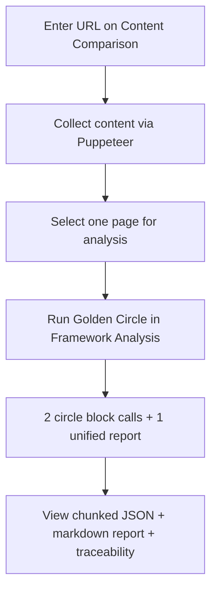
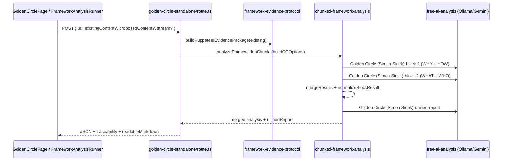

# Golden Circle Assessment — Complete Guide

**Version:** 2.0 (Flat Fractional Scoring)  
**Last updated:** June 2026  
**Audience:** Product owners, analysts, and engineers working with the Zero Barriers Growth Accelerator Golden Circle assessment.

---

## Scoring authority (read this first)

**Production scoring is flat fractional only (0.0–1.0).** The sole authority for how to score, the rating bands, the calculation tables, and the dimension structure is:

**[`docs/frameworks/Golden-Circle-Flat-Scoring.md`](../frameworks/Golden-Circle-Flat-Scoring.md)**

That file is injected into every AI block prompt (first 12,000 characters). Nothing in this guide overrides it.

| Document | Role |
|----------|------|
| `Golden-Circle-Flat-Scoring.md` | **Scoring + structure** — use this for all score interpretation |
| `GOLDEN_CIRCLE_COMPLETE.md` | **Definitions + Sinek examples + evidence cues only** — its 1–10 circle tables and weighted overall formula are **not** used by the runtime assessment |

No scoring logic was changed to produce these guides. If any other doc disagrees with the flat-scoring doc, **trust the flat-scoring doc**.

**Design rationale:** Flat-scoring md is purpose-built for **website brand signals** (what the company says and implies). The archived complete doc adds Sinek definitions, synonyms, and “what to look for” cues — not an alternate scoring method. Overall score = sum of 24 dimension scores ÷ 24 (equivalent to averaging four circle means). Keyword hints use qualified keys (`why:clarity`, `how:clarity`, etc.) because dimension names repeat across circles. See [guides README](./README.md#why-flat-scoring-not-the-complete-reference-scales).

---

## Why flat scoring for website analysis (design rationale)

Simon Sinek’s Golden Circle was created to explain how **inspiring leaders and organizations communicate** — purpose first, proof second. This platform applies that framework to **public website content**, not live leadership coaching or internal culture audits.

### Two documents, two jobs

| | `Golden-Circle-Flat-Scoring.md` | `GOLDEN_CIRCLE_COMPLETE.md` |
|---|--------------------------------|------------------------------|
| **Written for** | Website / brand messaging analysis | Deep reference + communication coaching |
| **Evidence** | What the site **says, promises, and implies** | Sinek definitions, examples, communication order |
| **Scoring** | 0.0–1.0 per dimension (24 total) | 1–10 per circle + weighted 0–100 overall |
| **Role in pipeline** | Injected into AI prompts — **scoring source of truth** | Synonyms, evidence checklists, best practices only |

### Why 0.0–1.0 fractional (not 1–10)

Most websites lead with WHAT (products) and bury WHY (purpose). Fractional scoring reflects **sparse, uneven evidence** honestly:

- **0.82** — clear purpose statement on homepage hero  
- **0.35** — implicit cause language without explicit WHY  
- **0.12** — dimension effectively absent from public copy  

Integer 1–10 bands push the model toward round scores and overstate confidence when a circle is only weakly signaled.

### Why equal weight across all 24 dimensions

Production uses **no arbitrary weights** (contrast the archived doc’s 35% WHY / 25% HOW / 20% WHAT / 20% WHO formula at [L448](../archived/GOLDEN_CIRCLE_COMPLETE.md#L448)):

```
OVERALL = (dim₁ + dim₂ + … + dim₂₄) ÷ 24
```

Each of the 24 dimensions counts equally. Circle-level scores are still reported as **simple means of their 6 dimensions** for readability:

```
WHY score = mean(why:clarity … why:emotional_resonance)
```

Mathematically, averaging four circle means equals averaging all 24 dimensions — runtime `mergeResults()` implements the flat 24-dimension mean directly.

### Qualified keyword keys

Dimension slugs like `clarity`, `alignment`, and `consistency` appear in multiple circles. JSON nests them under `categories.{why|how|what|who}.elements.{slug}`. Keyword hints use **qualified keys** (`why:clarity`, `how:clarity`, etc.) in `supplementary-element-hints.ts` so the model does not conflate circles.

### Practical layering

1. **Flat-scoring md** — bands, dimension definitions, output format  
2. **Puppeteer evidence protocol** — headlines, CTAs, testimonials, meta  
3. **Keyword hints** — recognition aids from `GOLDEN_CIRCLE_DIMENSION_HINTS`  
4. **Archived complete doc** — Sinek quotes, company examples, website evidence checklists (human reference)

---

## Table of Contents

1. [What This Assessment Does](#1-what-this-assessment-does)
2. [Official Golden Circle References](#2-official-golden-circle-references)
3. [The Four Circles and 24 Dimensions](#3-the-four-circles-and-24-dimensions)
4. [Scoring Methodology](#4-scoring-methodology)
5. [How We Apply Golden Circle to Website Content](#5-how-we-apply-golden-circle-to-website-content)
6. [User Workflows](#6-user-workflows)
7. [End-to-End Pipeline](#7-end-to-end-pipeline)
8. [Prompt Construction](#8-prompt-construction)
9. [API Contract](#9-api-contract)
10. [Response Structure](#10-response-structure)
11. [Integrity and Completeness Checks](#11-integrity-and-completeness-checks)
12. [Code and Documentation Reference Index](#12-code-and-documentation-reference-index)
13. [Dual Analysis Paths (Chunked vs Enhanced)](#13-dual-analysis-paths-chunked-vs-enhanced)
14. [Known Drift and Documentation Gaps](#14-known-drift-and-documentation-gaps)
15. [Environment and Performance](#15-environment-and-performance)
16. [Troubleshooting](#16-troubleshooting)
17. [Testing](#17-testing)
18. [Annotated Bibliography](#18-annotated-bibliography)
19. [Per-Dimension Reference Catalog](#19-per-dimension-reference-catalog)
20. [Implementation & Prompt File Reference](#20-implementation--prompt-file-reference)

---

## 1. What This Assessment Does

The Golden Circle assessment evaluates **organizational purpose and messaging** on a website (or pasted content) using Simon Sinek’s **WHY → HOW → WHAT** model, extended with a fourth **WHO** circle for audience and identity depth.

The platform:

- Reads **public website content** collected by Puppeteer (mission copy, methodology pages, product listings, audience language, testimonials, culture signals)
- Scores **all 24 dimensions** (6 per circle) using **flat fractional scoring** (0.0–1.0 per dimension, no weights)
- Produces **per-dimension evidence**, **circle averages**, an **overall score**, and a **unified markdown report**
- Supports **existing vs proposed content** comparison when proposed copy is supplied

**Core concept (Simon Sinek):** People don’t buy WHAT you do; they buy WHY you do it. WHAT is proof of WHY. Inspiring communication works **inside-out** (WHY first), not outside-in (features first).

**Enhanced WHO layer:** Zero Barriers adds WHO as a fourth circle — who you serve, who believes what you believe, and how identity deepens purpose ([GC-INT-1], [GC-3]).

---

## 2. Official Golden Circle References

> **Start here for deep research:** Section [19](#19-per-dimension-reference-catalog) maps every runtime dimension to flat-scoring definitions, archived doc line refs, and keyword hints. Section [18](#18-annotated-bibliography) is the full numbered bibliography.

### External (official) sources

| Ref | Resource | URL |
|-----|----------|-----|
| [GC-1] | Simon Sinek — *The Golden Circle* | https://simonsinek.com/golden-circle/ |
| [GC-2] | Simon Sinek — *Start With Why* (2009 book) | https://simonsinek.com/books/start-with-why/ |
| [GC-3] | Simon Sinek — *Find Your Why* (purpose discovery) | https://simonsinek.com/books/find-your-why/ |
| [GC-4] | TED Talk — *How Great Leaders Inspire Action* (Golden Circle origin) | https://www.ted.com/talks/simon_sinek_how_great_leaders_inspire_action |
| [GC-5] | The Optimism Company — official WHY/HOW/WHAT examples cited by Sinek | https://simonsinek.com/ |

### Internal reference documents

| Ref | Document | Purpose |
|-----|----------|---------|
| [GC-INT-1] | [`docs/archived/GOLDEN_CIRCLE_COMPLETE.md`](../archived/GOLDEN_CIRCLE_COMPLETE.md) | **Definitions only** — Sinek quotes, synonyms, examples, website evidence checklists (~603 lines). **Do not use its 1–10 or weighted 0–100 scoring for production.** |
| [GC-INT-2] | [`docs/frameworks/Golden-Circle-Flat-Scoring.md`](../frameworks/Golden-Circle-Flat-Scoring.md) | **Scoring authority** — flat 0.0–1.0 bands, 24 dimensions, calculation; injected into every block prompt |
| [GC-INT-3] | [`docs/archived/COMPLETE_FRAMEWORK_INDEX.md`](../archived/COMPLETE_FRAMEWORK_INDEX.md) | Master index of all framework docs in this repo |
| [GC-INT-4] | [`docs/guides/README.md`](./README.md) | Assessment guides index |
| [GC-INT-5] | [`.cursorrules`](../../.cursorrules) | Project-wide Golden Circle element inventory |
| [GC-INT-6] | [`docs/PAGE_WORKFLOWS.md`](../PAGE_WORKFLOWS.md) | Dashboard workflow for `/dashboard/golden-circle-standalone` |
| [GC-INT-7] | [`docs/LOCAL_RUNBOOK.md`](../LOCAL_RUNBOOK.md) | Local Ollama/dev setup |
| [GC-INT-8] | [`docs/guides/B2C_ELEMENTS_ASSESSMENT_GUIDE.md`](./B2C_ELEMENTS_ASSESSMENT_GUIDE.md) | Sister guide — consumer value pyramid |
| [GC-INT-9] | [`docs/guides/CLIFTONSTRENGTHS_ASSESSMENT_GUIDE.md`](./CLIFTONSTRENGTHS_ASSESSMENT_GUIDE.md) | Sister guide — organizational strengths |

---

## 3. The Four Circles and 24 Dimensions

The **production chunked path** organizes scoring into **four circles** (categories). Each circle has **6 dimensions**. Slugs use **snake_case** in JSON; keyword hints use **`categoryKey:slug`** qualified keys.

| Circle | Category key | Core question | Dimensions | Count |
|--------|--------------|---------------|------------|-------|
| 1 | `why` | Why do you exist beyond making money? | clarity, authenticity, inspiration, consistency, differentiation, emotional_resonance | 6 |
| 2 | `how` | How do you fulfill your WHY? | uniqueness, clarity, consistency, alignment, proof_points, competitive_moat | 6 |
| 3 | `what` | What do you do to bring WHY to life? | clarity, alignment, quality, proof, evolution, market_fit | 6 |
| 4 | `who` | Who believes what you believe? | clarity, alignment, specificity, understanding, resonance, loyalty | 6 |

**Total:** 24 dimensions.

### Communication order (inside-out)

Per Sinek and [GC-INT-1] [L435–444](../archived/GOLDEN_CIRCLE_COMPLETE.md#L435):

1. Lead with **WHY** — “We believe…”
2. Support with **HOW** — “We do this by…”
3. Prove with **WHAT** — “What we offer is…”
4. Connect with **WHO** — “For people who…”

Websites that violate this order (product-first hero, buried mission) typically score lower on WHY dimensions and alignment dimensions across circles.

### Duplicate slug names (important)

These slugs appear in more than one circle — they are **not** the same score:

| Slug | Appears in |
|------|------------|
| `clarity` | `why`, `how`, `what`, `who` |
| `consistency` | `why`, `how` |
| `alignment` | `how`, `what`, `who` |

Always interpret scores in context of `categories.{circle}.elements.{slug}`.

---

## 4. Scoring Methodology

**Authority:** [`Golden-Circle-Flat-Scoring.md`](../frameworks/Golden-Circle-Flat-Scoring.md)

### Rating bands (per dimension)

| Score range | Rating | Meaning |
|-------------|--------|---------|
| 0.8–1.0 | Excellent | Clear, compelling, inspirational |
| 0.6–0.79 | Good | Well-defined and solid |
| 0.4–0.59 | Needs Work | Unclear or generic |
| 0.0–0.39 | Poor | Undefined, weak, or product-focused |

### Calculation

```
Circle score  = mean of 6 dimension scores in that circle
Overall score = sum of all 24 dimension scores ÷ 24
              = (WHY + HOW + WHAT + WHO) ÷ 4   [equivalent formulation]
```

Runtime implementation: `mergeResults()` in [`chunked-framework-analysis.ts`](../../src/lib/chunked-framework-analysis.ts) averages **all 24 dimension scores** with equal weight.

### Strengths and gaps thresholds

From `mergeResults()`:

- **Top strengths:** dimensions with score ≥ **0.7** (up to 5)
- **Critical gaps:** dimensions with score < **0.4** (up to 5)

### What the archived doc provides (not scoring)

[`GOLDEN_CIRCLE_COMPLETE.md`](../archived/GOLDEN_CIRCLE_COMPLETE.md) includes per-circle 1–10 rubrics ([WHY L84](../archived/GOLDEN_CIRCLE_COMPLETE.md#L84), [HOW L158](../archived/GOLDEN_CIRCLE_COMPLETE.md#L158), [WHAT L232](../archived/GOLDEN_CIRCLE_COMPLETE.md#L232), [WHO L416](../archived/GOLDEN_CIRCLE_COMPLETE.md#L416)) and a **weighted 0–100 overall** formula ([L448–465](../archived/GOLDEN_CIRCLE_COMPLETE.md#L448)). These are **reference only** — production does not use them.

---

## 5. How We Apply Golden Circle to Website Content

### Evidence mapping by circle

| Circle | Website signals | Typical page locations |
|--------|-----------------|------------------------|
| **WHY** | Mission, purpose, “we believe,” cause, impact language | Homepage hero, About, Our Story, Impact |
| **HOW** | Methodology, values, process, differentiation, operating principles | Approach, Values, How We Work, differentiation pages |
| **WHAT** | Products, services, features, pricing, outcomes | Product, Services, Solutions, Pricing |
| **WHO** | ICP, personas, “for [audience],” testimonials, culture, team identity | Customers, Case Studies, Careers, Community |

### Archived website evidence checklist

From [GC-INT-1] [L469–506](../archived/GOLDEN_CIRCLE_COMPLETE.md#L469):

**WHY:** mission on homepage, “we believe” statements, origin story, impact language  
**HOW:** named methodology, values page, “our approach,” process steps, differentiation  
**WHAT:** product descriptions, pricing, features/benefits, catalog  
**WHO:** named testimonials, target market copy, “for [audience],” case studies, culture/team

### Evidence quality hierarchy

From [GC-INT-1] [L568–575](../archived/GOLDEN_CIRCLE_COMPLETE.md#L568) (strongest → weakest):

1. Direct quotes (“We believe…”)  
2. Named frameworks (“Our XYZ Methodology”)  
3. Specific examples (customer names, companies, results)  
4. Action proof (values demonstrated)  
5. Implicit evidence (cultural indicators)  
6. Generic claims (vague, unspecific)

### Common website failure modes

| Failure mode | Affected dimensions | Typical score pattern |
|--------------|---------------------|----------------------|
| Product-first homepage | `why:*`, `what:alignment`, `how:alignment` | Low WHY, high WHAT clarity only |
| Generic mission (“we innovate”) | `why:clarity`, `why:differentiation`, `why:authenticity` | Mid clarity, low differentiation |
| No audience specificity | `who:specificity`, `who:clarity` | Low WHO across board |
| Values page disconnected from products | `how:alignment`, `what:alignment` | Alignment gaps despite decent individual circle scores |

Evidence normalization: [`src/lib/framework-evidence-protocol.ts`](../../src/lib/framework-evidence-protocol.ts).

Per-dimension keyword hints: [`src/lib/elements/supplementary-element-hints.ts`](../../src/lib/elements/supplementary-element-hints.ts) → `GOLDEN_CIRCLE_DIMENSION_HINTS`.

---

## 6. User Workflows

### Primary UI entry points

| Route | Component | API endpoint |
|-------|-----------|--------------|
| `/dashboard/golden-circle-standalone` | `GoldenCirclePage` | `/api/analyze/golden-circle-standalone` |
| Content Comparison → Framework Analysis tab | `FrameworkAnalysisRunner` | Same endpoint via `framework-analysis-entrypoint` |
| Phase 2 dashboard tab | `phase2/page.tsx` | Golden Circle tab (embedded) |

### Typical flow (recommended)



1. **Collect** — Puppeteer gathers page content. Collection does **not** call Ollama/Gemini.
2. **Select page** — By default, one primary page is analyzed (homepage or entered URL).
3. **Analyze** — Chunked AI runs circle blocks, then unified synthesis.
4. **Review** — Results include per-dimension scores, evidence, `verification.completeness_check`, and `readableMarkdown`.

### Standalone page flow

[`src/components/analysis/GoldenCirclePage.tsx`](../../src/components/analysis/GoldenCirclePage.tsx) uses `useFrameworkPageAnalysis('/api/analyze/golden-circle-standalone')`:

- Enter URL (required)
- Optionally paste **proposed content** for comparison
- Optionally paste **scraped JSON** to skip re-collection
- Stream progress per circle block
- Export markdown report

### Workflow documentation

See [`docs/PAGE_WORKFLOWS.md`](../PAGE_WORKFLOWS.md) — section `/dashboard/golden-circle-standalone`.

---

## 7. End-to-End Pipeline

### Architecture diagram



### Key implementation files

| Step | File |
|------|------|
| API route | [`src/app/api/analyze/golden-circle-standalone/route.ts`](../../src/app/api/analyze/golden-circle-standalone/route.ts) |
| Shared chunk builder | [`src/lib/framework/build-chunk-options.ts`](../../src/lib/framework/build-chunk-options.ts) → `buildChunkAnalysisOptions('golden-circle')` |
| Chunk orchestration | [`src/lib/chunked-framework-analysis.ts`](../../src/lib/chunked-framework-analysis.ts) |
| Canonical chunk list | [`src/lib/framework/chunk-definitions.ts`](../../src/lib/framework/chunk-definitions.ts) → `GOLDEN_CIRCLE_CHUNK_CONFIG` |
| AI provider | [`src/lib/free-ai-analysis.ts`](../../src/lib/free-ai-analysis.ts) |
| Streaming wrapper | [`src/lib/streaming-analysis.ts`](../../src/lib/streaming-analysis.ts) |
| Client hook | [`src/hooks/useFrameworkPageAnalysis.ts`](../../src/hooks/useFrameworkPageAnalysis.ts) |
| Framework router | [`src/lib/framework-analysis-entrypoint.ts`](../../src/lib/framework-analysis-entrypoint.ts) |

### Chunk configuration & AI call count

The Golden Circle route does **not** set `categoriesPerBlock`. With **24 elements** (≤ 34 threshold) and typical content length, `chooseCategoriesPerBlock()` defaults to **`2` circles per block**:

```
Block 1: WHY (6) + HOW (6)   ← 12 dimensions in one prompt
Block 2: WHAT (6) + WHO (6)  ← 12 dimensions in one prompt
```

**Total AI calls (typical):** 3 (2 blocks + 1 unified report).

If `contentText` exceeds **7,000 characters**, `categoriesPerBlock` auto-switches to **`1`**, producing **4 blocks + unified = 5 calls**:

```
Block 1: WHY (6)
Block 2: HOW (6)
Block 3: WHAT (6)
Block 4: WHO (6)
```

**Analysis type labels:**

- `Golden Circle (Simon Sinek)-block-1` … `Golden Circle (Simon Sinek)-block-N`
- `Golden Circle (Simon Sinek)-unified-report`

---

## 8. Prompt Construction

Each block prompt is built by `buildBlockPrompt()` in [`src/lib/chunked-framework-analysis.ts`](../../src/lib/chunked-framework-analysis.ts).

### Prompt ingredients

| Section | Source | Notes |
|---------|--------|-------|
| Framework markdown | `docs/frameworks/Golden-Circle-Flat-Scoring.md` | Truncated to **12,000 characters** |
| Website content summary | `buildContentSummary()` | URL, title, meta, keywords, **first 1,500 chars** of content |
| Evidence protocol | Prepended to `contentText` in `buildGCOptions()` | CTAs, headlines, testimonials, etc. |
| Circle + dimension list | Per-block chunk definition | Exact slugs the model must score |
| **Recognition keyword hints** | `element-keyword-hints.ts` ← `GOLDEN_CIRCLE_DIMENSION_HINTS` | Qualified keys (`why:clarity`, etc.); supplementary only |
| Scoring rubric | `scoringInstructions` in `buildGCOptions()` + flat-scoring md | Never overridden by keyword hints |
| JSON schema | Inline in prompt | `categories.{circle}.elements.{slug}` |

### Block prompt template (abbreviated)

```
You are analyzing website content using the Golden Circle framework.
Evaluate EVERY dimension listed below. Do not skip any dimension.

FRAMEWORK MARKDOWN (SOURCE OF TRUTH):
{first 12k of Golden-Circle-Flat-Scoring.md}

WEBSITE CONTENT:
URL: ...
Content (first 1500 chars): ...

CATEGORIES IN THIS BLOCK:
- WHY (why): clarity, authenticity, inspiration, ...

KEYWORD RECOGNITION HINTS (supplementary — do not override scoring bands):
- why:clarity: keywords: why, purpose, believe, ...
...

SCORING:
Score each dimension 0.0-1.0 (flat fractional scoring): ...

Return ONLY valid JSON in this exact format:
{ "categories": { "why": { "categoryScore": 0.0, "elements": { ... } } } }
```

### Unified report prompt

`buildUnifiedReportWithOllama()` synthesizes markdown: Executive Summary, What Is Working, What Needs Improvement, Prioritized Action Plan, Alignment Notes (WHY→HOW→WHAT→WHO), Risk Notes.

### AI failure fallback

[`src/lib/framework-fallback-generator.ts`](../../src/lib/framework-fallback-generator.ts) → `generateFrameworkFallbackMarkdown({ framework: 'golden-circle', ... })`.

---

## 9. API Contract

### Endpoint

```
POST /api/analyze/golden-circle-standalone
```

**`maxDuration`:** 300 seconds (Vercel serverless).

### Request body

| Field | Type | Required | Description |
|-------|------|----------|-------------|
| `url` | string | **Yes** | Target website URL |
| `existingContent` | object | No | Pre-scraped content from LocalForage / content comparison |
| `proposedContent` | string | No | Proposed copy for side-by-side context |
| `analysisType` | string | No | Legacy label (ignored by chunked path) |
| `stream` | boolean | No | Enable SSE progress streaming |

### Content resolution order

1. Use `existingContent` if provided (client-side collection)  
2. On Vercel/production: `ProductionContentExtractor`  
3. Locally: `/api/analyze/compare` fallback scrape

### Success response (abbreviated)

```json
{
  "success": true,
  "existing": { "title": "...", "cleanText": "...", "url": "..." },
  "proposed": null,
  "analysis": {
    "framework": "Golden Circle (Simon Sinek)",
    "overallScore": 0.542,
    "totalElements": 24,
    "categories": {
      "why": {
        "categoryName": "WHY (Purpose, Cause, Belief)",
        "categoryScore": 0.61,
        "elementCount": 6,
        "elements": {
          "clarity": { "score": 0.72, "evidence": "...", "recommendation": "..." }
        }
      }
    },
    "verification": { "completeness_check": "pass", "expected": 24, "analyzed": 24 },
    "unifiedReport": "# Golden Circle Analysis\n...",
    "chunkedReport": "..."
  },
  "readableMarkdown": "# Golden Circle Analysis\n...",
  "traceability": { },
  "puppeteerEvidence": { },
  "message": "Golden Circle analysis completed"
}
```

### Error response

```json
{
  "success": false,
  "error": "Golden Circle analysis failed",
  "details": "..."
}
```

---

## 10. Response Structure

### Top-level analysis fields

| Field | Type | Description |
|-------|------|-------------|
| `framework` | string | `"Golden Circle (Simon Sinek)"` |
| `url` | string | Analyzed URL |
| `overallScore` | number | 0.0–1.0 mean of 24 dimensions |
| `totalElements` | number | Always **24** when complete |
| `categories` | object | Keys: `why`, `how`, `what`, `who` |
| `topStrengths` | array | Up to 5 dimensions ≥ 0.7 |
| `criticalGaps` | array | Up to 5 dimensions < 0.4 |
| `verification` | object | Completeness counts and `completeness_check` |
| `unifiedReport` | string | AI-synthesized markdown |
| `chunkedReport` | string | Deterministic markdown from merged JSON |
| `analysisMethod` | string | `"chunked"` |
| `chunksCompleted` / `chunksTotal` | number | Block progress |
| `errors` | string[] | Per-block errors if any |

### Per-dimension element shape

```typescript
interface DimensionResult {
  score: number;        // 0.0–1.0
  evidence: string;     // Quoted or paraphrased site copy
  recommendation: string;
}
```

---

## 11. Integrity and Completeness Checks

### Automated test

[`src/test/framework/element-completeness.test.ts`](../../src/test/framework/element-completeness.test.ts):

```typescript
validateFrameworkCompleteness('golden-circle');
// expectedCount: 24, categoryCount: 4
```

### Runtime verification

`mergeResults()` sets `verification.completeness_check`:

- **`pass`** — all 24 dimensions present with numeric scores  
- **`fail`** — missing dimensions or block errors

### Keyword hint coverage test

[`src/test/framework/element-keyword-hints.test.ts`](../../src/test/framework/element-keyword-hints.test.ts) validates:

- `inferFrameworkHintKey('Golden Circle (Simon Sinek)')` → `'golden-circle'`
- Qualified keys resolve for WHY and HOW blocks separately

---

## 12. Code and Documentation Reference Index

| Concern | Path |
|---------|------|
| Scoring authority | `docs/frameworks/Golden-Circle-Flat-Scoring.md` |
| Archived definitions | `docs/archived/GOLDEN_CIRCLE_COMPLETE.md` |
| Canonical chunks | `src/lib/framework/chunk-definitions.ts` → `GOLDEN_CIRCLE_CHUNK_CONFIG` |
| Keyword hints | `src/lib/elements/supplementary-element-hints.ts` → `GOLDEN_CIRCLE_DIMENSION_HINTS` |
| Hint injection | `src/lib/framework/element-keyword-hints.ts` |
| Production API | `src/app/api/analyze/golden-circle-standalone/route.ts` |
| Chunk engine | `src/lib/chunked-framework-analysis.ts` |
| UI page | `src/components/analysis/GoldenCirclePage.tsx` |
| Dashboard route | `src/app/dashboard/golden-circle-standalone/page.tsx` |
| Framework config | `src/lib/framework/framework-assessment-config.ts` |
| Universal assessment | `src/lib/universal-assessment-service.ts` |

---

## 13. Dual Analysis Paths (Chunked vs Enhanced)

| Path | Entry | Schema | Scoring |
|------|-------|--------|---------|
| **Chunked (production)** | `/api/analyze/golden-circle-standalone` | 24 dimensions, 4 circles | Flat 0.0–1.0 |
| **Enhanced / legacy** | `/api/analyze/golden-circle`, `/api/analyze/individual/golden-circle` | JSON rules-based | May use 0–100 legacy schema |
| **Detailed service** | `GoldenCircleDetailedService` | Stored analysis retrieval | Depends on stored run |

**Default UI** (`GoldenCirclePage`) uses the **chunked standalone** path.

Enhanced/legacy files:

| File | Role |
|------|------|
| `src/lib/ai-engines/assessment-rules/golden-circle-rules.json` | Enhanced JSON schema |
| `src/lib/ai-engines/framework-knowledge/golden-circle-framework.json` | Framework knowledge |
| `src/lib/services/standalone-golden-circle.service.ts` | Standalone service wrapper |
| `src/lib/services/golden-circle-detailed.service.ts` | Detailed analysis retrieval |

---

## 14. Known Drift and Documentation Gaps

| Topic | Canonical source | Drift / gap |
|-------|------------------|-------------|
| Chunk list | `GOLDEN_CIRCLE_CHUNK_CONFIG` | `buildGCOptions()` in route **duplicates** same list inline — keep in sync |
| Overall formula | Flat doc: mean of 4 circles | Runtime: mean of 24 dims — **mathematically equivalent** |
| Archived weighted score | 35/25/20/20 at [L448](../archived/GOLDEN_CIRCLE_COMPLETE.md#L448) | **Not used** in production |
| Archived 1–10 rubrics | Per-circle in complete doc | **Not used** — flat 0.0–1.0 only |
| WHO in Sinek’s original TED model | 3 circles (WHY/HOW/WHAT) | Platform uses **enhanced 4-circle** model per [GC-INT-1] |
| `buildChunkAnalysisOptions()` | Shared builder with scoring instructions | Route uses local `buildGCOptions()` instead — functionally aligned today |

---

## 15. Environment and Performance

| Variable | Purpose |
|----------|---------|
| `AI_PROVIDER` | `ollama` (local) or cloud provider |
| `OLLAMA_BASE_URL` | e.g. `http://127.0.0.1:11434` |
| `OLLAMA_MODEL` | e.g. `llama3.1:8b` |
| `OLLAMA_NUM_PREDICT` | Max tokens per call |
| `GEMINI_API_KEY` | Fallback when Ollama fails |
| `AI_ALLOW_FALLBACKS` | Enable Gemini fallback |

See [`docs/LOCAL_RUNBOOK.md`](../LOCAL_RUNBOOK.md).

### Performance characteristics

| Factor | Impact |
|--------|--------|
| Default 2-block mode | Block 1 scores **12 dimensions** (WHY + HOW) |
| 3 AI calls (typical) | Same call count as B2C default; fewer than B2B (6) or Clifton (5) |
| 1,500-char content cap | May miss deep-page purpose proof |
| Long content (>7k chars) | Switches to 1 circle/block → **5 calls** |

---

## 16. Troubleshooting

| Symptom | Likely cause | What to check |
|---------|--------------|---------------|
| `completeness_check: fail` | Block error or missing dimension | `analysis.errors`; compare route chunks to `GOLDEN_CIRCLE_CHUNK_CONFIG` |
| All WHY scores low | Product-first site | Analyze About/Impact page; pass richer `existingContent` |
| Duplicate slug confusion | `clarity` in 4 circles | Read `categories.{why\|how\|what\|who}.elements.clarity` separately |
| Alignment scores low | Disconnected values vs products | Check HOW and WHAT pages together |
| Unified report is raw JSON | Ollama JSON vs markdown conflict | Use `chunkedReport` fallback |
| All scores `0` | Ollama unreachable | `OLLAMA_BASE_URL`, `ollama serve` |

---

## 17. Testing

| Test | Location | What it validates |
|------|----------|-------------------|
| Dimension completeness | `src/test/framework/element-completeness.test.ts` | 24 dimensions, 4 circles |
| Keyword hints | `src/test/framework/element-keyword-hints.test.ts` | Qualified keys, framework inference |
| API security | `src/test/security/security-config.test.ts` | Protected route registration |

```bash
npm run test -- src/test/framework/element-completeness.test.ts
npm run test -- src/test/framework/element-keyword-hints.test.ts
npm run type-check
```

---

## 18. Annotated Bibliography

### External sources

| ID | Citation | Used for |
|----|----------|----------|
| [GC-1] | Sinek, S. (n.d.). *The Golden Circle*. https://simonsinek.com/golden-circle/ | Official WHY/HOW/WHAT definitions |
| [GC-2] | Sinek, S. (2009). *Start With Why*. Portfolio. https://simonsinek.com/books/start-with-why/ | Book-length framework exposition |
| [GC-3] | Sinek, S., & Mead, D. (2017). *Find Your Why*. Portfolio. https://simonsinek.com/books/find-your-why/ | Purpose discovery methodology |
| [GC-4] | Sinek, S. (2009). *How Great Leaders Inspire Action* (TED). https://www.ted.com/talks/simon_sinek_how_great_leaders_inspire_action | Original public framing; Apple/Wright Brothers examples |
| [GC-5] | The Optimism Company. (n.d.). Official Golden Circle examples. https://simonsinek.com/ | Canonical WHY/HOW/WHAT copy patterns |

### Internal implementation sources

| ID | File | Role in assessment |
|----|------|-------------------|
| [GC-INT-1] | `docs/archived/GOLDEN_CIRCLE_COMPLETE.md` | Circle definitions, Sinek quotes, website evidence checklists |
| [GC-INT-2] | `docs/frameworks/Golden-Circle-Flat-Scoring.md` | Injected into AI block prompts (≤12k chars) |
| [GC-INT-3] | `src/lib/framework/chunk-definitions.ts` → `GOLDEN_CIRCLE_CHUNK_CONFIG` | Canonical 24-dimension chunk manifest |
| [GC-INT-4] | `src/lib/elements/supplementary-element-hints.ts` → `GOLDEN_CIRCLE_DIMENSION_HINTS` | Qualified keyword hints |
| [GC-INT-5] | `src/app/api/analyze/golden-circle-standalone/route.ts` | Production API; `buildGCOptions()` |
| [GC-INT-6] | `src/lib/chunked-framework-analysis.ts` | Prompt builder, merge, unified report |
| [GC-INT-7] | `src/lib/framework-evidence-protocol.ts` | Puppeteer evidence → prompt preamble |
| [GC-INT-8] | `src/test/framework/element-completeness.test.ts` | Automated 24-dimension integrity test |

---

## 19. Per-Dimension Reference Catalog

All 24 production dimensions from `GOLDEN_CIRCLE_CHUNK_CONFIG`. **Flat-scoring definitions** are in [`Golden-Circle-Flat-Scoring.md`](../frameworks/Golden-Circle-Flat-Scoring.md). **Archived doc** line numbers point to parent circle sections in `GOLDEN_CIRCLE_COMPLETE.md`.

### Circle 1: WHY — Purpose, Cause, Belief (`why`)

| Qualified key | Slug | Block (default) | Flat-scoring dimension | Archived parent (line) | Keywords (sample) |
|---------------|------|-----------------|------------------------|------------------------|-------------------|
| `why:clarity` | `clarity` | 1 | How clear and well-articulated is the WHY? | [L22](../archived/GOLDEN_CIRCLE_COMPLETE.md#L22) | why, purpose, believe, cause, mission, clear |
| `why:authenticity` | `authenticity` | 1 | Does it reflect true beliefs and values? | [L22](../archived/GOLDEN_CIRCLE_COMPLETE.md#L22) | authentic, genuine, true, values, integrity |
| `why:inspiration` | `inspiration` | 1 | Does it inspire and motivate people? | [L67](../archived/GOLDEN_CIRCLE_COMPLETE.md#L67) | inspire, motivate, vision, change the world, passion |
| `why:consistency` | `consistency` | 1 | Is it consistent across all communications? | [L57](../archived/GOLDEN_CIRCLE_COMPLETE.md#L57) | consistent, always, aligned, same message, throughout |
| `why:differentiation` | `differentiation` | 1 | Is it unique and meaningful? | [L67](../archived/GOLDEN_CIRCLE_COMPLETE.md#L67) | unique, only, different, unlike, stand out |
| `why:emotional_resonance` | `emotional_resonance` | 1 | Does it connect emotionally? | [L57](../archived/GOLDEN_CIRCLE_COMPLETE.md#L57) | feel, heart, emotion, connect, resonate |

**Sinek anchor quote:** “People don't buy WHAT you do, they buy WHY you do it.” — [L30](../archived/GOLDEN_CIRCLE_COMPLETE.md#L30)

**Strong WHY examples (archived):** Apple, TOMS, Tesla, Patagonia — [L77–82](../archived/GOLDEN_CIRCLE_COMPLETE.md#L77)

### Circle 2: HOW — Process, Methodology, Differentiation (`how`)

| Qualified key | Slug | Block (default) | Flat-scoring dimension | Archived parent (line) | Keywords (sample) |
|---------------|------|-----------------|------------------------|------------------------|-------------------|
| `how:uniqueness` | `uniqueness` | 1 | What makes your HOW distinctive? | [L94](../archived/GOLDEN_CIRCLE_COMPLETE.md#L94) | unique, proprietary, only we, distinctive, method |
| `how:clarity` | `clarity` | 1 | How clearly defined are your methods? | [L130](../archived/GOLDEN_CIRCLE_COMPLETE.md#L130) | how we, process, approach, methodology, clear steps |
| `how:consistency` | `consistency` | 1 | Do you consistently follow your HOW? | [L141](../archived/GOLDEN_CIRCLE_COMPLETE.md#L141) | consistent, always, standard, repeatable, systematic |
| `how:alignment` | `alignment` | 1 | Does your HOW support your WHY? | [L94](../archived/GOLDEN_CIRCLE_COMPLETE.md#L94) | support our why, fulfill, aligned, in service of |
| `how:proof_points` | `proof_points` | 1 | Can you demonstrate your HOW with evidence? | [L130](../archived/GOLDEN_CIRCLE_COMPLETE.md#L130) | proven, case study, results, evidence, demonstrate |
| `how:competitive_moat` | `competitive_moat` | 1 | Does your HOW create barriers to competition? | [L141](../archived/GOLDEN_CIRCLE_COMPLETE.md#L141) | advantage, moat, barrier, defensible, exclusive |

**Sinek fingerprint concept:** “The combination of your WHY and HOWs is like your organization's fingerprint.” — [L100](../archived/GOLDEN_CIRCLE_COMPLETE.md#L100)

**Strong HOW examples (archived):** Apple, Southwest, Amazon, Disney — [L151–156](../archived/GOLDEN_CIRCLE_COMPLETE.md#L151)

### Circle 3: WHAT — Products, Services, Features (`what`)

| Qualified key | Slug | Block (default) | Flat-scoring dimension | Archived parent (line) | Keywords (sample) |
|---------------|------|-----------------|------------------------|------------------------|-------------------|
| `what:clarity` | `clarity` | 2 | How clear are your offerings? | [L168](../archived/GOLDEN_CIRCLE_COMPLETE.md#L168) | what we do, offer, product, service, features |
| `what:alignment` | `alignment` | 2 | Do offerings align with WHY and HOW? | [L176](../archived/GOLDEN_CIRCLE_COMPLETE.md#L176) | bring our why, fulfill our mission, supports our purpose |
| `what:quality` | `quality` | 2 | Is quality consistent and excellent? | [L215](../archived/GOLDEN_CIRCLE_COMPLETE.md#L215) | quality, excellent, premium, reliable, best-in-class |
| `what:proof` | `proof` | 2 | Do offerings prove your WHY and HOW? | [L176](../archived/GOLDEN_CIRCLE_COMPLETE.md#L176) | testimonial, case study, results, metrics, outcomes |
| `what:evolution` | `evolution` | 2 | Do you innovate while staying true to WHY? | [L204](../archived/GOLDEN_CIRCLE_COMPLETE.md#L204) | innovate, evolve, next generation, improve, latest |
| `what:market_fit` | `market_fit` | 2 | Do offerings meet market needs? | [L204](../archived/GOLDEN_CIRCLE_COMPLETE.md#L204) | for teams who, built for, solves, addresses, customer need |

**Sinek anchor quote:** “WHAT you do serves as the tangible proof of your WHY.” — [L176](../archived/GOLDEN_CIRCLE_COMPLETE.md#L176)

**Clear WHAT examples (archived):** Apple, Starbucks, Nike, Salesforce — [L225–230](../archived/GOLDEN_CIRCLE_COMPLETE.md#L225)

### Circle 4: WHO — Target Audience, People, Relationships (`who`)

| Qualified key | Slug | Block (default) | Flat-scoring dimension | Archived parent (line) | Keywords (sample) |
|---------------|------|-----------------|------------------------|------------------------|-------------------|
| `who:clarity` | `clarity` | 2 | How clearly defined is your audience? | [L323](../archived/GOLDEN_CIRCLE_COMPLETE.md#L323) | for, audience, ideal for, designed for, who we serve |
| `who:alignment` | `alignment` | 2 | Does your audience share your WHY? | [L248](../archived/GOLDEN_CIRCLE_COMPLETE.md#L248) | people who believe, share our values, like-minded |
| `who:specificity` | `specificity` | 2 | Are you specific or too broad? | [L323](../archived/GOLDEN_CIRCLE_COMPLETE.md#L323) | specific, niche, segment, persona, industry, role |
| `who:understanding` | `understanding` | 2 | Do you deeply understand their needs? | [L323](../archived/GOLDEN_CIRCLE_COMPLETE.md#L323) | pain points, challenges, we understand, frustrated |
| `who:resonance` | `resonance` | 2 | Does your message resonate with them? | [L392](../archived/GOLDEN_CIRCLE_COMPLETE.md#L392) | resonate, speak to, for you if, this is for |
| `who:loyalty` | `loyalty` | 2 | Does your WHO create loyal advocates? | [L392](../archived/GOLDEN_CIRCLE_COMPLETE.md#L392) | community, advocates, fans, loyal, belong, members |

**WHO framework depth (archived):** Five WHO dimensions of purpose and connection — [L260–321](../archived/GOLDEN_CIRCLE_COMPLETE.md#L260)

**Strong WHO examples (archived):** Peloton, HubSpot, Slack (serve); Zappos, Google, Patagonia (identity) — [L402–414](../archived/GOLDEN_CIRCLE_COMPLETE.md#L402)

### Additional archived reference sections

| Topic | Archived doc (line) | Content |
|-------|---------------------|---------|
| Analysis order (inside-out) | [L426](../archived/GOLDEN_CIRCLE_COMPLETE.md#L426) | WHY → HOW → WHAT → WHO |
| Website evidence checklist | [L469](../archived/GOLDEN_CIRCLE_COMPLETE.md#L469) | Per-circle checklist for scrapers/analysts |
| Best practices DO/DON'T | [L509](../archived/GOLDEN_CIRCLE_COMPLETE.md#L509) | Analysis discipline |
| Limbic vs neocortex | [L533](../archived/GOLDEN_CIRCLE_COMPLETE.md#L533) | Why inside-out communication works |
| Evidence hierarchy | [L568](../archived/GOLDEN_CIRCLE_COMPLETE.md#L568) | Strongest → weakest evidence |
| Quick reference table | [L559](../archived/GOLDEN_CIRCLE_COMPLETE.md#L559) | Four circles at a glance |
| Legacy weighted scoring | [L448](../archived/GOLDEN_CIRCLE_COMPLETE.md#L448) | **Not production** — 35/25/20/20 weights |

---

## 20. Implementation & Prompt File Reference

### API & chunk wiring

| Concern | File | Symbol / function |
|---------|------|-------------------|
| HTTP entry | `src/app/api/analyze/golden-circle-standalone/route.ts` | `POST`, `buildGCOptions()`, `generateGoldenCircleAnalysis()` |
| Chunk manifest (canonical) | `src/lib/framework/chunk-definitions.ts` | `GOLDEN_CIRCLE_CHUNK_CONFIG` |
| Chunk manifest (route copy) | `src/app/api/analyze/golden-circle-standalone/route.ts` | `buildGCOptions().chunks` — mirrors canonical config |
| Shared builder (alternate) | `src/lib/framework/build-chunk-options.ts` | `buildChunkAnalysisOptions('golden-circle')` |
| Analysis engine | `src/lib/chunked-framework-analysis.ts` | `analyzeFrameworkInChunks()` |
| Keyword hint builder | `src/lib/framework/element-keyword-hints.ts` | `formatKeywordHintsSection()` |
| Block prompt builder | `src/lib/chunked-framework-analysis.ts` | `buildBlockPrompt()` |
| Markdown loader | `src/lib/chunked-framework-analysis.ts` | `loadFrameworkMarkdown()` → `Golden-Circle-Flat-Scoring.md` |
| Content truncation | `src/lib/chunked-framework-analysis.ts` | `buildContentSummary()` — 1,500 chars |
| Block sizing | `src/lib/chunked-framework-analysis.ts` | `chooseCategoriesPerBlock()` — default 2 for GC |
| Merge + verification | `src/lib/chunked-framework-analysis.ts` | `mergeResults()`, `normalizeBlockResult()` |
| Unified report | `src/lib/chunked-framework-analysis.ts` | `buildUnifiedReportWithOllama()` |
| Evidence package | `src/lib/framework-evidence-protocol.ts` | `buildPuppeteerEvidencePackage()`, `formatEvidenceForPrompt()` |
| AI calls | `src/lib/free-ai-analysis.ts` | `analyzeWithAI()` |
| Streaming SSE | `src/lib/streaming-analysis.ts` | `streamChunkedAnalysis()` |

### AI analysis type labels (default 2-block mode)

| Call order | `analysisType` string | Dimensions scored |
|------------|----------------------|-------------------|
| 1 | `Golden Circle (Simon Sinek)-block-1` | WHY (6) + HOW (6) |
| 2 | `Golden Circle (Simon Sinek)-block-2` | WHAT (6) + WHO (6) |
| 3 | `Golden Circle (Simon Sinek)-unified-report` | Synthesis only |

### Enhanced / legacy path

| File | Role |
|------|------|
| `src/lib/ai-engines/assessment-rules/golden-circle-rules.json` | 0–100 JSON schema |
| `src/lib/ai-engines/framework-knowledge/golden-circle-framework.json` | Per-circle indicators |
| `src/lib/services/standalone-golden-circle.service.ts` | Enhanced analysis service |
| `src/app/api/analyze/golden-circle/route.ts` | Legacy API route |
| `src/app/api/analyze/individual/golden-circle/route.ts` | Individual analysis route |
| `src/lib/services/golden-circle-detailed.service.ts` | Stored analysis retrieval |

---

## Quick Reference Card

```
Framework:       Golden Circle (Simon Sinek) + WHO enhancement
Dimensions:      24 across 4 circles (6 each)
Scoring:         0.0–1.0 flat (no weights)
AI calls:        3 typical (2 blocks + unified); 5 if content >7k chars
Endpoint:        POST /api/analyze/golden-circle-standalone
UI:              /dashboard/golden-circle-standalone
Source of truth: docs/frameworks/Golden-Circle-Flat-Scoring.md
Canonical chunks: src/lib/framework/chunk-definitions.ts → GOLDEN_CIRCLE_CHUNK_CONFIG
Keyword hints:   supplementary-element-hints.ts (qualified keys: why:clarity, etc.)
Completeness:    src/test/framework/element-completeness.test.ts (expect 24)
Largest block:   WHY + HOW (12 dimensions, default mode)
Official source: https://simonsinek.com/golden-circle/
```

---

*For circle definitions and Sinek examples, start with [`GOLDEN_CIRCLE_COMPLETE.md`](../archived/GOLDEN_CIRCLE_COMPLETE.md). For implementation debugging, start with [`golden-circle-standalone/route.ts`](../../src/app/api/analyze/golden-circle-standalone/route.ts) and [`chunk-definitions.ts`](../../src/lib/framework/chunk-definitions.ts).*
